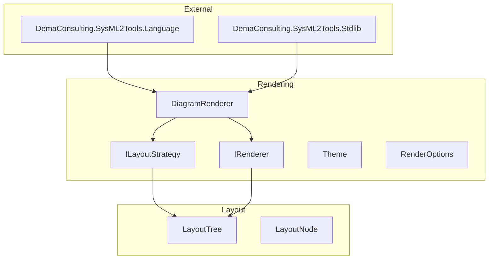

# DemaConsulting.SysML2Tools

## Architecture

The `DemaConsulting.SysML2Tools` core library provides the Layout and Rendering subsystems
for SysML v2 diagram generation. It depends on `DemaConsulting.SysML2Tools.Language` for
parsing and semantic analysis, and on `DemaConsulting.SysML2Tools.Stdlib` for the pre-compiled
standard library.

Phase 3 introduces two subsystems: **Layout** and **Rendering**. The Layout subsystem defines
the `LayoutTree` intermediate representation consumed by renderers — nine immutable node record
types covering all SysML diagram elements. The Rendering subsystem defines the interfaces and
data types that form the rendering pipeline: `IRenderer`, `ILayoutStrategy`, `Theme`,
`RenderOptions`, `RenderOutput`, and `DiagramRenderer`.

## External Interfaces

**IRenderer**: Low-level renderer interface.

- *Type*: Interface.
- *Role*: Consumer.
- *Contract*: `string MediaType { get; }`, `string DefaultExtension { get; }`,
  `void Render(LayoutTree layout, RenderOptions options, Stream output)`.
  Implementations must be pure and stateless.

**ILayoutStrategy**: Layout computation interface.

- *Type*: Interface.
- *Role*: Provider.
- *Contract*: `LayoutTree BuildLayout(ViewContext context, RenderOptions options)`.

**LayoutTree**: Intermediate representation for one rendered diagram view.

- *Type*: Sealed record.
- *Role*: Data container.
- *Contract*: `double Width`, `double Height`, `IReadOnlyList<LayoutNode> Nodes`.
  All coordinates are absolute; origin is top-left.

**Theme**: Visual rendering configuration.

- *Type*: Sealed record.
- *Role*: Configuration.
- *Contract*: `DepthFillColors`, `StrokeColor`, `StrokeWidth`, `LineCornerRadius`,
  `FontSizeTitle`, `FontSizeBody`, `LabelPadding`, `Font`. Three built-in instances are
  provided by `Themes.Light`, `Themes.Dark`, and `Themes.Print`.

## Dependencies

- **DemaConsulting.SysML2Tools.Language** — provides `WorkspaceLoader`, `SysmlWorkspace`,
  `SysmlNode` and all subtypes used by `DiagramRenderer` for pattern-matching view declarations.
- **DemaConsulting.SysML2Tools.Stdlib** — provides `StdlibProvider.GetSymbolTable()` used
  by `DiagramRenderer` to seed the semantic workspace with the pre-compiled standard library.

## Risk Control Measures

N/A — not a safety-classified software item.

## Data Flow

### Layout and Rendering Data Flow

1. `DiagramRenderer.RenderWorkspace` receives a `SysmlWorkspace`, an `IRenderer`, and
   `RenderOptions`. For each view declared in the workspace it constructs a `ViewContext`
   containing the view name and workspace reference.
2. `ILayoutStrategy.BuildLayout` is called with the `ViewContext` and `RenderOptions`. The
   strategy places all nodes with absolute coordinates, routes all lines using A* path-finding
   with even waypoint spacing, and returns a fully resolved `LayoutTree`.
3. `IRenderer.Render` is called with the `LayoutTree`, `RenderOptions`, and a fresh output
   `Stream`. The renderer reads each `LayoutNode` in the tree, translates it to output-format
   primitives, and writes bytes to the stream.
4. Fill colors for `LayoutBox` nodes are derived by the renderer as
   `Theme.DepthFillColors[box.Depth % theme.DepthFillColors.Count]`.
5. Corner rounding for `LayoutLine` elbows is applied by the renderer using
   `Theme.LineCornerRadius`; `0.0` produces sharp corners.
6. Each rendered stream is wrapped in a `RenderOutput` with `SuggestedFileName` derived from
   the view name and `IRenderer.DefaultExtension`.

## Design Constraints

- Platform: multi-targets net8.0, net9.0, and net10.0 on Windows, Linux, and macOS.
- SysML v2 parsing, semantic analysis, and standard library are provided by the Language and
  Stdlib assemblies; the Core assembly contains only Layout and Rendering concerns.
