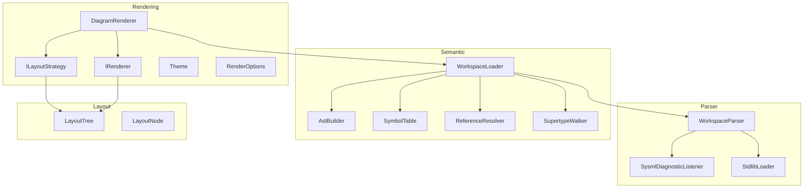

# DemaConsulting.SysML2Tools

## Architecture

The `DemaConsulting.SysML2Tools` core library provides the SysML v2 parsing engine, embedded
standard library, and the foundation for future semantic model, layout algorithms, and the
`IRenderer` interface shared by all renderer packages.

The system contains two subsystems in Phase 2: **Parser** and **Semantic**. The Parser subsystem
provides syntax-level parsing, while the Semantic subsystem builds a symbol table and performs
reference resolution. The Parser subsystem is further divided into the public API unit
(`WorkspaceParser`) and an internal subsystem (`Internal`) containing `SysmlDiagnosticListener`
and `StdlibLoader`. The Semantic subsystem contains the public `WorkspaceLoader` unit and an
internal subsystem with `AstBuilder`, `SymbolTable`, `ReferenceResolver`, and `SupertypeWalker`.
Supporting data types (`DiagnosticSeverity`, `SysmlDiagnostic`, `WorkspaceParseResult`,
`SysmlLoadResult`, `SysmlWorkspace`) are declared at the appropriate namespace levels.

Phase 3 adds two further subsystems: **Layout** and **Rendering**. The Layout subsystem defines
the `LayoutTree` intermediate representation consumed by renderers — nine immutable node record
types covering all SysML diagram elements. The Rendering subsystem defines the interfaces and
data types that form the rendering pipeline: `IRenderer`, `ILayoutStrategy`, `Theme`,
`RenderOptions`, `RenderOutput`, and `DiagramRenderer`.

## External Interfaces

**WorkspaceParser.ParseAsync**: Parses the embedded stdlib plus every file in the provided collection asynchronously.

- *Type*: In-process .NET static async method.
- *Role*: Provider.
- *Contract*: Accepts `IEnumerable<string> filePaths`; returns `Task<WorkspaceParseResult>` containing
  all parsed file paths and all collected diagnostics. Stdlib is parsed once and cached; user files
  are parsed in parallel on the thread pool.
- *Constraints*: `filePaths` must not be null; each path must be a readable file.

**WorkspaceParser.ParseSource**: Parses an in-memory source string with a caller-supplied virtual
file path.

- *Type*: In-process .NET static method.
- *Role*: Provider.
- *Contract*: Accepts `string filePath` (virtual or real) and `string content`; returns
  `IReadOnlyList<SysmlDiagnostic>` containing all diagnostics from parsing that single source.
- *Constraints*: None. Both parameters are used as-is; `filePath` appears verbatim in diagnostics.

**WorkspaceParseResult**: Aggregate result record returned by `WorkspaceParser.ParseAsync`.

- *Type*: Sealed class.
- *Role*: Provider.
- *Contract*: Exposes `IReadOnlyList<string> Files`, `IReadOnlyList<SysmlDiagnostic> Diagnostics`,
  and `bool HasErrors`.

**SysmlDiagnostic**: Record representing a single diagnostic message.

- *Type*: Sealed record.
- *Role*: Data transfer object.
- *Contract*: Fields — `string FilePath`, `int Line`, `int Column`,
  `DiagnosticSeverity Severity`, `string Message`.

**DiagnosticSeverity**: Enumeration of diagnostic severity levels.

- *Type*: Enum.
- *Role*: Data type.
- *Values*: `Info`, `Warning`, `Error`.

**WorkspaceLoader.LoadAsync**: Loads the embedded stdlib plus every user file into a semantic workspace.

- *Type*: In-process .NET static async method.
- *Role*: Provider.
- *Contract*: Accepts `IEnumerable<string> filePaths`; returns `Task<SysmlLoadResult>` containing
  the semantic workspace, all collected diagnostics, and a `HasErrors` flag. Stdlib ASTs are
  cached; user files are parsed in parallel on the thread pool.
- *Constraints*: `filePaths` must not be null; each path should be a readable file path.

**SysmlLoadResult**: Aggregate result record returned by `WorkspaceLoader.LoadAsync`.

- *Type*: Sealed record.
- *Role*: Data transfer object.
- *Contract*: Exposes `SysmlWorkspace? Workspace`, `IReadOnlyList<SysmlDiagnostic> Diagnostics`,
  and `bool HasErrors`.

**SysmlWorkspace**: Semantic workspace containing all registered declarations.

- *Type*: Sealed class.
- *Role*: Data container.
- *Contract*: Exposes `IReadOnlyList<string> Files` and
  `IReadOnlyDictionary<string, object> Declarations`.

**IRenderer**: Low-level renderer interface (Phase 3+).

- *Type*: Interface.
- *Role*: Consumer.
- *Contract*: `string MediaType { get; }`, `string DefaultExtension { get; }`,
  `void Render(LayoutTree layout, RenderOptions options, Stream output)`.
  Implementations must be pure and stateless.

**ILayoutStrategy**: Layout computation interface (Phase 3+).

- *Type*: Interface.
- *Role*: Provider.
- *Contract*: `LayoutTree BuildLayout(ViewContext context, RenderOptions options)`.

**LayoutTree**: Intermediate representation for one rendered diagram view (Phase 3+).

- *Type*: Sealed record.
- *Role*: Data container.
- *Contract*: `double Width`, `double Height`, `IReadOnlyList<LayoutNode> Nodes`.
  All coordinates are absolute; origin is top-left.

**Theme**: Visual rendering configuration (Phase 3+).

- *Type*: Sealed record.
- *Role*: Configuration.
- *Contract*: `DepthFillColors`, `StrokeColor`, `StrokeWidth`, `LineCornerRadius`,
  `FontSizeTitle`, `FontSizeBody`, `LabelPadding`, `Font`. Three built-in instances are
  provided by `Themes.Light`, `Themes.Dark`, and `Themes.Print`.

## Dependencies

- **Antlr4.Runtime.Standard** — ANTLR4 C# runtime; provides `AntlrInputStream`,
  `CommonTokenStream`, `IAntlrErrorListener<T>`, and the infrastructure for running
  the pre-generated `SysMLv2Lexer` and `SysMLv2Parser`. See *ANTLR4 Integration Design*.
- **Embedded Stdlib resources** — 94 SysML v2 standard library files (58 `.sysml` + 36
  `.kerml`) from the Systems-Modeling/SysML-v2-Release tag 2026-04; licensed EPL-2.0 and
  committed under `Stdlib/`. All 94 stdlib files (58 `.sysml` + 36 `.kerml`) are loaded by
  WorkspaceLoader; KerML parse errors are downgraded to Warnings because the SysML v2 grammar
  does not fully cover KerML-specific syntax.

## Risk Control Measures

N/A — not a safety-classified software item.

## Data Flow

1. `WorkspaceParser.ParseAsync` awaits the shared `Lazy<Task<...>>` stdlib result. On first call
   the factory fires `Task.Run(ParseStdlibInternal)`, which calls `StdlibLoader.LoadAll()` to
   enumerate all embedded manifest resources matching the `Stdlib.` prefix and ending with
   `.sysml`, reads each stream into a `(virtualPath, content)` pair, and parses each with the
   internal `ParseSource` overload.
2. Concurrently, all caller-supplied file paths are dispatched to the thread pool via
   `Task.WhenAll`, each reading its file content and calling the internal `ParseSource` overload.
3. The internal `ParseSource` creates a `SysmlDiagnosticListener` bound to the current file
   path and a per-file `List<SysmlDiagnostic>`.
4. `SysMLv2Lexer` is constructed over an `AntlrInputStream`; the listener is registered on
   the lexer. A `CommonTokenStream` wraps the lexer. `SysMLv2Parser` is constructed over the
   token stream; the listener is also registered on the parser.
5. The entry rule `rootNamespace()` is invoked; the resulting CST root is discarded in Phase 1.
   Any lexer or parser errors invoke `SysmlDiagnosticListener.SyntaxError`, which appends a
   new `SysmlDiagnostic(filePath, line, column, Error, message)` to the per-file list.
6. After all async work completes, `WorkspaceParser.ParseAsync` concatenates stdlib and user-file
   paths and diagnostics into a `WorkspaceParseResult` and returns it.

### Semantic Data Flow

1. `WorkspaceLoader.LoadAsync` awaits the shared `Lazy<Task<StdlibSemanticResult>>` stdlib
   semantic task. On first call, the factory fires `Task.Run(BuildStdlibSemanticAsync)`, which
   enumerates all embedded manifest resources matching both `.sysml` and `.kerml` extensions,
   reads each stream, parses to a CST via `WorkspaceParser.ParseSourceToCst`, builds a typed
   AST via `AstBuilder.Build`, and collects all diagnostics (KerML errors downgraded to Warnings).
2. Concurrently, all caller-supplied file paths are dispatched to the thread pool via
   `Task.WhenAll`, each reading file content and calling `WorkspaceParser.ParseSourceToCst`
   followed by `AstBuilder.Build`; file I/O failures are caught and returned as Error-severity
   diagnostics.
3. `SymbolTable.RegisterAll` is called for each stdlib and user AST root, building the
   qualified-name registry.
4. `ReferenceResolver.ResolveAll` iterates all registered symbols, resolving supertype
   references and emitting Warning diagnostics for unresolved names and circular imports.
5. `SupertypeWalker.WalkAll` traverses every specialization chain, detecting cyclic
   specialization and emitting Warning diagnostics for detected cycles.
6. A `SysmlWorkspace` is constructed from the loaded file list and symbol table, and wrapped
   in a `SysmlLoadResult` with all accumulated diagnostics.

### Layout and Rendering Data Flow

1. `DiagramRenderer.RenderWorkspace` receives a `SysmlWorkspace`, an `IRenderer`, and
   `RenderOptions`. For each view declared in the workspace it constructs a `ViewContext`
   containing the view name and workspace reference.
2. `ILayoutStrategy.BuildLayout` is called with the `ViewContext` and `RenderOptions`. The
   strategy places all nodes with absolute coordinates, routes all lines using A* path-finding
   with even waypoint spacing, and returns a fully resolved `LayoutTree`.
3. `IRenderer.Render` is called with the `LayoutTree`, `RenderOptions`, and a fresh output
   `Stream`. The renderer reads each `LayoutNode` in the tree, translates it to output-format
   primitives, and writes bytes to the stream.
4. Fill colors for `LayoutBox` nodes are derived by the renderer as
   `Theme.DepthFillColors[box.Depth % theme.DepthFillColors.Count]`.
5. Corner rounding for `LayoutLine` elbows is applied by the renderer using
   `Theme.LineCornerRadius`; `0.0` produces sharp corners.
6. Each rendered stream is wrapped in a `RenderOutput` with `SuggestedFileName` derived from
   the view name and `IRenderer.DefaultExtension`.

## Design Constraints

- Platform: multi-targets net8.0, net9.0, and net10.0 on Windows, Linux, and macOS.
- The `.kerml` stdlib files are embedded as assembly resources but are not parsed in Phase 1;
  KerML grammar support is deferred to Phase 2.
- The ANTLR4-generated C# files under `Parser/Antlr/` are committed to the repository and
  must not be manually edited; they are regenerated using `antlr-4.13.1-complete.jar` as
  documented in `Grammar/README.md`.
- `WorkspaceParser` provides syntax-only parsing (CST construction). Semantic model
  construction, symbol table registration, and reference resolution are performed by
  `WorkspaceLoader` in the Semantic subsystem.
