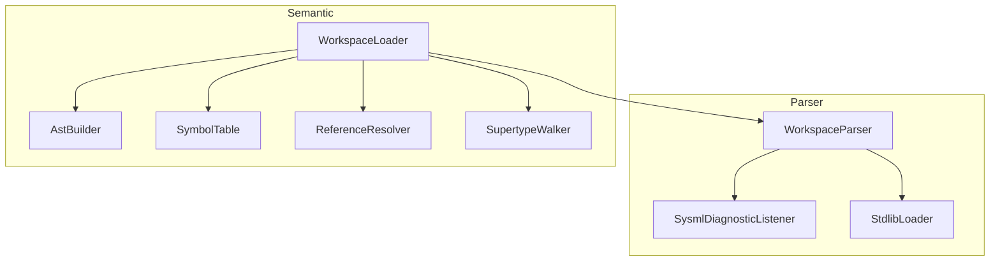

# DemaConsulting.SysML2Tools

## Architecture

The `DemaConsulting.SysML2Tools` core library provides the SysML v2 parsing engine, embedded
standard library, and the foundation for future semantic model, layout algorithms, and the
`IRenderer` interface shared by all renderer packages.

The system contains two subsystems in Phase 2: **Parser** and **Semantic**. The Parser subsystem
provides syntax-level parsing, while the Semantic subsystem builds a symbol table and performs
reference resolution. The Parser subsystem is further divided into the public API unit
(`WorkspaceParser`) and an internal subsystem (`Internal`) containing `SysmlDiagnosticListener`
and `StdlibLoader`. The Semantic subsystem contains the public `WorkspaceLoader` unit and an
internal subsystem with `AstBuilder`, `SymbolTable`, `ReferenceResolver`, and `SupertypeWalker`.
Supporting data types (`DiagnosticSeverity`, `SysmlDiagnostic`, `WorkspaceParseResult`,
`SysmlLoadResult`, `SysmlWorkspace`) are declared at the appropriate namespace levels.

## External Interfaces

**WorkspaceParser.ParseAsync**: Parses the embedded stdlib plus every file in the provided collection asynchronously.

- *Type*: In-process .NET static async method.
- *Role*: Provider.
- *Contract*: Accepts `IEnumerable<string> filePaths`; returns `Task<WorkspaceParseResult>` containing
  all parsed file paths and all collected diagnostics. Stdlib is parsed once and cached; user files
  are parsed in parallel on the thread pool.
- *Constraints*: `filePaths` must not be null; each path must be a readable file.

**WorkspaceParser.ParseSource**: Parses an in-memory source string with a caller-supplied virtual
file path.

- *Type*: In-process .NET static method.
- *Role*: Provider.
- *Contract*: Accepts `string filePath` (virtual or real) and `string content`; returns
  `IReadOnlyList<SysmlDiagnostic>` containing all diagnostics from parsing that single source.
- *Constraints*: None. Both parameters are used as-is; `filePath` appears verbatim in diagnostics.

**WorkspaceParseResult**: Aggregate result record returned by `WorkspaceParser.ParseAsync`.

- *Type*: Sealed class.
- *Role*: Provider.
- *Contract*: Exposes `IReadOnlyList<string> Files`, `IReadOnlyList<SysmlDiagnostic> Diagnostics`,
  and `bool HasErrors`.

**SysmlDiagnostic**: Record representing a single diagnostic message.

- *Type*: Sealed record.
- *Role*: Data transfer object.
- *Contract*: Fields — `string FilePath`, `int Line`, `int Column`,
  `DiagnosticSeverity Severity`, `string Message`.

**DiagnosticSeverity**: Enumeration of diagnostic severity levels.

- *Type*: Enum.
- *Role*: Data type.
- *Values*: `Info`, `Warning`, `Error`.

## Dependencies

- **Antlr4.Runtime.Standard** — ANTLR4 C# runtime; provides `AntlrInputStream`,
  `CommonTokenStream`, `IAntlrErrorListener<T>`, and the infrastructure for running
  the pre-generated `SysMLv2Lexer` and `SysMLv2Parser`. See *ANTLR4 Integration Design*.
- **Embedded Stdlib resources** — 94 SysML v2 standard library files (58 `.sysml` + 36
  `.kerml`) from the Systems-Modeling/SysML-v2-Release tag 2026-04; licensed EPL-2.0 and
  committed under `Stdlib/`. Phase 1 loads only the `.sysml` files; `.kerml` files are
  embedded but not parsed until Phase 2.

## Risk Control Measures

N/A — not a safety-classified software item.

## Data Flow

1. `WorkspaceParser.ParseAsync` awaits the shared `Lazy<Task<...>>` stdlib result. On first call
   the factory fires `Task.Run(ParseStdlibInternal)`, which calls `StdlibLoader.LoadAll()` to
   enumerate all embedded manifest resources matching the `Stdlib.` prefix and ending with
   `.sysml`, reads each stream into a `(virtualPath, content)` pair, and parses each with the
   internal `ParseSource` overload.
2. Concurrently, all caller-supplied file paths are dispatched to the thread pool via
   `Task.WhenAll`, each reading its file content and calling the internal `ParseSource` overload.
3. The internal `ParseSource` creates a `SysmlDiagnosticListener` bound to the current file
   path and a per-file `List<SysmlDiagnostic>`.
4. `SysMLv2Lexer` is constructed over an `AntlrInputStream`; the listener is registered on
   the lexer. A `CommonTokenStream` wraps the lexer. `SysMLv2Parser` is constructed over the
   token stream; the listener is also registered on the parser.
5. The entry rule `rootNamespace()` is invoked; the resulting CST root is discarded in Phase 1.
   Any lexer or parser errors invoke `SysmlDiagnosticListener.SyntaxError`, which appends a
   new `SysmlDiagnostic(filePath, line, column, Error, message)` to the per-file list.
6. After all async work completes, `WorkspaceParser.ParseAsync` concatenates stdlib and user-file
   paths and diagnostics into a `WorkspaceParseResult` and returns it.

## Design Constraints

- Platform: multi-targets net8.0, net9.0, and net10.0 on Windows, Linux, and macOS.
- The `.kerml` stdlib files are embedded as assembly resources but are not parsed in Phase 1;
  KerML grammar support is deferred to Phase 2.
- The ANTLR4-generated C# files under `Parser/Antlr/` are committed to the repository and
  must not be manually edited; they are regenerated using `antlr-4.13.1-complete.jar` as
  documented in `Grammar/README.md`.
- Phase 1 performs syntax-only parsing (CST construction). No semantic model, symbol table,
  or reference resolution is performed.
