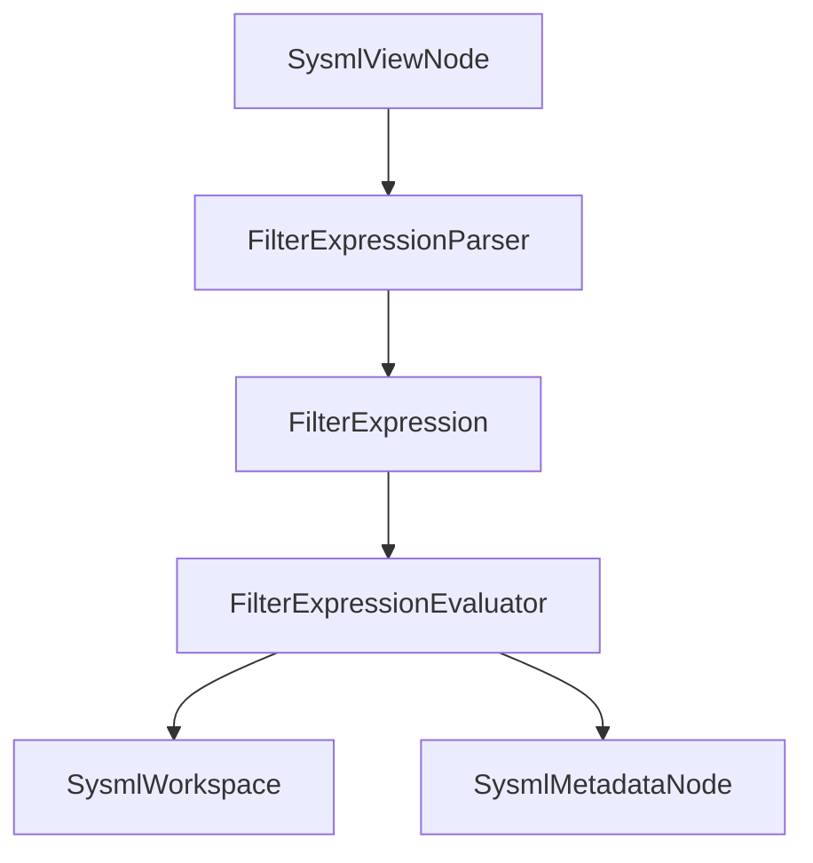

<!-- cspell:ignore parenthesization istype hastype -->

## DemaConsulting.SysML2Tools — Filtering Subsystem

### Overview

The Filtering subsystem parses and evaluates the Phase 1 subset of standalone view
`filter [<expr>];` expressions captured on `SysmlViewNode.FilterExpressionText`, and (Phase 2a)
the same subset of bracket-form `expose <path>::**[<expr>];` expressions captured per-entry on
`SysmlViewNode.ExposeMembers`. It contains one unit, `FilterExpressionEvaluator`, whose
implementation spans three tightly-coupled source files: `FilterExpression` (the abstract syntax
tree), `FilterExpressionParser` (the ANTLR-backed parser adapter), and `FilterExpressionEvaluator`
(the metadata-driven boolean evaluator).

This subsystem is intentionally narrow in Phase 1: it supports metadata classification tests,
boolean connectives, parenthesization, and `(as Type).attribute` reads (bare or compared against a
scalar literal). General feature-chain navigation, arithmetic, conditionals, `istype`, `hastype`,
and `all` are explicitly unsupported and are surfaced as diagnostics instead of exceptions.

### Interfaces

**FilterExpressionParser**: Raw-text-to-AST adapter.

- *Type*: Static class.
- *Role*: Provider.
- *Contract*: `FilterParseResult Parse(string expressionText)`. Accepts the raw bracket contents
  captured from a standalone `filter [<expr>];` member and returns either a supported
  `FilterExpression` tree or one-or-more `SysmlDiagnostic` instances explaining why parsing could
  not produce one.

**FilterExpression**: Phase 1 filter-expression AST.

- *Type*: Abstract record hierarchy.
- *Role*: Data model.
- *Contract*: Represents only the supported Phase 1 subset: classification tests, boolean
  connectives, parenthesization, metadata attribute reads, scalar literals, and equality/
  inequality comparisons. Each node's `ToString()` is a canonical pretty-printer.

**FilterExpressionEvaluator**: Candidate-set evaluator.

- *Type*: Static class.
- *Role*: Provider.
- *Contract*: `FilterEvaluationResult Evaluate(SysmlWorkspace workspace, IReadOnlyList<string>
  candidateQualifiedNames, FilterExpression expression)`. Evaluates the parsed expression against
  the supplied candidates and returns the matched subset plus evaluation diagnostics.

### Design

1. `AstBuilder` preserves the original token spacing of a view's standalone filter text in
   `SysmlViewNode.FilterExpressionText`, so the Filtering subsystem receives a re-lexable fragment
   rather than `RuleContext.GetText()`'s whitespace-stripped form.
2. `FilterExpressionParser.Parse` reuses the generated SysML grammar's `ownedExpression()` rule to
   parse that fragment, rather than introducing a second filter-specific grammar. This keeps the
   accepted syntax aligned with the language parser while constraining the semantic output to the
   supported Phase 1 subset.
3. The parser walks the ANTLR CST into a small AST hierarchy (`FilterExpression` and subtypes).
   Unsupported nodes do not produce partial ASTs: they append a `SysmlDiagnostic` and return no
   expression. The AST's `ToString()` implementations form the subsystem's canonical
   pretty-printer, used by the round-trip tests to prove parser/printer alignment.
4. `FilterExpressionEvaluator.Evaluate` treats the caller-supplied `candidateQualifiedNames` as the
   only elements eligible to match. For each candidate name it resolves the declaration from
   `SysmlWorkspace.Declarations` and evaluates the AST against that node.
5. Classification tests (`@Type`, `@Pkg::Type`) and `(as Type).attribute` reads inspect only the
   candidate's directly-owned `SysmlMetadataNode` children. A metadata annotation matches when its
   resolved `MetadataType` edge points at the requested type, when that target ends with
   `"::Type"` for a bare-name filter, or — if the metadata type never resolved — when the raw
   `TypeReference` text itself matches, allowing graceful fallback for otherwise-usable models.
6. Bare attribute reads are boolean predicates: they succeed only when the addressed metadata
   attribute exists and its captured literal kind is Boolean with value `true`. Equality and
   inequality comparisons support Boolean, Number, and String literals. A missing annotation or a
   missing attribute is treated conservatively as false, never as an exception.
7. The subsystem never throws for malformed or unsupported filter text. `GeneralViewLayoutStrategy`
   uses parser diagnostics as the reason string when it falls back to rendering the unfiltered
   resolved scope.
8. (Phase 2a) `ExposeScopeResolver` reuses `Parse`/`Evaluate` unchanged for bracket-form
   `expose <path>::**[<expr>];` entries: it computes a per-entry candidate set restricted to
   `SysmlDefinitionNode`s within that entry's own target containment subtree (mirroring
   `GeneralViewLayoutStrategy.CollectDefinitions`'s existing restriction), calls `Evaluate` with
   that candidate set, and adds the matched subset to the resolved scope's `ExplicitMembers`. No
   change was required in this subsystem to support the second caller, confirming the evaluator's
   candidate-set-agnostic design.

### Design Constraints

- The parser depends on the generated `SysMLv2Lexer`/`SysMLv2Parser` from the Language system and
  therefore accepts only syntax valid under the repository's committed grammar.
- Phase 1 supports metadata-driven filtering only. Feature-chain navigation other than the
  `(as Type).attribute` metadata read is intentionally rejected.
- The evaluator is read-only over `SysmlWorkspace`; it never mutates declarations or resolved
  edges.
- `Parse`/`Evaluate` must never throw and must never crash the process, since a planned future GUI
  will call them live on every keystroke of a text-editing filter box (see
  `docs/design/sysml2-tools-core/filtering/filter-expression-evaluator.md`'s Error Handling
  section for the hardening this constraint requires beyond ordinary syntax-error diagnostics:
  a bounded nesting-depth guard against ANTLR's own recursive-descent stack overflow, a broadened
  catch for ANTLR-internal failures such as astral-plane Unicode input, an EOF check rejecting
  trailing garbage after a valid expression prefix, and a finite-value check rejecting numeric
  literals that overflow `double`).

### Requirements Traceability

| Requirement ID | Satisfied by |
| --- | --- |
| SysML2Tools-Core-Filtering-StandaloneViewFilterEvaluation | `Parse`, `Evaluate`, and `FilterExpression.ToString()` |
| SysML2Tools-Core-Filtering-BracketFormExposeEvaluation | `ExposeScopeResolver` reusing `Parse`/`Evaluate` |
