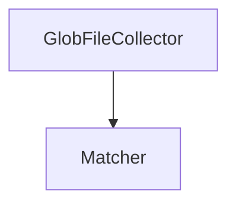

## DemaConsulting.SysML2Tools — Io Subsystem

### Overview

The Io subsystem provides shared filesystem file-discovery behavior for the Tool project's
CLI commands. It contains a single unit, `GlobFileCollector`, which resolves an ordered list of
glob patterns — including recursive `**` segments, `!`-prefixed exclusions, and bare-`*`
extension filtering — into a stable, sorted, deduplicated list of absolute file paths. The
`lint`, `render`, and `query` commands each delegate their file-pattern resolution to this one
unit, so all three commands support identical glob semantics.

This subsystem has no dependency on the SysML semantic model, layout, or rendering pipeline; it
is a pure, stateless filesystem-discovery helper.

### Interfaces

**GlobFileCollector**: File glob pattern resolver.

- *Type*: Static class.
- *Role*: Provider.
- *Contract*: `IReadOnlyList<string> Collect(IEnumerable<string> patterns,
  IEnumerable<string> extensions, string workingDirectory)`. Stateless and thread-safe.

### Design

1. `GlobFileCollector.Collect` receives an ordered list of glob patterns, a set of file
   extensions used to filter bare-`*` patterns, and a working directory used to resolve relative
   patterns. Each pattern is split into a static filesystem root and a glob tail; the tail is
   passed to the off-the-shelf `Microsoft.Extensions.FileSystemGlobbing.Matcher`, which supports
   recursive `**` segments.
2. Patterns prefixed with `!` are exclusion patterns: matching files are removed from the
   accumulated result set rather than added. Patterns are processed strictly in the order
   supplied, so a later inclusion pattern can re-add a file previously removed by an earlier
   exclusion.
3. When a pattern's final path segment is a bare `*` (no extension), results are filtered to
   files whose extension (case-insensitive) is in the caller-supplied extension set. When the
   final segment specifies an explicit extension (e.g. `*.sysml`), results are taken as-is.
4. Fully-qualified absolute patterns containing no glob metacharacters are resolved directly as
   literal paths via a file-existence check, without any directory traversal. Relative patterns
   — whether or not they contain glob metacharacters — always resolve via `Matcher` against the
   working directory; only a fully-qualified absolute pattern with no glob metacharacters takes
   the literal-path fast path.
5. Every result — whether glob-matched or a literal path — is resolved to its actual on-disk
   casing before being added to the result set, so deduplication (using ordinal, case-sensitive
   comparison) correctly collapses duplicate references to the same physical file regardless of
   the filesystem's own case-sensitivity.
6. Missing directories and missing literal files are silently skipped; `Collect` never throws
   for missing filesystem entries.
7. The final result is sorted (ordinal) and deduplicated before being returned.

### Design Constraints

- Depends on the off-the-shelf `Microsoft.Extensions.FileSystemGlobbing` package for glob
  pattern matching (including `**` recursion); `GlobFileCollector` itself implements only
  pattern splitting, exclusion accumulation, extension filtering, and on-disk casing
  normalization.
- Has no dependency on `DemaConsulting.SysML2Tools.Semantic`, `.Layout`, or `.Rendering`; the
  Io subsystem is usable independently of the rest of the Core library.

### Requirements Traceability

| Requirement ID | Satisfied by |
| --- | --- |
| SysML2Tools-Core-Io-GlobFileCollector | `GlobFileCollector.Collect` |
