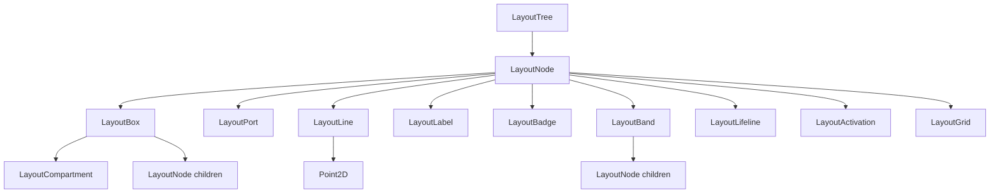

## DemaConsulting.SysML2Tools — Layout Subsystem

### Overview

The Layout subsystem defines the intermediate representation consumed by all renderers. It
provides a tree of immutable records — collectively called a `LayoutTree` — that describes
the visual structure of one rendered diagram view. All spatial decisions (node placement,
line routing, compartment sizing) are made by an `ILayoutStrategy` before the tree is handed
to a renderer; the renderer only reads the tree and writes output.

The Layout subsystem contains nine concrete node types, each a `sealed record` derived from
the abstract base `LayoutNode`:

| Node type | Role | SysML diagram types |
| --- | --- | --- |
| `LayoutBox` | Rectangular container with label, depth, compartments, children | Block, IBD, Package, SM, Activity |
| `LayoutPort` | Connection point on a box edge; child of `LayoutBox` | IBD, Block |
| `LayoutLine` | Pre-routed orthogonal polyline with end markers and mid-label | All relational diagrams |
| `LayoutLabel` | Standalone text label at absolute position | All diagram types |
| `LayoutBadge` | Small icon decorator (pseudostate, choice node, etc.) | SM, Activity |
| `LayoutBand` | Swim-lane with orientation, label, and nested children | Activity, Sequence |
| `LayoutLifeline` | Sequence-diagram lifeline: dashed line with header box | Sequence |
| `LayoutActivation` | Narrow activation bar on a lifeline | Sequence |
| `LayoutGrid` | Tabular layout with header rows and column-spanning cells | Requirement, Allocation tables |

### Interfaces

The Layout subsystem exposes only data types. No methods are defined; all construction is
performed by `ILayoutStrategy` implementations (see *Rendering Subsystem*).

**LayoutTree**: Root container for a single rendered diagram view.

- *Type*: Sealed record.
- *Role*: Data container.
- *Contract*: `double Width`, `double Height`, `IReadOnlyList<LayoutNode> Nodes`. All
  coordinates within descendant nodes are absolute; the origin is the top-left corner of the
  canvas defined by `Width` × `Height`.

**LayoutNode**: Abstract base for all layout nodes.

- *Type*: Abstract record.
- *Role*: Discriminated-union root.
- *Contract*: No members. Renderers switch on concrete derived types and skip unknown subtypes
  for forward compatibility.

**LayoutBox**: Primary structural node for rectangular containers.

- *Type*: Sealed record.
- *Role*: Data container.
- *Contract*: `double X`, `double Y`, `double Width`, `double Height`, `string? Label`,
  `int Depth`, `BoxShape Shape`, `IReadOnlyList<LayoutCompartment> Compartments`,
  `IReadOnlyList<LayoutNode> Children`. `Depth` is an integer nesting level; renderers
  derive fill color from `Theme.DepthFillColors[Depth % count]`. `Children` contains all
  spatially nested nodes including `LayoutPort` instances attached to this box's edges.

**LayoutCompartment**: A labeled section within a `LayoutBox`.

- *Type*: Sealed record.
- *Role*: Data container.
- *Contract*: `string? Title`, `IReadOnlyList<string> Rows`.

**LayoutPort**: Connection point on a box edge.

- *Type*: Sealed record.
- *Role*: Data container.
- *Contract*: `double CentreX`, `double CentreY`, `PortSide Side`, `string? Label`. Position
  is absolute. `Side` indicates which edge of the parent box the port is attached to.

**LayoutLine**: Pre-routed orthogonal polyline.

- *Type*: Sealed record.
- *Role*: Data container.
- *Contract*: `IReadOnlyList<Point2D> Waypoints`, `EndMarkerStyle SourceEnd`,
  `EndMarkerStyle TargetEnd`, `LineStyle LineStyle`, `string? MidpointLabel`.
  Waypoints are absolute positions. Corner rounding at elbows is applied by the renderer
  using `Theme.LineCornerRadius`.

**Point2D**: Immutable 2-D point.

- *Type*: Sealed record.
- *Role*: Value object.
- *Contract*: `double X`, `double Y`. Both coordinates are absolute.

**LayoutLabel**: Standalone text element.

- *Type*: Sealed record.
- *Role*: Data container.
- *Contract*: `double X`, `double Y`, `double MaxWidth`, `string Text`, `TextAlign Align`.

**LayoutBadge**: Small icon decorator.

- *Type*: Sealed record.
- *Role*: Data container.
- *Contract*: `double CentreX`, `double CentreY`, `double Size`, `BadgeShape Shape`,
  `string? Label`. Centre position is absolute.

**LayoutBand**: Swim-lane container.

- *Type*: Sealed record.
- *Role*: Data container.
- *Contract*: `double X`, `double Y`, `double Width`, `double Height`,
  `BandOrientation Orientation`, `string? Label`, `IReadOnlyList<LayoutNode> Children`.

**LayoutLifeline**: Sequence-diagram lifeline.

- *Type*: Sealed record.
- *Role*: Data container.
- *Contract*: `double CentreX`, `double TopY`, `double BottomY`, `string Label`,
  `double HeaderWidth`, `double HeaderHeight`.

**LayoutActivation**: Activation bar on a lifeline.

- *Type*: Sealed record.
- *Role*: Data container.
- *Contract*: `double CentreX`, `double TopY`, `double BottomY`.

**LayoutGrid**: Tabular layout node.

- *Type*: Sealed record.
- *Role*: Data container.
- *Contract*: `double X`, `double Y`, `IReadOnlyList<LayoutGridRow> Rows`. Each
  `LayoutGridRow` carries `bool IsHeader` and `IReadOnlyList<LayoutGridCell> Cells`.
  Each `LayoutGridCell` carries `double Width`, `double Height`, `string Text`,
  `TextAlign Align`, `int ColSpan`.

### Design

The Layout subsystem is a pure data model with no methods or algorithms. The design
decisions recorded here reflect constraints imposed during the Phase 3 vocabulary review.

1. **Absolute coordinates.** All `X`, `Y`, `CentreX`, `CentreY`, `TopY`, `BottomY` fields
   store values in canvas space with the origin at the top-left corner. Renderers never
   accumulate a transform stack; each node can be drawn independently.

2. **Depth not color.** `LayoutBox` carries an `int Depth` field. The renderer maps depth
   to fill color by indexing into `Theme.DepthFillColors` with modulo wrapping. This keeps
   the layout tree re-renderable with any theme without recomputing layout.

3. **Tree structure via Children.** `LayoutBox.Children` and `LayoutBand.Children` express
   spatial containment. `LayoutPort` nodes appear inside `LayoutBox.Children` because they
   are spatially on or inside the box. There is no back-reference from child to parent;
   absolute coordinates are sufficient for rendering.

4. **Pre-routed lines.** `LayoutLine.Waypoints` contains the complete ordered sequence of
   absolute points determined by `ILayoutStrategy`. The renderer draws straight segments
   between consecutive waypoints and applies `Theme.LineCornerRadius` at elbows.
   No path-finding occurs inside a renderer.

5. **No LayoutCurve.** Orthogonal waypoints combined with a non-zero `Theme.LineCornerRadius`
   handle all elbow-rounding cases including self-loops. A separate curved-line node type
   would duplicate the waypoints mechanism without adding expressiveness.

6. **No port parent reference.** `LayoutPort` stores only absolute `CentreX`/`CentreY` and
   a `PortSide`. The renderer does not need to know the parent box to draw the port symbol;
   the `ILayoutStrategy` has already resolved the absolute position.

### Design Constraints

- All Layout types target net8.0, net9.0, and net10.0 with `<Nullable>enable</Nullable>`.
- No methods or behaviors are defined in the Layout subsystem data types; it is a data model only.
- `TextAlign` is declared in `LayoutLabel.cs` and reused by `LayoutGrid.cs`; both files
  are in the same `DemaConsulting.SysML2Tools.Layout` namespace, so no cross-namespace
  import is required.

### Subsystem Structure

Beyond the `LayoutTree` data model described above, the Layout subsystem contains two
sub-subsystems and one helper unit, each documented in its own chapter:

- **Engine** — the reusable, model-independent geometric layout engines (`ChannelRouter`,
  `ForceDirectedEngine`, `PortAssigner`, `LayeredLayoutEngine`, `ContainmentPacker`). See
  the *Layout Engine Subsystem* chapter.
- **Internal** — the per-view layout strategies that map the semantic model to a
  `LayoutTree` (general, interconnection, state transition, action flow, sequence, grid, and
  browser views), plus `LayoutWarnings`. See the *Layout Internal Subsystem* chapter.
- **ConnectorLabelPlacer** — collision-aware placement of connector midpoint labels. See its
  own unit chapter.

The view strategies own the mapping from the SysML semantic model into geometric input,
invoke one or more engines to compute geometry, and assemble the resulting `LayoutTree`. The
engines themselves never reference the semantic model.

### Requirements Traceability

| Requirement ID | Satisfied by |
| --- | --- |
| SysML2Tools-Core-Layout-LayoutTree | `LayoutTree` record |
| SysML2Tools-Core-Layout-AbsoluteCoordinates | All coordinate fields; no transform logic |
| SysML2Tools-Core-Layout-LayoutBox | `LayoutBox` record with `Depth`, `Shape`, `Compartments`, `Children` |
| SysML2Tools-Core-Layout-DepthNotColor | `LayoutBox.Depth` int; no color field |
| SysML2Tools-Core-Layout-TreeStructure | `LayoutBox.Children` and `LayoutBand.Children` |
| SysML2Tools-Core-Layout-LayoutPort | `LayoutPort` record with `CentreX`, `CentreY`, `Side` |
| SysML2Tools-Core-Layout-LayoutLine | `LayoutLine` record with `Waypoints`, end markers, `LineStyle` |
| SysML2Tools-Core-Layout-LayoutLabel | `LayoutLabel` record |
| SysML2Tools-Core-Layout-LayoutBadge | `LayoutBadge` record |
| SysML2Tools-Core-Layout-LayoutBand | `LayoutBand` record |
| SysML2Tools-Core-Layout-LayoutLifeline | `LayoutLifeline` and `LayoutActivation` records |
| SysML2Tools-Core-Layout-LayoutGrid | `LayoutGrid`, `LayoutGridRow`, `LayoutGridCell` records |
| SysML2Tools-Core-Layout-PreRoutedLines | `LayoutLine.Waypoints`; routing in `ILayoutStrategy` |
