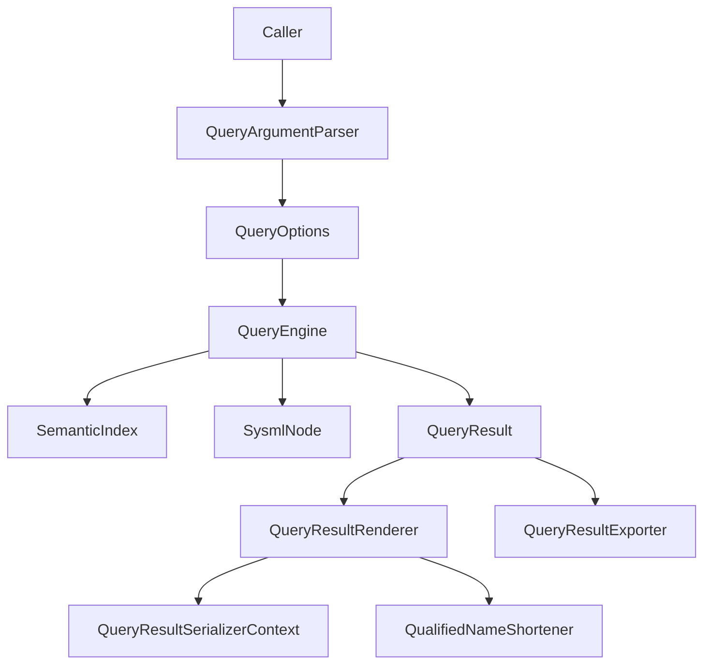

## DemaConsulting.SysML2Tools — Query Subsystem

### Overview

The Query subsystem is Core's public, reusable model-analysis API. It answers 12 fixed
questions over an already-loaded `SysmlWorkspace` and returns a uniform `QueryResult` that
callers can render as Markdown or JSON or write to a file. The Tool project's `query`
command is now only one caller of this subsystem; CLI-only behavior is documented in
`docs/design/sysml2-tools-tool/query.md`.

This subsystem contains the following public types:

- `QueryVerb` / `QueryVerbParsing` — the fixed 12-verb vocabulary, token conversion, and the
  `RequiresElement` rule.
- `QueryOptions` — the immutable option record shared by every verb; Core callers supply an
  already-loaded workspace, so this record has no input-files property. `IncludeConnections`
  opts the `impact` verb into connector traversal and is meaningful for no other verb.
- `QueryArgumentParser` — parses a token list into `(QueryOptions? Options,
  IReadOnlyList<string> Files)` for callers that accept the same verb/option grammar as the
  CLI.
- `QueryEngine` — the public execution surface: 12 verb methods plus `Execute`, which
  centralizes the verb switch used by both library callers and the CLI adapter.
- `QueryResult`, `QueryResultEntry`, and `QueryEntryDirection` — the verb-agnostic result
  model.
- `QueryResultRenderer` — the shared Markdown/JSON rendering and deterministic sorting layer.
- `QueryResultSerializerContext` — the source-generated `System.Text.Json` context used by
  `RenderJson`.
- `QueryResultExporter` — synchronous and asynchronous file-writing wrappers around the
  renderer.
- `Utilities.QualifiedNameShortener` — the shared prefix-stripping helper used only by the
  `dependencies` verb's Markdown rendering.
- `NamespaceDoc` — the XML-documentation anchor for the `DemaConsulting.SysML2Tools.Query`
  namespace and its public usage pattern.

### Interfaces

**`QueryArgumentParser`**: Shared token parser for query-style callers.

- *Type*: Static class.
- *Role*: Provider.
- *Contract*: `Parse(IReadOnlyList<string> commandArgs, bool helpRequested)` returns a
  `(QueryOptions? Options, IReadOnlyList<string> Files)` tuple. `Files` are returned
  separately because file-glob interpretation is a caller concern, not a Core concern.

**`QueryEngine`**: Workspace analysis entry point.

- *Type*: Static class.
- *Role*: Provider.
- *Contract*: `Execute(SysmlWorkspace workspace, QueryOptions options, SysmlNode? element)`
  dispatches to one of 12 public verb methods. Stateless and thread-safe for concurrent
  read-only use.

**`QueryResult` / `QueryResultEntry` / `QueryEntryDirection`**: Uniform result envelope.

- *Type*: Sealed records plus enum.
- *Role*: Data container.
- *Contract*: `Verb`, optional `Element`, free-form `Summary` lines, and deterministic
  `Entries`; `Direction` is populated only for `dependencies`, and the `Depth`/`Relation`/
  `ViaQualifiedName` traversal metadata only by the traversing verbs. Every optional member is
  omitted from JSON when null, so adding members never changes an existing verb's payload
  shape.

**`QueryResultRenderer`**: Result-to-text renderer.

- *Type*: Static class.
- *Role*: Provider.
- *Contract*: `RenderMarkdown(QueryResult, int depth = 1, string? heading = null)` returns
  Markdown lines; `RenderJson(QueryResult)` returns one indented JSON string.

**`QueryResultExporter`**: Result-to-file writer.

- *Type*: Static class.
- *Role*: Provider.
- *Contract*: `WriteMarkdown`/`WriteMarkdownAsync` and `WriteJson`/`WriteJsonAsync` write the
  exact renderer output to a caller-specified file path.

**`QualifiedNameShortener`**: Shared Markdown compaction helper.

- *Type*: Static class.
- *Role*: Provider.
- *Contract*: `Shorten(IReadOnlyList<string> qualifiedNames)` returns an ordinal-keyed map
  from original qualified names to their shortened forms, retaining every name's leaf segment.

### Design

1. `QueryArgumentParser` validates that the first token is one of the 12 verb tokens, captures
   `--element`/`--format`/`--walk-depth`/`--direction`/`--kind`/`--name`/
   `--include-stdlib`/`--include-connections`/`--heading`, and returns any trailing positional
   tokens separately as the caller-owned `Files` list.
2. `QueryEngine.Execute` is the public dispatcher. It validates the element-required rule for
   library callers, then routes `QueryOptions.Verb` to the matching verb method so the Tool
   project and any other caller reuse the exact same switch.
3. `Uses` reads outgoing semantic edges from `workspace.Index.GetOutgoingEdges`, filters
   stdlib targets unless `IncludeStdlib` is set, and emits one `QueryResultEntry` per outgoing
   relationship.
4. `UsedBy` reads the reverse index via `workspace.Index.GetIncomingEdges`, applies the same
   stdlib filter to incoming sources, and emits one entry per incoming relationship.
5. `Dependencies` combines `Uses` and `UsedBy` for the same subject, tagging entries with
   `QueryEntryDirection.Outgoing` or `Incoming` rather than performing a third traversal.
6. `Impact` performs a breadth-first transitive closure over incoming edges, optionally bounded
   by `WalkDepth`, with a minimum-connector-hop guard preventing infinite loops on cyclic
   graphs. Each frontier item is a `(qualified name, connector hops taken)` pair, and each item
   is expanded by two collaborating helpers:
   - `CollectImpactReferences` — always on: it reads `workspace.Index.GetIncomingEdges` and
     emits one entry per newly-reached source, carrying the connector-hop count through
     unchanged (a reference hop never consumes a connector hop). Edges whose kind is in
     `ImpactConnectorEdgeKinds` are **filtered out** by `IsImpactConnectorKind`, because
     `ReferenceResolver` publishes resolved connector endpoints into `SemanticIndex.AllEdges`
     alongside ordinary reference edges. Without that filter every connector would be followed
     a second time here — directed instead of undirected, attributed to the raw endpoint instead
     of its owning declaration, without `ViaQualifiedName`, and outside the connector hop bound.
     The filter makes `CollectImpactConnections` the single attribution path for connector
     relationships, so a connector is reported exactly once and only under `IncludeConnections`.
   - `CollectImpactConnections` — only when `QueryOptions.IncludeConnections` is set. It walks
     the connector edges collected once per invocation by `CollectConnectorEdges` for
     `ImpactConnectorEdgeKinds` (`Connect` and `Binding`) and follows each one **undirected**:
     a connector is traversed whenever exactly one of its two endpoints satisfies
     `IsSelfOrNestedUnder` for the frontier item, and the other endpoint is then reported.
     Requiring *exactly* one side to match simultaneously rejects unrelated connectors and
     self-loops whose two ends are both nested inside the subject. `Connect` and `Binding` are
     the only two kinds treated this way, because they are the only kinds whose recorded
     source/target order is a textual convention rather than a semantic direction; every other
     edge kind keeps the reverse-only directed traversal of the first helper.
   Containment roll-up applies in both directions. On the subject side, `IsSelfOrNestedUnder`
   (shared verbatim with the `connections` verb) lets a `part` subject match a connector
   attached to one of its nested ports. On the far side, `RollUpToNearestDeclaration` probes the
   endpoint itself first and returns it unchanged when it is already a declared qualified name,
   so a connector naming a sibling part directly (`connect alpha to beta;`) reports `beta`
   rather than the enclosing definition that also owns the subject. Stripping of trailing `::`
   segments applies only to endpoints absent from `Declarations` — typically ports inherited
   through a typed usage — so a port endpoint such as `System::hub::J1` is attributed to
   `System::hub`. Probing the endpoint before stripping is what keeps `impact` and `connections`
   in agreement about the same connector's topology. No information is lost: the raw far
   endpoint is preserved structurally in `ViaQualifiedName` and textually in the entry's `Notes`
   alongside the originating connector keyword, and an endpoint with no declared ancestor is
   reported unchanged rather than dropped.
   Two independent bounds are applied, because they differ when `WalkDepth` is `null`. The
   reference closure keeps its exact existing semantics (`null` means unlimited), enforced by
   the outer breadth-first loop. Connector hops are bounded per traversal path by `WalkDepth`
   when supplied and by `DefaultConnectionHopLimit` (one hop) when it is not — a bound the outer
   loop therefore cannot express, so a per-frontier-item hop counter carries it instead. The
   one-hop default exists because connector graphs in real models are dense meshes, in which an
   unbounded connector closure degenerates to "the whole assembly". A single shared ordinal
   `bestHops` dictionary spans both helpers, mapping each qualified name to the **minimum**
   connector-hop count at which it has been reached, and the shared `TryReach` helper resolves
   every arrival three ways: a first arrival is added to the next frontier and emits an entry;
   a re-arrival at a strictly cheaper hop count is added to the frontier but emits no second
   entry; a re-arrival at an equal or costlier hop count is discarded. Minimum-hop tracking is
   required because connector-hop cost is not monotonic in breadth-first depth — an element
   first reached over a connector may later be reached over a pure reference path that consumed
   none of the hop budget, and a membership-only guard would pin it to its costlier first
   arrival and silently drop everything one connector hop beyond it. Suppressing the entry on
   re-arrival keeps each element reported exactly once, and keeps `Depth`, `Relation`, `Detail`,
   `Notes`, and `ViaQualifiedName` describing the shallowest path: first arrival in a
   breadth-first walk is by construction the minimum depth, so an already-recorded entry is
   never rewritten. Termination is guaranteed because a recorded hop count strictly decreases on
   each re-admission and is bounded below by zero. A consequence worth stating explicitly: an
   element unlocked only by a cheaper re-arrival is reported at the breadth-first level at which
   it actually became reachable, which is deeper than the re-arrival level — this is correct,
   not an off-by-one.
7. `Describe` reports the target element's own kind and qualified name in `Summary`, then adds
   resolved supertypes, typing, annotations, applied metadata annotations, and a `Children: N`
   count. `N` is the count of visible, named child entries actually placed in `Entries` (i.e.
   direct children with a non-null `QualifiedName` that pass the `IncludeStdlib` visibility
   rule), not the raw `element.Children.Count` - so the stated count always matches the number
   of rows shown, even though non-element children (comments, metadata annotations, imports)
   and, when `IncludeStdlib` is unset, stdlib-seeded children are present in `element.Children`
   but excluded from both the count and the table.
   Metadata values preserve scalar booleans, numbers, and strings directly, while unsupported
   non-scalar values fall back to raw source text so information is never silently dropped.
8. `Hierarchy` walks specialization relationships recursively. `--direction up` follows
   outgoing `Supertype` edges, `down` follows incoming edges, and `both` unions the two walks.
9. `Requirements` reports `Satisfy`, `Verify`, and `Allocate` edges where the subject element is
   either the source or the target, using direction-aware detail text.
10. `Interface` reports direct child features that are ports or have a resolved typing, using
    the feature keyword as `Kind` and typing plus multiplicity as `Detail`.
11. `Connections` reports resolved `Connect` edges through the shared `CollectConnectorEdges`
    node walk, which visits every node reachable from workspace declarations and reads each
    connector node's own `ResolvedEdges`. Entries record the other endpoint, connector keyword,
    and endpoint role.
    **Correction (previously documented otherwise):** connector edges *are* present in
    `SemanticIndex.AllEdges` — `ReferenceResolver`'s feature-chain resolution pass appends
    `Connect`/`Binding`/`Transition` edges into the same aggregate edge list that constructs the
    index, and the index keys every edge by both source and target with no kind filtering. The
    earlier claim that they "live on each connector node's own `ResolvedEdges` rather than in
    `SemanticIndex`'s global edge list" was factually wrong. The node walk is nevertheless
    retained, for a different and correct reason: a `SysmlEdge` carries only
    `(Source, Target, Kind)` and not the originating connector's keyword
    (`connect`/`connection`/`message`/`bind`), which this verb reports as each entry's `Kind`
    and which `Impact` reports in each connection entry's `Notes`. Sharing the one collector
    between the two verbs also guarantees they can never disagree about connection topology.
12. `States` recursively walks descendants, collecting `state` features and transition children.
    When a resolved `Transition` edge is present it uses that edge's endpoints; otherwise it
    falls back to the transition node's raw source/target text.
13. `List` and `Find` enumerate `workspace.Declarations`, applying the same `IncludeStdlib`
    visibility rule and optional `--kind`/`--name` substring filters. `Find` reuses `List`'s
    filtering behavior; the Tool project owns the CLI-only rule that at least one filter must be
    supplied.
14. `QueryResultRenderer` sorts entries exactly once by `QualifiedName` (ordinal) for both
    Markdown and JSON. All verbs except `dependencies` render Markdown as a heading, optional
    summary bullet list, a verb-specific bold-text label (e.g. `**Children**` for `describe`,
    `**Uses**` for `uses`), and then either the shared table or a verb-specific "no entries"
    fallback line (e.g. `_No children._`) when there are none. Labeling the (possibly empty)
    entries section tells the reader what kind of thing it holds, so a zero-row result reads as
    an unremarkable, expected outcome rather than a broken query. The label is always plain bold
    text, never an ATX heading, so the whole report stays within the single Markdown section
    started by the main heading regardless of the caller's requested heading depth.
    `dependencies` is the one intentional exception: Markdown is rendered as direction-grouped
    prose bullets after shortening the subject and entry names with `QualifiedNameShortener`,
    with no separate label. `RenderJson` never shortens names and uses
    `QueryResultSerializerContext` so the JSON shape remains fully qualified and AOT-safe.
15. `QueryResultExporter` renders first, then writes the exact Markdown or JSON text to the
    caller-supplied file path. Markdown is joined with `"\n"`; no parent-directory creation or
    filesystem-exception translation is performed in Core.

#### Output Model

- `QueryResult` carries `Verb`, optional `Element`, free-form `Summary` lines, and `Entries`.
- `QueryResultEntry` carries `QualifiedName`, optional `Kind`, optional `Detail`, optional
  multi-line `Notes`, optional `Direction`, and the three optional traversal-metadata members
  `Depth`, `Relation`, and `ViaQualifiedName`.
- `QueryEntryDirection` is populated only for `dependencies`, and JSON omits the property when
  it is `null`.
- `Depth` (`int?`) is the 1-based traversal depth at which an entry was reached, populated by
  the traversing verbs (`impact`, `hierarchy`). It is the authoritative, machine-readable
  counterpart to the `"depth N"` text that `Detail` continues to carry; API consumers read
  `Depth` and never parse `Detail`. `Detail` is deliberately left unchanged so Markdown output
  stays human-readable and every existing Markdown assertion is byte-identical.
- `Relation` (`SysmlEdgeKind?`) records which relationship kind reached an entry, so
  "referenced by" (`Supertype`, `Typing`, …) and "connected to" (`Connect`, `Binding`) are
  machine-distinguishable within one combined `impact` result. `SysmlEdgeKind` is reused
  directly rather than mirrored into a Query-local enum, because Core already exposes Language
  semantic-model types (`SysmlWorkspace`, `SysmlNode`) in `QueryEngine`'s public signatures, so
  a mirrored enum would be pure duplication requiring lock-step maintenance.
- `Relation` serializes as its enum member name (e.g. `"Connect"`) via
  `JsonStringEnumConverter<SysmlEdgeKind>`, a deliberate and documented asymmetry with the
  pre-existing numeric `Direction`: `Direction`'s numeric JSON shape is an established contract
  that cannot be changed, whereas a brand-new property is free to adopt the better shape. String
  serialization is also the safer of the two here, since it is immune to `SysmlEdgeKind` member
  reordering.
- `ViaQualifiedName` (`string?`) names the actual far endpoint an entry was attributed from
  when containment roll-up occurred — for a connection entry, the nested port the connector
  reached, whose nearest owning declaration is reported as `QualifiedName`. It is `null` when
  the far endpoint was already a declaration and no roll-up occurred, matching the
  `QueryResultEntry` XML documentation; the raw endpoints remain named in the entry's `Notes`.
- All three traversal-metadata members are nullable and carry
  `[JsonIgnore(WhenWritingNull)]`, exactly mirroring `Direction`, so no non-traversing verb's
  JSON payload changes shape.
- `QueryResultSerializerContext` contains the source-generated JSON metadata for `QueryResult`
  and `QueryResultEntry` and preserves the same sorted order used by Markdown rendering.

#### Known Model Gaps

- Nested port features are absent from `workspace.Declarations` and are therefore not
  resolvable as a query subject via `--element`. The `impact` verb's containment roll-up does
  not close this gap: it maps port endpoints *outward* to their declared owners, it does not
  make port names resolvable as query subjects. Closing it would require a nested-feature
  lookup fallback in the Tool's element resolution and is out of scope here.
- Connector edges are recorded against usage-scoped qualified names (e.g.
  `System::hub::J1`), never definition-scoped names, so `impact --include-connections` on a
  `part def` subject reports nothing from the connector branch even when its usages are
  connected. Reaching a definition's usages would require a separate def-to-usage traversal.
- State-usage bodies containing `accept <Signal> then <state>;` trigger-shorthand transitions
  still inherit a pre-existing grammar and `AstBuilder` limitation: the shorthand transition can
  absorb an adjacent sibling `state` usage instead of producing its own `SysmlTransitionNode`.
  Explicit `transition first X if G then Y;` syntax is unaffected. The Query subsystem reports
  the model it receives; it does not attempt to repair this upstream semantic-model gap.

### Design Constraints

- The subsystem depends only on the loaded semantic model (`SysmlWorkspace`, `SemanticIndex`,
  `SysmlNode`, and resolved `SysmlEdge` data). It does not resolve globs, load files, create a
  workspace, or perform console I/O.
- `QueryOptions` intentionally has no `Files` property. Core callers provide a workspace
  directly, while `QueryArgumentParser` returns trailing positional tokens separately for
  callers that want CLI-style parsing.
- `QueryResultExporter` does not create parent directories and does not catch
  `IOException`/`UnauthorizedAccessException`/`NotSupportedException`; callers own those
  policies.
- Deterministic ordering is centralized in `QueryResultRenderer`; verb methods may emit entries
  in traversal order without affecting external output stability.
- `QualifiedNameShortener` affects only `dependencies` Markdown output. JSON output, and every
  other verb's Markdown output, remains fully qualified.
- The default `impact` semantics are reference-only: `IncludeConnections` defaults to `false`,
  and when it is unset no connector edges are collected, no connector branch runs, and
  `Connect`/`Binding` edges are filtered out of the reference closure as well. Additions to
  `QueryResultEntry` are nullable and null-omitted from JSON, so a default-path JSON payload
  keeps its original shape.
- **The default `impact` result changed relative to releases before this correction.** Resolved
  connector endpoints have always been present in `SemanticIndex.AllEdges`, so the default walk
  previously followed them as ordinary incoming reference edges: unbounded by the connector hop
  limit, attributed to the raw nested-port endpoint rather than its owning declaration, and
  without any relation metadata. That contradicted the documented default contract and emitted
  qualified names (such as `System::hub::J1`) that cannot be used as a `--element` subject. It
  is now corrected, so a default `impact` query over a model with declared-endpoint connectors
  reports fewer rows than before — frequently none. The correction also makes
  `--include-connections` a strict superset of the default, which is the only defensible
  meaning for an `--include-*` flag.
- `impact` is deliberately **not** exactly "transitive `used-by`" any more. `UsedBy` remains
  unfiltered and still reports connector edges as incoming references, because `used-by` answers
  "what edges point at this" while `impact` answers "what breaks if this changes". The two
  legitimately diverge once connectors receive first-class, rolled-up, hop-bounded handling.
  This divergence is recorded rather than removed; `Uses`, `UsedBy`, and `Dependencies` keep
  their existing semantics.
- Connector traversal is bounded by default (`DefaultConnectionHopLimit` = 1 hop) rather than
  unbounded, because real connector graphs are dense meshes in which an unbounded closure
  answers "the whole assembly". A caller widens the bound deliberately by supplying
  `WalkDepth`.
- `Relation`'s string JSON serialization couples the Query JSON contract to `SysmlEdgeKind`
  member *names*. This is an accepted, deliberate trade: string serialization is immune to
  member reordering (which numeric serialization is not), at the cost of making a future
  member *rename* a breaking JSON change.

### Requirements Traceability

| Requirement ID | Satisfied by |
| --- | --- |
| SysML2Tools-Core-Query-Uses | `QueryEngine.Uses` |
| SysML2Tools-Core-Query-UsedBy | `QueryEngine.UsedBy` |
| SysML2Tools-Core-Query-Dependencies | `QueryEngine.Dependencies`; `QueryResultRenderer.RenderMarkdown`/`RenderJson` |
| SysML2Tools-Core-Query-DependenciesNameShortening | `QueryResultRenderer.RenderMarkdown`; `QualifiedNameShortener` |
| SysML2Tools-Core-Query-Impact | `QueryEngine.Impact`; `CollectImpactReferences`; `IsImpactConnectorKind` |
| SysML2Tools-Core-Query-ImpactConnections | `QueryEngine.CollectImpactConnections`; `RollUpToNearestDeclaration` |
| SysML2Tools-Core-Query-ImpactHopMinimality | `QueryEngine.TryReach` |
| SysML2Tools-Core-Query-EntryTraversalMetadata | `QueryResultEntry.Depth`/`Relation`/`ViaQualifiedName` |
| SysML2Tools-Core-Query-Describe | `QueryEngine.Describe` |
| SysML2Tools-Core-Query-Hierarchy | `QueryEngine.Hierarchy` |
| SysML2Tools-Core-Query-Requirements | `QueryEngine.Requirements` |
| SysML2Tools-Core-Query-Interface | `QueryEngine.Interface` |
| SysML2Tools-Core-Query-Connections | `QueryEngine.Connections`; `CollectConnectorEdges`; `IsSelfOrNestedUnder` |
| SysML2Tools-Core-Query-States | `QueryEngine.States`; `QueryEngine.CollectStates` |
| SysML2Tools-Core-Query-List | `QueryEngine.List` |
| SysML2Tools-Core-Query-Find | `QueryEngine.Find` |
| SysML2Tools-Core-Query-StdlibFilter | `QueryEngine.IsVisible` |
| SysML2Tools-Core-Query-Exporter | `QueryResultExporter.WriteMarkdown`/`WriteJson` (sync and async variants) |
