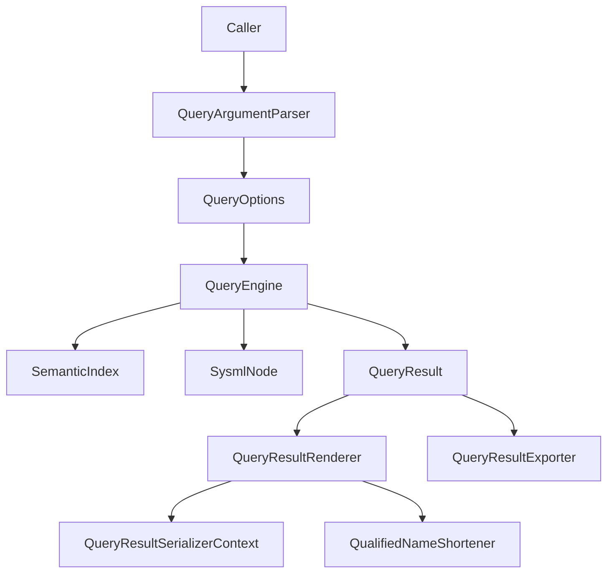

## DemaConsulting.SysML2Tools — Query Subsystem

### Overview

The Query subsystem is Core's public, reusable model-analysis API. It answers 12 fixed
questions over an already-loaded `SysmlWorkspace` and returns a uniform `QueryResult` that
callers can render as Markdown or JSON or write to a file. The Tool project's `query`
command is now only one caller of this subsystem; CLI-only behavior is documented in
`docs/design/sysml2-tools-tool/query.md`.

This subsystem contains the following public types:

- `QueryVerb` / `QueryVerbParsing` — the fixed 12-verb vocabulary, token conversion, and the
  `RequiresElement` rule.
- `QueryOptions` — the immutable option record shared by every verb; Core callers supply an
  already-loaded workspace, so this record has no input-files property.
- `QueryArgumentParser` — parses a token list into `(QueryOptions? Options,
  IReadOnlyList<string> Files)` for callers that accept the same verb/option grammar as the
  CLI.
- `QueryEngine` — the public execution surface: 12 verb methods plus `Execute`, which
  centralizes the verb switch used by both library callers and the CLI adapter.
- `QueryResult`, `QueryResultEntry`, and `QueryEntryDirection` — the verb-agnostic result
  model.
- `QueryResultRenderer` — the shared Markdown/JSON rendering and deterministic sorting layer.
- `QueryResultSerializerContext` — the source-generated `System.Text.Json` context used by
  `RenderJson`.
- `QueryResultExporter` — synchronous and asynchronous file-writing wrappers around the
  renderer.
- `Utilities.QualifiedNameShortener` — the shared prefix-stripping helper used only by the
  `dependencies` verb's Markdown rendering.
- `NamespaceDoc` — the XML-documentation anchor for the `DemaConsulting.SysML2Tools.Query`
  namespace and its public usage pattern.

### Interfaces

**`QueryArgumentParser`**: Shared token parser for query-style callers.

- *Type*: Static class.
- *Role*: Provider.
- *Contract*: `Parse(IReadOnlyList<string> commandArgs, bool helpRequested)` returns a
  `(QueryOptions? Options, IReadOnlyList<string> Files)` tuple. `Files` are returned
  separately because file-glob interpretation is a caller concern, not a Core concern.

**`QueryEngine`**: Workspace analysis entry point.

- *Type*: Static class.
- *Role*: Provider.
- *Contract*: `Execute(SysmlWorkspace workspace, QueryOptions options, SysmlNode? element)`
  dispatches to one of 12 public verb methods. Stateless and thread-safe for concurrent
  read-only use.

**`QueryResult` / `QueryResultEntry` / `QueryEntryDirection`**: Uniform result envelope.

- *Type*: Sealed records plus enum.
- *Role*: Data container.
- *Contract*: `Verb`, optional `Element`, free-form `Summary` lines, and deterministic
  `Entries`; `Direction` is populated only for `dependencies`.

**`QueryResultRenderer`**: Result-to-text renderer.

- *Type*: Static class.
- *Role*: Provider.
- *Contract*: `RenderMarkdown(QueryResult, int depth = 1, string? heading = null)` returns
  Markdown lines; `RenderJson(QueryResult)` returns one indented JSON string.

**`QueryResultExporter`**: Result-to-file writer.

- *Type*: Static class.
- *Role*: Provider.
- *Contract*: `WriteMarkdown`/`WriteMarkdownAsync` and `WriteJson`/`WriteJsonAsync` write the
  exact renderer output to a caller-specified file path.

**`QualifiedNameShortener`**: Shared Markdown compaction helper.

- *Type*: Static class.
- *Role*: Provider.
- *Contract*: `Shorten(IReadOnlyList<string> qualifiedNames)` returns an ordinal-keyed map
  from original qualified names to their shortened forms, retaining every name's leaf segment.

### Design

1. `QueryArgumentParser` validates that the first token is one of the 12 verb tokens, captures
   `--element`/`--format`/`--walk-depth`/`--direction`/`--kind`/`--name`/
   `--include-stdlib`/`--heading`, and returns any trailing positional tokens separately as the
   caller-owned `Files` list.
2. `QueryEngine.Execute` is the public dispatcher. It validates the element-required rule for
   library callers, then routes `QueryOptions.Verb` to the matching verb method so the Tool
   project and any other caller reuse the exact same switch.
3. `Uses` reads outgoing semantic edges from `workspace.Index.GetOutgoingEdges`, filters
   stdlib targets unless `IncludeStdlib` is set, and emits one `QueryResultEntry` per outgoing
   relationship.
4. `UsedBy` reads the reverse index via `workspace.Index.GetIncomingEdges`, applies the same
   stdlib filter to incoming sources, and emits one entry per incoming relationship.
5. `Dependencies` combines `Uses` and `UsedBy` for the same subject, tagging entries with
   `QueryEntryDirection.Outgoing` or `Incoming` rather than performing a third traversal.
6. `Impact` performs a breadth-first transitive closure over incoming edges, optionally bounded
   by `WalkDepth`, with a visited set preventing infinite loops on cyclic graphs.
7. `Describe` reports the target element's own kind and qualified name in `Summary`, then adds
   resolved supertypes, typing, annotations, applied metadata annotations, and a `Children: N`
   count. `N` is the count of visible, named child entries actually placed in `Entries` (i.e.
   direct children with a non-null `QualifiedName` that pass the `IncludeStdlib` visibility
   rule), not the raw `element.Children.Count` - so the stated count always matches the number
   of rows shown, even though non-element children (comments, metadata annotations, imports)
   and, when `IncludeStdlib` is unset, stdlib-seeded children are present in `element.Children`
   but excluded from both the count and the table.
   Metadata values preserve scalar booleans, numbers, and strings directly, while unsupported
   non-scalar values fall back to raw source text so information is never silently dropped.
8. `Hierarchy` walks specialization relationships recursively. `--direction up` follows
   outgoing `Supertype` edges, `down` follows incoming edges, and `both` unions the two walks.
9. `Requirements` reports `Satisfy`, `Verify`, and `Allocate` edges where the subject element is
   either the source or the target, using direction-aware detail text.
10. `Interface` reports direct child features that are ports or have a resolved typing, using
    the feature keyword as `Kind` and typing plus multiplicity as `Detail`.
11. `Connections` walks nodes reachable from workspace declarations because resolved `Connect`
    edges live on each connector node's own `ResolvedEdges` rather than in `SemanticIndex`'s
    global edge list. Entries record the other endpoint, connector keyword, and endpoint role.
12. `States` recursively walks descendants, collecting `state` features and transition children.
    When a resolved `Transition` edge is present it uses that edge's endpoints; otherwise it
    falls back to the transition node's raw source/target text.
13. `List` and `Find` enumerate `workspace.Declarations`, applying the same `IncludeStdlib`
    visibility rule and optional `--kind`/`--name` substring filters. `Find` reuses `List`'s
    filtering behavior; the Tool project owns the CLI-only rule that at least one filter must be
    supplied.
14. `QueryResultRenderer` sorts entries exactly once by `QualifiedName` (ordinal) for both
    Markdown and JSON. All verbs except `dependencies` render Markdown as a heading, optional
    summary bullet list, a verb-specific bold-text label (e.g. `**Children**` for `describe`,
    `**Uses**` for `uses`), and then either the shared table or a verb-specific "no entries"
    fallback line (e.g. `_No children._`) when there are none. Labeling the (possibly empty)
    entries section tells the reader what kind of thing it holds, so a zero-row result reads as
    an unremarkable, expected outcome rather than a broken query. The label is always plain bold
    text, never an ATX heading, so the whole report stays within the single Markdown section
    started by the main heading regardless of the caller's requested heading depth.
    `dependencies` is the one intentional exception: Markdown is rendered as direction-grouped
    prose bullets after shortening the subject and entry names with `QualifiedNameShortener`,
    with no separate label. `RenderJson` never shortens names and uses
    `QueryResultSerializerContext` so the JSON shape remains fully qualified and AOT-safe.
15. `QueryResultExporter` renders first, then writes the exact Markdown or JSON text to the
    caller-supplied file path. Markdown is joined with `"\n"`; no parent-directory creation or
    filesystem-exception translation is performed in Core.

#### Output Model

- `QueryResult` carries `Verb`, optional `Element`, free-form `Summary` lines, and `Entries`.
- `QueryResultEntry` carries `QualifiedName`, optional `Kind`, optional `Detail`, optional
  multi-line `Notes`, and optional `Direction`.
- `QueryEntryDirection` is populated only for `dependencies`, and JSON omits the property when
  it is `null`.
- `QueryResultSerializerContext` contains the source-generated JSON metadata for `QueryResult`
  and preserves the same sorted order used by Markdown rendering.

#### Known Model Gaps

- State-usage bodies containing `accept <Signal> then <state>;` trigger-shorthand transitions
  still inherit a pre-existing grammar and `AstBuilder` limitation: the shorthand transition can
  absorb an adjacent sibling `state` usage instead of producing its own `SysmlTransitionNode`.
  Explicit `transition first X if G then Y;` syntax is unaffected. The Query subsystem reports
  the model it receives; it does not attempt to repair this upstream semantic-model gap.

### Design Constraints

- The subsystem depends only on the loaded semantic model (`SysmlWorkspace`, `SemanticIndex`,
  `SysmlNode`, and resolved `SysmlEdge` data). It does not resolve globs, load files, create a
  workspace, or perform console I/O.
- `QueryOptions` intentionally has no `Files` property. Core callers provide a workspace
  directly, while `QueryArgumentParser` returns trailing positional tokens separately for
  callers that want CLI-style parsing.
- `QueryResultExporter` does not create parent directories and does not catch
  `IOException`/`UnauthorizedAccessException`/`NotSupportedException`; callers own those
  policies.
- Deterministic ordering is centralized in `QueryResultRenderer`; verb methods may emit entries
  in traversal order without affecting external output stability.
- `QualifiedNameShortener` affects only `dependencies` Markdown output. JSON output, and every
  other verb's Markdown output, remains fully qualified.

### Requirements Traceability

| Requirement ID | Satisfied by |
| --- | --- |
| SysML2Tools-Core-Query-Uses | `QueryEngine.Uses` |
| SysML2Tools-Core-Query-UsedBy | `QueryEngine.UsedBy` |
| SysML2Tools-Core-Query-Dependencies | `QueryEngine.Dependencies`; `QueryResultRenderer.RenderMarkdown`/`RenderJson` |
| SysML2Tools-Core-Query-DependenciesNameShortening | `QueryResultRenderer.RenderMarkdown`; `QualifiedNameShortener` |
| SysML2Tools-Core-Query-Impact | `QueryEngine.Impact` |
| SysML2Tools-Core-Query-Describe | `QueryEngine.Describe` |
| SysML2Tools-Core-Query-Hierarchy | `QueryEngine.Hierarchy` |
| SysML2Tools-Core-Query-Requirements | `QueryEngine.Requirements` |
| SysML2Tools-Core-Query-Interface | `QueryEngine.Interface` |
| SysML2Tools-Core-Query-Connections | `QueryEngine.Connections`; `QueryEngine.CollectConnectEdges` |
| SysML2Tools-Core-Query-States | `QueryEngine.States`; `QueryEngine.CollectStates` |
| SysML2Tools-Core-Query-List | `QueryEngine.List` |
| SysML2Tools-Core-Query-Find | `QueryEngine.Find` |
| SysML2Tools-Core-Query-StdlibFilter | `QueryEngine.IsVisible` |
| SysML2Tools-Core-Query-Exporter | `QueryResultExporter.WriteMarkdown`/`WriteJson` (sync and async variants) |
