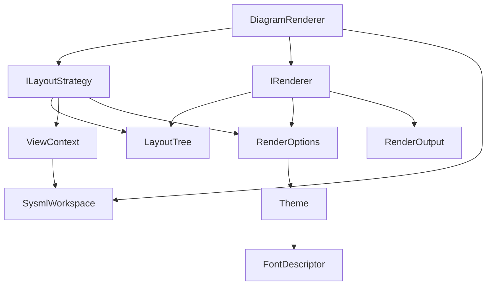

## DemaConsulting.SysML2Tools — Rendering Subsystem

### Overview

The Rendering subsystem defines the interfaces and data types that form the rendering
pipeline for SysML2 Tools. It bridges the Layout subsystem (which produces a `LayoutTree`)
and the concrete renderer packages (`DemaConsulting.SysML2Tools.Svg` and
`DemaConsulting.SysML2Tools.Png`) by declaring the contracts that both sides must satisfy.

The subsystem contains five types: `IRenderer` (low-level render interface), `ILayoutStrategy`
(layout computation interface), `Theme` and `FontDescriptor` (visual configuration), `RenderOptions`
(per-render parameters), `RenderOutput` (render result), and `DiagramRenderer` (orchestrator).

### Interfaces

**IRenderer**: Low-level renderer interface.

- *Type*: Interface.
- *Role*: Consumer.
- *Contract*: `string MediaType { get; }`, `string DefaultExtension { get; }`,
  `void Render(LayoutTree layout, RenderOptions options, Stream output)`. Implementations
  must be pure and stateless and must not access the filesystem. The `Stream output`
  parameter receives all rendered bytes; the caller owns the stream lifetime.

**ILayoutStrategy**: Layout computation interface.

- *Type*: Interface.
- *Role*: Provider.
- *Contract*: `LayoutTree BuildLayout(ViewContext context, RenderOptions options)`.
  Implementations are responsible for all node placement and line routing including A*
  path-finding and even waypoint spacing.

**ViewContext**: Inputs to a layout computation.

- *Type*: Sealed record.
- *Role*: Data transfer object.
- *Contract*: `string ViewName`, `SysmlWorkspace Workspace`.

**Theme**: Visual configuration record.

- *Type*: Sealed record.
- *Role*: Configuration.
- *Contract*: `IReadOnlyList<string> DepthFillColors`, `string StrokeColor`,
  `double StrokeWidth`, `double LineCornerRadius`, `double FontSizeTitle`,
  `double FontSizeBody`, `double LabelPadding`, `FontDescriptor Font`.
  `DepthFillColors` is indexed as `DepthFillColors[depth % count]` to derive the fill
  color for a `LayoutBox` at a given nesting depth.

**FontDescriptor**: Font family and optional embedded resource.

- *Type*: Sealed record.
- *Role*: Configuration.
- *Contract*: `string FamilyName`, `string? EmbeddedResourcePath`. When
  `EmbeddedResourcePath` is `null`, the renderer uses the system font matching
  `FamilyName`.

**Themes**: Static provider of built-in theme instances.

- *Type*: Static class.
- *Role*: Factory.
- *Contract*: Three static read-only properties — `Themes.Light` (screen display),
  `Themes.Dark` (dark-mode screen), `Themes.Print` (black-and-white output).

**RenderOptions**: Per-render configuration.

- *Type*: Sealed record.
- *Role*: Data transfer object.
- *Contract*: `Theme Theme`, `double Scale = 1.0`, `double Dpi = 96.0`,
  `int DepthLimit = 0`. `DepthLimit == 0` means unlimited depth; positive values cap
  the nesting depth rendered.

**RenderOutput**: Single rendered output stream.

- *Type*: Sealed record.
- *Role*: Data transfer object.
- *Contract*: `string SuggestedFileName`, `string MediaType`, `Stream Data`. The
  `SuggestedFileName` includes the file extension but no path component.

**DiagramRenderer**: High-level rendering orchestrator.

- *Type*: Sealed class.
- *Role*: Orchestrator.
- *Contract*: `IReadOnlyList<RenderOutput> RenderWorkspace(SysmlWorkspace workspace, IRenderer renderer, RenderOptions options)`.
  Iterates over all views in the workspace, calls `ILayoutStrategy.BuildLayout` for each,
  then calls `IRenderer.Render` and collects the results. Implementation is deferred to
  Phase 4.

### Design

1. `DiagramRenderer.RenderWorkspace` receives a `SysmlWorkspace` (from the Semantic subsystem),
   an `IRenderer`, and `RenderOptions`. For each view declared in the workspace it constructs
   a `ViewContext`, calls `ILayoutStrategy.BuildLayout` to obtain a `LayoutTree`, then passes
   that tree and the options to `IRenderer.Render`. Each rendered stream is wrapped in a
   `RenderOutput` and collected into the return list.

2. `ILayoutStrategy.BuildLayout` receives a `ViewContext` containing the workspace and the view
   name, plus `RenderOptions` for size and scale hints. It produces a fully resolved
   `LayoutTree` with all waypoints in absolute canvas coordinates.

3. `IRenderer.Render` receives the `LayoutTree` and `RenderOptions` and writes all rendered
   bytes to the supplied `Stream`. It must not perform any layout computation; it only reads
   the tree and translates each node to output-format primitives.

4. `Theme.DepthFillColors` is indexed using modulo arithmetic: `color = DepthFillColors[depth % count]`.
   This ensures valid color selection regardless of nesting depth.

5. `Theme.LineCornerRadius` controls how renderers round orthogonal-line elbows. A value of
   `0.0` produces sharp corners; positive values produce arc-rounded elbows. This applies to
   all `LayoutLine` waypoints including self-loop routing.

### Design Constraints

- `DiagramRenderer`, `IRenderer`, `ILayoutStrategy`, and `ILayoutStrategy` are Phase 3
  interface definitions. All `Render` and `RenderWorkspace` method bodies throw
  `NotImplementedException` until Phase 4 implementation.
- `ViewContext.Workspace` references `SysmlWorkspace` from
  `DemaConsulting.SysML2Tools.Semantic`; the `using` directive `using DemaConsulting.SysML2Tools.Semantic;`
  is required in `ILayoutStrategy.cs` and `DiagramRenderer.cs`.
- `IRenderer` implementations in `DemaConsulting.SysML2Tools.Svg` and
  `DemaConsulting.SysML2Tools.Png` require `<ProjectReference>` entries pointing to
  `DemaConsulting.SysML2Tools.csproj`.

### Requirements Traceability

| Requirement ID | Satisfied by |
| --- | --- |
| SysML2Tools-Core-Rendering-IRenderer | `IRenderer` interface |
| SysML2Tools-Core-Rendering-IRendererStateless | `IRenderer` doc constraint; stub throws `NotImplementedException` |
| SysML2Tools-Core-Rendering-Theme | `Theme` and `FontDescriptor` records |
| SysML2Tools-Core-Rendering-ThemeDepthWrap | `Theme.DepthFillColors` with modulo indexing documented in `Theme` |
| SysML2Tools-Core-Rendering-RenderOptions | `RenderOptions` record with default values |
| SysML2Tools-Core-Rendering-ILayoutStrategy | `ILayoutStrategy` interface and `ViewContext` record |
| SysML2Tools-Core-Rendering-DiagramRenderer | `DiagramRenderer` class stub |
| SysML2Tools-Core-Rendering-RenderOutput | `RenderOutput` record |
| SysML2Tools-Core-Rendering-BuiltinThemes | `Themes.Light`, `Themes.Dark`, `Themes.Print` |
