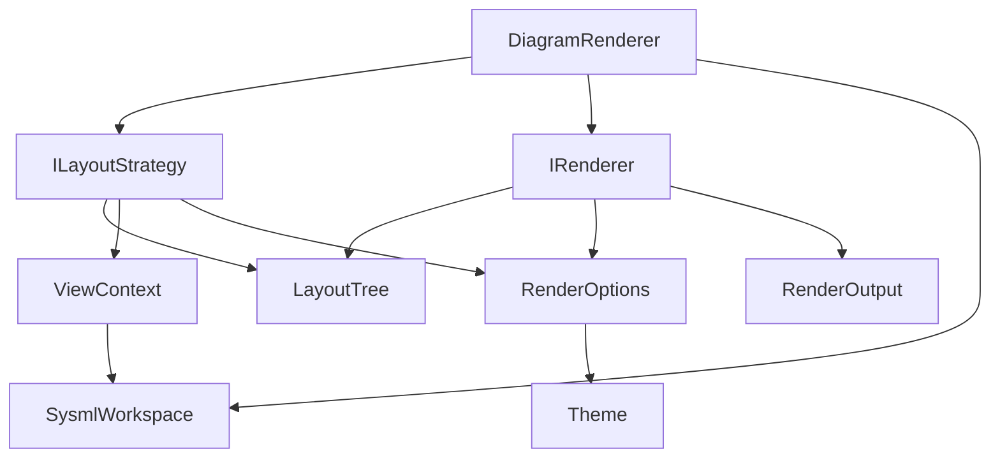

## DemaConsulting.SysML2Tools — Rendering Subsystem

### Overview

The Rendering subsystem wires together the rendering pipeline for SysML2 Tools. It bridges the
Layout subsystem (which produces a `LayoutTree`) and the off-the-shelf renderer packages
(`DemaConsulting.Rendering.Svg` and `DemaConsulting.Rendering.Skia`) using the contracts that
both sides must satisfy.

The SysML-agnostic rendering contracts — `IRenderer` (low-level render interface), `Theme`
(visual configuration), `RenderOptions` (per-render parameters), and `RenderOutput` (render
result) — are provided off-the-shelf by the `DemaConsulting.Rendering.Abstractions` package.
The SysML-coupled types that remain in this subsystem are `ILayoutStrategy` and `ViewContext`
(the layout computation contract) and `DiagramRenderer` (orchestrator), together with the
internal `DiagramTypeRouter` and `StdlibFilter` helpers. SysML2Tools verifies its integration
with the off-the-shelf contracts through its own tests.

### Interfaces

```mermaid
flowchart TD
    DiagramRenderer --> ILayoutStrategy
    DiagramRenderer --> IRenderer
    DiagramRenderer --> SysmlWorkspace
    ILayoutStrategy --> LayoutTree
    ILayoutStrategy --> ViewContext
    ILayoutStrategy --> RenderOptions
    IRenderer --> LayoutTree
    IRenderer --> RenderOptions
    IRenderer --> RenderOutput
    RenderOptions --> Theme
    ViewContext --> SysmlWorkspace
```

**IRenderer**: Low-level renderer interface.

- *Type*: Interface.
- *Role*: Consumer.
- *Contract*: `string MediaType { get; }`, `string DefaultExtension { get; }`,
  `void Render(LayoutTree layout, RenderOptions options, Stream output)`. Implementations
  must be pure and stateless and must not access the filesystem. The `Stream output`
  parameter receives all rendered bytes; the caller owns the stream lifetime.

**ILayoutStrategy**: Layout computation interface.

- *Type*: Interface.
- *Role*: Provider.
- *Contract*: `LayoutTree BuildLayout(ViewContext context, RenderOptions options)`.
  Implementations are responsible for all node placement and orthogonal connector routing,
  producing a fully resolved `LayoutTree`.

**ViewContext**: Inputs to a layout computation.

- *Type*: Sealed record.
- *Role*: Data transfer object.
- *Contract*: `string ViewName`, `SysmlWorkspace Workspace`, `SysmlViewNode? ViewNode = null`.
  `ViewNode` is the view's resolved AST node, giving a layout strategy access to the view's
  declared `render`/`expose`/`filter` body statements. Of these, only `ExposedNames` (and its
  resolved `Expose` edges) drives content scoping — `RenderTargetName` never affects which
  elements are included in the diagram. `RenderTargetName` does, however, drive **strategy
  selection**: `DiagramTypeRouter` recognizes `asTreeDiagram` and `asInterconnectionDiagram` and
  routes to the browser and interconnection strategies respectively ahead of the name/supertype
  heuristic; any other value (including `null`, `asElementTable`, or `asTextualNotation`) remains
  inert, with no corresponding strategy selection or diagnostic. `FilterExpressionText` is
  captured as raw text and not yet evaluated. `ViewNode` is `null` for the `--auto` synthesized
  view, which carries no AST node of its own.

**Theme**: Visual configuration record.

- *Type*: Sealed record.
- *Role*: Configuration.
- *Contract*: `IReadOnlyList<string> DepthFillColors`, `string StrokeColor`,
  `double StrokeWidth`, `double LineCornerRadius`, `double FontSizeTitle`,
  `double FontSizeBody`, `double LabelPadding`, `double ConnectorStub`, `double BendRadius`,
  `double CleanLegMargin`. Font choice is not part of the theme; each renderer hardcodes its own
  typeface internally. `DepthFillColors` is indexed as `DepthFillColors[depth % count]` to derive
  the fill color for a `LayoutBox` at a given nesting depth.

**Themes**: Static provider of built-in theme instances.

- *Type*: Static class.
- *Role*: Factory.
- *Contract*: Three static read-only properties — `Themes.Light` (screen display),
  `Themes.Dark` (dark-mode screen), `Themes.Print` (black-and-white output).

**RenderOptions**: Per-render configuration.

- *Type*: Sealed record.
- *Role*: Data transfer object.
- *Contract*: `Theme Theme`, `double Scale = 1.0`, `double Dpi = 96.0`,
  `int DepthLimit = 0`. `DepthLimit == 0` means unlimited depth; positive values cap
  the nesting depth rendered.

**RenderOutput**: Single rendered output stream.

- *Type*: Sealed record.
- *Role*: Data transfer object.
- *Contract*: `string SuggestedFileName`, `string MediaType`, `Stream Data`, and an
  `IReadOnlyList<string> Warnings` init-only property carrying non-fatal layout-quality
  warnings produced while laying out the view (empty when the layout is clean). The
  `SuggestedFileName` includes the file extension but no path component.

**DiagramRenderer**: High-level rendering orchestrator.

- *Type*: Sealed class.
- *Role*: Orchestrator.
- *Contract*: `IReadOnlyList<RenderOutput> RenderWorkspace(SysmlWorkspace workspace, IRenderer renderer, RenderOptions options)`.
  Iterates over all views in the workspace, routes each view to an `ILayoutStrategy` via
  `DiagramTypeRouter`, calls `ILayoutStrategy.BuildLayout`, then calls `IRenderer.Render`
  and collects the results. Standard-library view declarations are filtered by `StdlibFilter`.

**DiagramTypeRouter**: Internal routing helper.

- *Type*: Internal static class.
- *Role*: Router.
- *Contract*: `static ILayoutStrategy GetStrategy(object viewNode, SysmlWorkspace workspace, out string? unsupportedMessage)`.
  First checks the view's declared `render` target for an exact, case-sensitive match against
  `asTreeDiagram` (routes to `BrowserViewLayoutStrategy`) or `asInterconnectionDiagram` (routes to
  `InterconnectionViewLayoutStrategy`), taking precedence over the heuristic below; any other
  render target value (including none, `asElementTable`, or `asTextualNotation`) falls through
  unchanged. Absent a recognized render target, inspects the view node's name and declared
  supertype names (case-insensitively) for a recognized view-kind marker, in priority order —
  Interconnection, StateTransition/State, ActionFlow/Action, Grid/Matrix/Tabular, Browser/Tree,
  then Sequence — and returns the matching concrete `ILayoutStrategy`, falling back to
  `GeneralViewLayoutStrategy` for unrecognized views or non-view nodes. The `unsupportedMessage`
  out-parameter is reserved for future unsupported view kinds and is currently always null
  because every view resolves to a strategy.

**StdlibFilter**: Standard-library element filter.

- *Type*: Internal static class.
- *Role*: Filter.
- *Contract*: `static bool IsStdlibElement(string qualifiedName)`. Returns `true` when the
  qualified name matches a standard-library prefix. Used by `DiagramRenderer` to exclude
  stdlib view declarations from rendering.

### Design

1. `DiagramRenderer.RenderWorkspace` receives a `SysmlWorkspace` (from the Semantic subsystem),
   an `IRenderer`, and `RenderOptions`. For each view declared in the workspace it constructs
   a `ViewContext`, calls `ILayoutStrategy.BuildLayout` to obtain a `LayoutTree`, then passes
   that tree and the options to `IRenderer.Render`. Each rendered stream is wrapped in a
   `RenderOutput` and collected into the return list.

2. `ILayoutStrategy.BuildLayout` receives a `ViewContext` containing the workspace, the view
   name, and (when available) the view's resolved AST node, plus `RenderOptions` for size and
   scale hints. It produces a fully resolved `LayoutTree` with all waypoints in absolute canvas
   coordinates. All seven layout strategies (`GeneralViewLayoutStrategy`,
   `GridViewLayoutStrategy`, `BrowserViewLayoutStrategy`, `InterconnectionViewLayoutStrategy`,
   `StateTransitionViewLayoutStrategy`, `ActionFlowViewLayoutStrategy`, and
   `SequenceViewLayoutStrategy`) now read `ViewContext.ViewNode` to scope their diagrams, via the
   shared `ExposeScopeResolver` helper: when the view has one or more resolved `Expose` edges,
   each strategy's diagram is scoped to the union of the exposed targets' containment subtrees
   (resolving through a usage's type to its definition's subtree where needed). `GeneralView`,
   `GridView`, and `BrowserView` apply this scope directly as a workspace-wide filter; the four
   single-root strategies (`InterconnectionView`, `StateTransitionView`, `ActionFlowView`, and
   `SequenceView`) additionally use the resolved scope to restrict which single root each one
   selects before narrowing that root's own content. A view with no `Expose` edges renders the
   full workspace (or full root content), unchanged from prior behavior. The view's
   `render`/`filter` statements never affect this scope (see the Layout subsystem's
   *ExposeScopeResolver* unit chapter for the shared scoping algorithm).

3. `IRenderer.Render` receives the `LayoutTree` and `RenderOptions` and writes all rendered
   bytes to the supplied `Stream`. It must not perform any layout computation; it only reads
   the tree and translates each node to output-format primitives.

4. `Theme.DepthFillColors` is indexed using modulo arithmetic: `color = DepthFillColors[depth % count]`.
   This ensures valid color selection regardless of nesting depth.

5. `Theme.LineCornerRadius` controls how renderers round orthogonal-line elbows. A value of
   `0.0` produces sharp corners; positive values produce arc-rounded elbows. This applies to
   all `LayoutLine` waypoints including self-loop routing.

### Design Constraints

- `ViewContext.Workspace` references `SysmlWorkspace` from
  `DemaConsulting.SysML2Tools.Semantic`; the `using` directive `using DemaConsulting.SysML2Tools.Semantic;`
  is required in `ILayoutStrategy.cs` and `DiagramRenderer.cs`.
- The `IRenderer` implementations come from the off-the-shelf `DemaConsulting.Rendering.Svg` and
  `DemaConsulting.Rendering.Skia` packages, referenced by the Tool via `<PackageReference>`.

### Requirements Traceability

| Requirement ID | Satisfied by |
| --- | --- |
| SysML2Tools-Core-Rendering-IRenderer | `IRenderer` interface |
| SysML2Tools-Core-Rendering-IRendererStateless | `SvgRenderer` and `PngRenderer` are pure stateless implementations |
| SysML2Tools-Core-Rendering-Theme | `Theme` record |
| SysML2Tools-Core-Rendering-ThemeDepthWrap | `Theme.DepthFillColors` with modulo indexing documented in `Theme` |
| SysML2Tools-Core-Rendering-RenderOptions | `RenderOptions` record with default values |
| SysML2Tools-Core-Rendering-ILayoutStrategy | `ILayoutStrategy` interface and `ViewContext` record |
| SysML2Tools-Core-Rendering-ViewContextViewNode | `ViewContext.ViewNode` flows to `DiagramRenderer.RenderWorkspace` |
| SysML2Tools-Core-Rendering-DiagramRenderer | `DiagramRenderer.RenderWorkspace`; `DiagramTypeRouter`; `StdlibFilter` |
| SysML2Tools-Core-Rendering-RenderOutput | `RenderOutput` record |
| SysML2Tools-Core-Rendering-BuiltinThemes | `Themes.Light`, `Themes.Dark`, `Themes.Print` |
