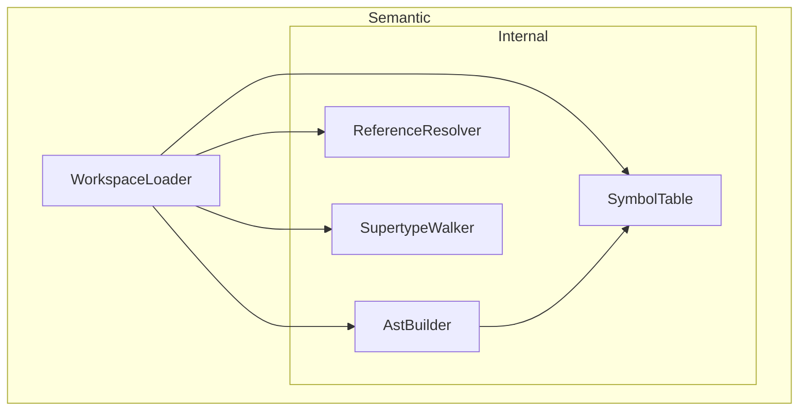

# DemaConsulting.SysML2Tools — Semantic Subsystem

## Overview

The Semantic subsystem builds a semantic workspace from the parsed SysML/KerML source files. It
operates as a second layer above the Parser subsystem, consuming ANTLR4 CSTs produced by
`WorkspaceParser` and transforming them into a structured symbol table with resolved references.

## Architecture

The Semantic subsystem contains one public unit (`WorkspaceLoader`) and an internal subsystem
(`Internal`) containing `AstBuilder`, `SymbolTable`, `ReferenceResolver`, and `SupertypeWalker`.

## External Interfaces

**WorkspaceLoader.LoadAsync**: Loads the embedded stdlib plus every file in the provided
collection asynchronously.

- *Type*: In-process .NET static async method.
- *Role*: Provider.
- *Contract*: Accepts `IEnumerable<string> filePaths`; returns `Task<SysmlLoadResult>` containing
  a `SysmlWorkspace` with all qualified-name declarations and all collected diagnostics. Stdlib
  is loaded and cached; user files are parsed in parallel on the thread pool.
- *Constraints*: `filePaths` must be valid, readable file paths. KerML stdlib parse errors are
  downgraded to Warnings since the SysML v2 grammar does not fully cover KerML syntax.

**SysmlLoadResult**: Aggregate result returned by `WorkspaceLoader.LoadAsync`.

- *Type*: Sealed record.
- *Role*: Data transfer object.
- *Contract*: Exposes `SysmlWorkspace? Workspace`, `IReadOnlyList<SysmlDiagnostic> Diagnostics`,
  and `bool HasErrors`.

**SysmlWorkspace**: Fully-loaded and semantically-resolved workspace.

- *Type*: Sealed class.
- *Role*: Data container.
- *Contract*: Exposes `IReadOnlyList<string> Files` and `IReadOnlyDictionary<string, object> Declarations`
  mapping qualified names to declaration nodes.

## Data Flow

1. `WorkspaceLoader.LoadAsync` awaits the shared `Lazy<Task<StdlibSemanticResult>>` stdlib result.
   On first call the factory fires `Task.Run(BuildStdlibSemanticAsync)`, which reads each stdlib
   resource stream, calls `WorkspaceParser.ParseSourceToCst`, downgradeskerml parse errors to
   Warnings, builds an AST via `AstBuilder`, and registers it into a `SymbolTable`.
2. Concurrently, all caller-supplied file paths are dispatched via `Task.WhenAll`, each parsing
   its content via `WorkspaceParser.ParseSourceToCst`, building an AST, and registering into
   the same `SymbolTable`.
3. `ReferenceResolver.ResolveAll` traverses all AST nodes, checks each supertype name against
   the symbol table, and emits Warning diagnostics for unresolved references. It also builds
   an import graph and performs cycle detection.
4. `SupertypeWalker.WalkAll` traverses specialization chains for all symbols and emits Warning
   diagnostics for cyclic specialization.
5. A `SysmlWorkspace` is constructed from the loaded file list and symbol table, and returned
   in a `SysmlLoadResult`.

## Design Constraints

- KerML stdlib files are parsed with the SysML v2 grammar; any parse errors are downgraded to
  Warnings since the grammar does not fully support KerML-specific syntax.
- The stdlib AST and symbol table are cached in a static `Lazy<Task<>>` and shared across all
  concurrent callers.
- `AstBuilder` is not thread-safe — a separate instance is created for each file.
