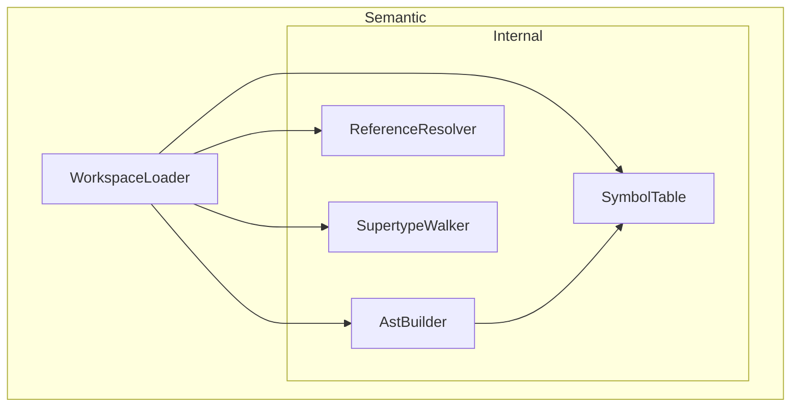

## DemaConsulting.SysML2Tools — Semantic Subsystem

### Overview

The Semantic subsystem builds a semantic workspace from the parsed SysML/KerML source files. It
operates as a second layer above the Parser subsystem, consuming ANTLR4 CSTs produced by
`WorkspaceParser` and transforming them into a structured symbol table with resolved references.

### Interfaces

The Semantic subsystem contains one public unit (`WorkspaceLoader`) and an internal subsystem
(`Internal`) containing `AstBuilder`, `SymbolTable`, `ReferenceResolver`, and `SupertypeWalker`.

**WorkspaceLoader.LoadAsync**: Loads every file in the provided collection asynchronously,
optionally seeded with a pre-populated symbol table.

- *Type*: In-process .NET static async method.
- *Role*: Provider.
- *Contract*: Accepts `IEnumerable<string> filePaths` and an optional `SymbolTable? seedSymbolTable`;
  returns `Task<SysmlLoadResult>` containing a `SysmlWorkspace` with all qualified-name declarations
  and all collected diagnostics. When `seedSymbolTable` is provided, the workspace is initialized with
  a copy of its symbols before processing user files. User files are parsed in parallel on the
  thread pool.
- *Constraints*: `filePaths` must not be null; each path should be a readable file path.

**SysmlLoadResult**: Aggregate result returned by `WorkspaceLoader.LoadAsync`.

- *Type*: Sealed record.
- *Role*: Data transfer object.
- *Contract*: Exposes `SysmlWorkspace? Workspace`, `IReadOnlyList<SysmlDiagnostic> Diagnostics`,
  and `bool HasErrors`.

**SysmlWorkspace**: Fully-loaded and semantically-resolved workspace.

- *Type*: Sealed class.
- *Role*: Data container.
- *Contract*: Exposes `IReadOnlyList<string> Files` and `IReadOnlyDictionary<string, object> Declarations`
  mapping qualified names to declaration nodes.

### Design

1. `WorkspaceLoader.LoadAsync` creates a `SymbolTable` seeded from `seedSymbolTable` via the copy
   constructor `new SymbolTable(seedSymbolTable.Symbols)` when a seed is provided, or creates an
   empty `SymbolTable` when `seedSymbolTable` is `null`.
2. All caller-supplied file paths are dispatched via `Task.WhenAll`, each parsing
   its content via `WorkspaceParser.ParseSourceToCst`, building an AST, and registering into
   the same `SymbolTable`.
3. `ReferenceResolver.ResolveAll` traverses all AST nodes, checks each supertype name against
   the symbol table, and emits Warning diagnostics for unresolved references. It also builds
   an import graph and performs cycle detection.
4. `SupertypeWalker.WalkAll` traverses specialization chains for all symbols and emits Warning
   diagnostics for cyclic specialization.
5. A `SysmlWorkspace` is constructed from the loaded file list and symbol table, and returned
   in a `SysmlLoadResult`.

### Design Constraints

- There is no shared static state; each call to `LoadAsync` creates an independent `SymbolTable`.
- `AstBuilder` is not thread-safe — a separate instance is created for each file.
