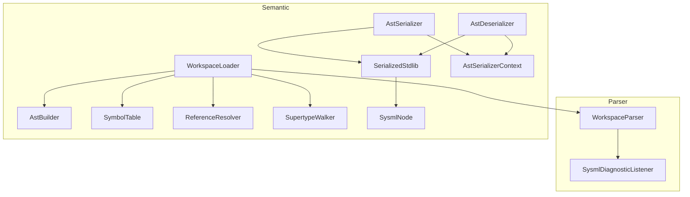

# DemaConsulting.SysML2Tools.Language

## Architecture

The `DemaConsulting.SysML2Tools.Language` library provides the SysML v2 parsing engine,
AST construction, symbol table, reference resolution, supertype walking, and AST
serialization/deserialization for .NET. It is stdlib-agnostic: it parses only the files
explicitly supplied by the caller, optionally seeded with a pre-populated `SymbolTable`.

The library contains two subsystems: **Parser** and **Semantic**. The Parser subsystem
provides syntax-level parsing, while the Semantic subsystem builds a symbol table and performs
reference resolution. The Parser subsystem contains the public API unit (`WorkspaceParser`)
and an internal unit (`SysmlDiagnosticListener`). The Semantic subsystem contains the public
`WorkspaceLoader` unit, serialization units (`AstSerializer`, `AstDeserializer`), and an
internal subsystem with `AstBuilder`, `SymbolTable`, `ReferenceResolver`, `SupertypeWalker`,
`SysmlNode`, `SerializedStdlib`, and `AstSerializerContext`.
Supporting data types (`SysmlLoadResult`, `SysmlWorkspace`) are declared at the `Semantic`
namespace level. `DiagnosticSeverity`, `SysmlDiagnostic`, and `WorkspaceParseResult` remain
in the `Parser` namespace.

## External Interfaces

**WorkspaceParser.ParseSource**: Parses an in-memory source string with a caller-supplied virtual
file path.

- *Type*: In-process .NET static method.
- *Role*: Provider.
- *Contract*: Accepts `string filePath` (virtual or real) and `string content`; returns
  `IReadOnlyList<SysmlDiagnostic>` containing all diagnostics from parsing that single source.
- *Constraints*: None. Both parameters are used as-is; `filePath` appears verbatim in diagnostics.

**WorkspaceLoader.LoadAsync**: Loads the provided user files into a semantic workspace, optionally
seeded with a pre-populated `SymbolTable` (e.g., the pre-compiled stdlib).

- *Type*: In-process .NET static async method.
- *Role*: Provider.
- *Contract*: Accepts `IEnumerable<string> filePaths` and an optional `SymbolTable? seedSymbolTable`;
  returns `Task<SysmlLoadResult>`. When `seedSymbolTable` is provided, the workspace is initialized
  with a copy of its symbols before parsing user files. User files are parsed in parallel on the
  thread pool. Reference resolution and supertype walking run on user file AST roots only.
- *Constraints*: `filePaths` must not be null; each path should be a readable file path.

**AstSerializer.Serialize**: Serializes a `SymbolTable` and diagnostics to a UTF-8 JSON byte array
for embedding as a binary resource.

- *Type*: In-process .NET static method.
- *Role*: Provider.
- *Contract*: Accepts `SymbolTable table` and `IReadOnlyList<SysmlDiagnostic> diagnostics`;
  returns `byte[]` containing the UTF-8 JSON serialization via `AstSerializerContext` source-generator.
- *Constraints*: Neither parameter may be null.

**AstDeserializer.Deserialize**: Deserializes a pre-compiled stdlib binary back to a `SymbolTable`
and diagnostics.

- *Type*: In-process .NET static method.
- *Role*: Provider.
- *Contract*: Accepts `byte[] data` (UTF-8 JSON produced by `AstSerializer.Serialize`); returns
  `(SymbolTable Table, IReadOnlyList<SysmlDiagnostic> Diagnostics)`.
- *Constraints*: `data` must not be null; must be valid UTF-8 JSON in `SerializedStdlib` format.

**SymbolTable**: Registry mapping qualified names to AST declaration nodes.

- *Type*: Public sealed class.
- *Role*: Data container.
- *Contract*: `SymbolTable()` default constructor; `SymbolTable(IReadOnlyDictionary<string, SysmlNode>)`
  copy constructor. `IReadOnlyDictionary<string, SysmlNode> Symbols` property.
  `RegisterAll(SysmlNode? root)` recursively registers all named nodes.

**SysmlNode**: Polymorphic base class for all SysML/KerML AST nodes.

- *Type*: Public abstract class with JSON polymorphism attributes.
- *Role*: Data model.
- *Contract*: Six concrete subtypes: `SysmlPackageNode`, `SysmlDefinitionNode`, `SysmlFeatureNode`,
  `SysmlImportNode`, `SysmlViewNode`, `SysmlViewpointNode`. All are public and JSON-serializable.

**SysmlLoadResult**: Aggregate result record returned by `WorkspaceLoader.LoadAsync`.

- *Type*: Sealed record.
- *Role*: Data transfer object.
- *Contract*: Exposes `SysmlWorkspace? Workspace`, `IReadOnlyList<SysmlDiagnostic> Diagnostics`,
  and `bool HasErrors`.

**SysmlWorkspace**: Semantic workspace containing all registered declarations.

- *Type*: Sealed class.
- *Role*: Data container.
- *Contract*: Exposes `IReadOnlyList<string> Files` and
  `IReadOnlyDictionary<string, SysmlNode> Declarations`.

## Dependencies

- **Antlr4.Runtime.Standard** — ANTLR4 C# runtime; provides `AntlrInputStream`,
  `CommonTokenStream`, `IAntlrErrorListener<T>`, and the infrastructure for running
  the pre-generated `SysMLv2Lexer` and `SysMLv2Parser`. See *ANTLR4 Integration Design*.
- **System.Text.Json** — UTF-8 JSON serialization for `AstSerializer`/`AstDeserializer`
  using source-generated `AstSerializerContext` for AOT-safe polymorphic serialization.

## Risk Control Measures

N/A — not a safety-classified software item.

## Data Flow

1. `WorkspaceLoader.LoadAsync` optionally clones the provided `seedSymbolTable` via the copy
   constructor `new SymbolTable(seedSymbolTable.Symbols)`, or creates an empty `SymbolTable`.
2. All caller-supplied file paths are dispatched to the thread pool via `Task.WhenAll`, each
   reading file content asynchronously and calling `WorkspaceParser.ParseSourceToCst` followed
   by `AstBuilder.Build`; file I/O failures are caught and returned as Error-severity diagnostics.
3. `SymbolTable.RegisterAll` is called for each user AST root, adding qualified-name entries.
4. `ReferenceResolver.ResolveAll` iterates all user AST roots, resolving supertype references
   and emitting Warning diagnostics for unresolved names and circular imports. The import graph
   is built keyed on top-level namespace names (not file paths) to enable name-based cycle detection.
5. `SupertypeWalker.WalkAll` traverses every specialization chain, detecting cyclic specialization
   and emitting Warning diagnostics for detected cycles.
6. A `SysmlWorkspace` is constructed from the loaded file list and symbol table's `Symbols` property,
   and wrapped in a `SysmlLoadResult` with all accumulated diagnostics.

### Serialization Data Flow

1. `AstSerializer.Serialize` wraps the `SymbolTable.Symbols` dictionary and diagnostics in a
   `SerializedStdlib` DTO and calls `JsonSerializer.SerializeToUtf8Bytes` using the source-generated
   `AstSerializerContext.Default.SerializedStdlib` type info.
2. JSON polymorphism is expressed via `[JsonPolymorphic]` and `[JsonDerivedType]` attributes on
   `SysmlNode`, writing a `$type` discriminator for each concrete subtype.
3. `AstDeserializer.Deserialize` reads the byte array using the same context, reconstructing
   the `SymbolTable` via the copy constructor and returning diagnostics.

## Design Constraints

- Platform: multi-targets net8.0, net9.0, and net10.0 on Windows, Linux, and macOS.
- The ANTLR4-generated C# files under `Parser/Antlr/` are committed to the repository and
  must not be manually edited; they are regenerated using `antlr-4.13.1-complete.jar` as
  documented in `Grammar/README.md`.
- `WorkspaceParser` provides syntax-only parsing (CST construction). Semantic model
  construction, symbol table registration, and reference resolution are performed by
  `WorkspaceLoader` in the Semantic subsystem.
- The Language library does NOT embed or load stdlib files; that responsibility belongs to
  `DemaConsulting.SysML2Tools.Stdlib` and the `StdlibGen` build-time tool.
- `SysmlNode` and all subtypes are public to allow cross-assembly serialization and reference
  by `DemaConsulting.SysML2Tools.Core` (Layout/Rendering). Internal implementation units
  (`AstBuilder`, `ReferenceResolver`, `SupertypeWalker`, `SymbolTable`) remain `internal`
  with `InternalsVisibleTo` for `DemaConsulting.SysML2Tools.Tests`, `DemaConsulting.SysML2Tools.Stdlib`,
  and `StdlibGen`.
