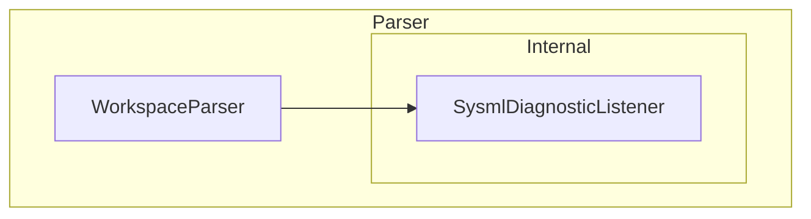

## Parser

### Overview

The Parser subsystem provides syntax-level parsing of SysML v2 source text. It transforms UTF-8
source into an ANTLR4 concrete syntax tree (CST) and collects any syntax errors as structured
`SysmlDiagnostic` records. The subsystem performs no semantic analysis, symbol registration, or
reference resolution; those responsibilities belong to the Semantic subsystem, which consumes the
CST produced here.

The subsystem contains one public unit (`WorkspaceParser`) and one internal unit
(`SysmlDiagnosticListener`). The `DiagnosticSeverity` enum, the `SysmlDiagnostic` record, and the
`WorkspaceParseResult` class are declared at the `Parser` namespace level.

### Interfaces

**WorkspaceParser.ParseSource**: Parses an in-memory source string using a caller-supplied virtual
file path for diagnostic attribution.

- *Type*: In-process .NET static method.
- *Role*: Provider.
- *Contract*: Accepts `string filePath` and `string content`; returns
  `IReadOnlyList<SysmlDiagnostic>` containing every diagnostic produced while parsing that source.
- *Constraints*: `filePath` appears verbatim in each returned diagnostic.

**SysmlDiagnostic**: Structured description of a single syntax problem.

- *Type*: Sealed record.
- *Role*: Data transfer object.
- *Contract*: Exposes `FilePath`, one-based `Line`, zero-based `Column`, a `DiagnosticSeverity`
  value, and a human-readable `Message`.

**WorkspaceParseResult**: Aggregate result of parsing a workspace.

- *Type*: Sealed class.
- *Role*: Data container.
- *Contract*: Exposes `IReadOnlyList<string> Files`, `IReadOnlyList<SysmlDiagnostic> Diagnostics`,
  and a `bool HasErrors` gate that is true when any `Error`-severity diagnostic is present.

### Design

1. `WorkspaceParser.ParseSource` delegates to the internal `ParseSourceToCst`, discarding the CST
   and returning only the accumulated diagnostics.
2. `ParseSourceToCst` constructs an `AntlrInputStream`, a `SysMLv2Lexer`, a `CommonTokenStream`,
   and a `SysMLv2Parser`. It replaces the default ANTLR4 error listeners with a shared
   `SysmlDiagnosticListener` on both the lexer and parser so that lexer and parser errors are
   collected uniformly.
3. The listener appends one `Error`-severity `SysmlDiagnostic` per syntax error, capturing the
   supplied file path, line, and column.

### Design Constraints

- The ANTLR4-generated C# under `Parser/Antlr/` is committed to the repository and must not be
  edited by hand; it is regenerated as documented in `Grammar/README.md`.
- `WorkspaceParser` performs syntax-only parsing. Semantic model construction, symbol
  registration, and reference resolution are performed by `WorkspaceLoader` in the Semantic
  subsystem.
