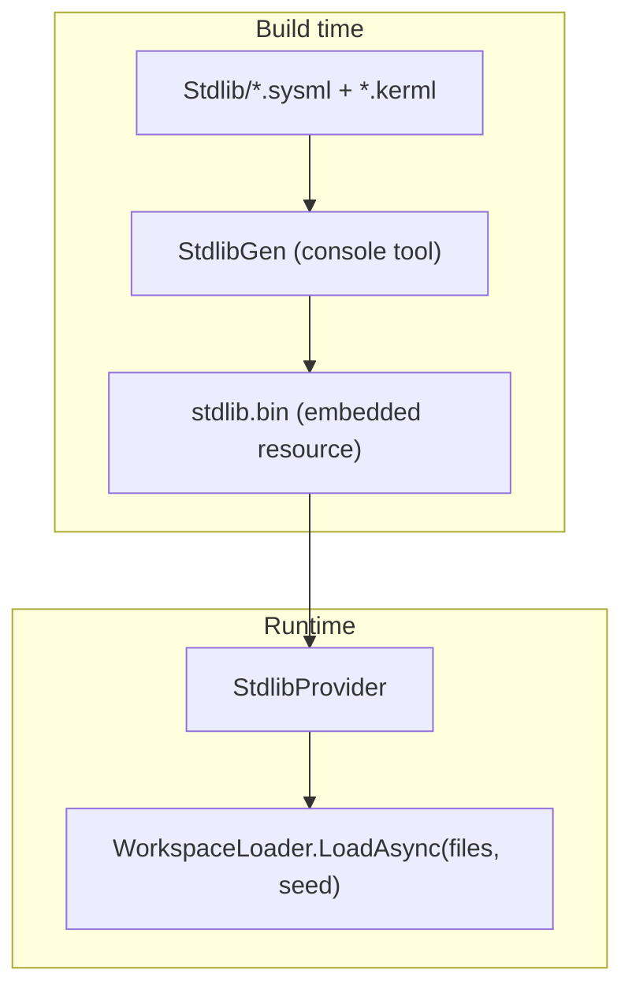

# DemaConsulting.SysML2Tools.Stdlib

## Architecture

The `DemaConsulting.SysML2Tools.Stdlib` library provides the pre-compiled SysML v2 standard
library symbol table as an embedded binary resource. At build time, the `StdlibGen` console
tool parses all stdlib source files (`.sysml` and `.kerml`) from the `Stdlib/` directory,
serializes the resulting `SymbolTable` to `stdlib.bin`, and the Stdlib assembly embeds the
binary via an MSBuild target. At runtime, `StdlibProvider.GetSymbolTable()` deserializes the
embedded `stdlib.bin` resource exactly once (Lazy-cached) and returns the `SymbolTable` for
use as a seed to `WorkspaceLoader.LoadAsync`.

The `StdlibGen` tool is a build-time-only console application that is NOT linked into
`DemaConsulting.SysML2Tools.Stdlib.dll`. It uses `InternalsVisibleTo` access to the Language
assembly's internal types (`WorkspaceParser.ParseSourceToCst`, `AstBuilder`, `ReferenceResolver`,
`SupertypeWalker`).

## External Interfaces

**StdlibProvider.GetSymbolTable**: Returns the pre-compiled stdlib `SymbolTable` and any
diagnostics produced during pre-compilation.

- *Type*: In-process .NET static method.
- *Role*: Provider.
- *Contract*: Returns `(SymbolTable Table, IReadOnlyList<SysmlDiagnostic> Diagnostics)`.
  The result is deserialized once from the embedded `stdlib.bin` resource and cached for the
  lifetime of the application domain. Thread-safe via `Lazy<T>`.
- *Constraints*: The embedded `stdlib.bin` resource must exist; missing resource throws
  `InvalidOperationException`.

## Dependencies

- **DemaConsulting.SysML2Tools.Language** — provides `SymbolTable`, `AstDeserializer`,
  and `SysmlDiagnostic`; also provides `InternalsVisibleTo` access to `StdlibGen` for build.
- **Embedded stdlib.bin** — pre-compiled binary generated by `StdlibGen` at build time from
  the 94 SysML v2 standard library files (58 `.sysml` + 36 `.kerml`) in `Stdlib/`. Licensed
  EPL-2.0. KerML parse errors are downgraded to Warnings by `StdlibGen` because the SysML v2
  grammar does not fully cover KerML-specific syntax.

## Risk Control Measures

N/A — not a safety-classified software item.

## Data Flow

### Build-Time Flow

1. The MSBuild target `GenerateStdlibBin` (declared in `DemaConsulting.SysML2Tools.Stdlib.csproj`,
   `BeforeTargets="PrepareForBuild"`) fires when any `.sysml` or `.kerml` file under `Stdlib/`
   is newer than `$(IntermediateOutputPath)stdlib.bin`.
2. The target first builds `StdlibGen.csproj` with `TargetFramework=net9.0`, then executes:
   `dotnet StdlibGen.dll --stdlib-dir Stdlib/ --output obj/.../stdlib.bin`.
3. `StdlibGen` enumerates all `.sysml` and `.kerml` files, parses each via
   `WorkspaceParser.ParseSourceToCst`, builds ASTs via `AstBuilder.Build`, and registers all
   symbols in a `SymbolTable`. KerML parse errors are downgraded to Warnings.
4. `ReferenceResolver.ResolveAll` and `SupertypeWalker.WalkAll` run on all AST roots.
5. `AstSerializer.Serialize` serializes the `SymbolTable` and diagnostics to UTF-8 JSON bytes
   and writes the result to `stdlib.bin`.
6. The `EmbedStdlibBin` target then adds `stdlib.bin` to `EmbeddedResource` with logical name
   `DemaConsulting.SysML2Tools.Stdlib.stdlib.bin`.

### Runtime Flow

1. On first call to `StdlibProvider.GetSymbolTable()`, the `Lazy<T>` factory fires
   `LoadFromResource()`.
2. `LoadFromResource` opens the embedded `DemaConsulting.SysML2Tools.Stdlib.stdlib.bin` stream,
   reads it into a `MemoryStream`, and calls `AstDeserializer.Deserialize(bytes)`.
3. `AstDeserializer` deserializes the JSON using `AstSerializerContext` source-generated code,
   reconstructs the `SymbolTable` via the copy constructor, and returns diagnostics.
4. The `(SymbolTable, IReadOnlyList<SysmlDiagnostic>)` tuple is cached by the `Lazy<T>`; all
   subsequent calls return the same cached instances without re-reading the resource stream.
5. Callers pass the `SymbolTable` to `WorkspaceLoader.LoadAsync(filePaths, seedSymbolTable)`
   which clones it via the copy constructor before adding user symbols.

## Design Constraints

- Platform: multi-targets net8.0, net9.0, and net10.0 on Windows, Linux, and macOS.
- `StdlibGen` is a net9.0-only console application; it is built via an `<MSBuild>` task with
  `TargetFramework=net9.0` rather than a `<ProjectReference>` (which would cause NETSDK1005
  framework mismatch errors for net8.0/net10.0 builds of the Stdlib project).
- The `stdlib.bin` file is an incremental build output in `$(IntermediateOutputPath)` and is
  NOT committed to the repository; it is regenerated when stdlib source files change.
