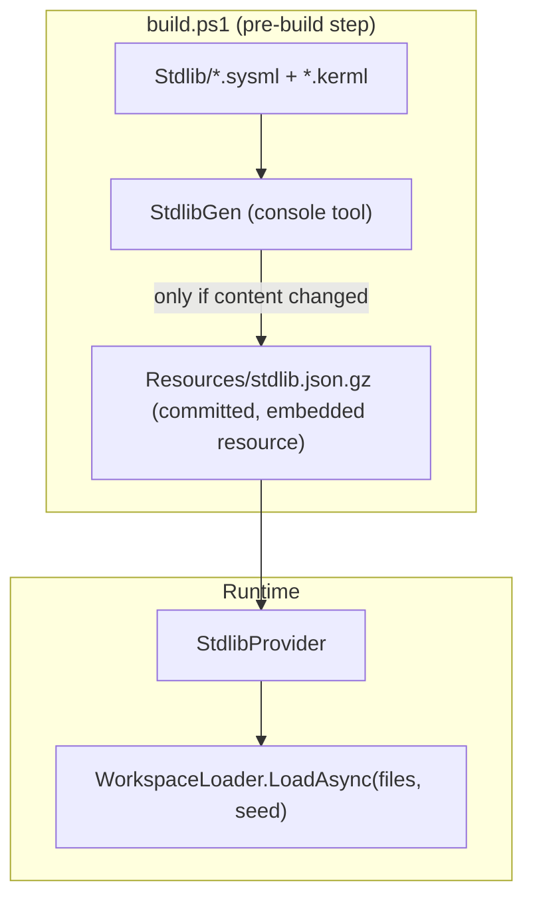

# DemaConsulting.SysML2Tools.Stdlib

## Architecture

The `DemaConsulting.SysML2Tools.Stdlib` library provides the pre-compiled SysML v2 standard
library symbol table as an embedded, gzip-compressed resource. The `StdlibGen` console tool
parses all stdlib source files (`.sysml` and `.kerml`) from the `Stdlib/` directory,
serializes the resulting `SymbolTable` to UTF-8 JSON, gzip-compresses it, and writes the
result to `Resources/stdlib.json.gz`, which is committed to source control and embedded as a
plain, checked-in resource (no build-time generation step). At runtime,
`StdlibProvider.GetSymbolTable()` decompresses and deserializes the embedded
`stdlib.json.gz` resource exactly once (Lazy-cached) and returns the `SymbolTable` for use as
a seed to `WorkspaceLoader.LoadAsync`.

`StdlibGen` is invoked as a plain, sequential step by `build.ps1` before every solution
build — not as a `ProjectReference` or nested MSBuild/Exec call from `Stdlib.csproj`. This
deliberately avoids MSBuild-in-MSBuild coordination between `Stdlib.csproj` and the
`StdlibGen` tool, which previously caused CS2012 file-in-use races and NETSDK1005
restore-corruption errors from nested/recursive builds sharing the `Language.csproj`
dependency with the outer solution build. `StdlibGen` only overwrites its output file when
the content actually changed (comparing gzip-compressed bytes, which are deterministic for
identical input since `GZipStream` writes a fixed zero MTIME header field), so running it on
every build is a cheap no-op except when stdlib source files have actually changed — this
also means `stdlib.json.gz` can never be forgotten or silently go stale.

`StdlibGen` is a standalone console application that is NOT linked into
`DemaConsulting.SysML2Tools.Stdlib.dll`. It uses `InternalsVisibleTo` access to the Language
assembly's internal types (`WorkspaceParser.ParseSourceToCst`, `AstBuilder`, `ReferenceResolver`,
`SupertypeWalker`).

```mermaid
flowchart TD
    subgraph "build.ps1 (pre-build step)"
        StdlibFiles["Stdlib/*.sysml + *.kerml"]
        StdlibGen["StdlibGen (console tool)"]
        StdlibJsonGz["Resources/stdlib.json.gz (committed, embedded resource)"]
        StdlibFiles --> StdlibGen
        StdlibGen -- "only if content changed" --> StdlibJsonGz
    end
    subgraph "Runtime"
        StdlibProvider
        WorkspaceLoader["WorkspaceLoader.LoadAsync(files, seed)"]
    end
    StdlibJsonGz --> StdlibProvider
    StdlibProvider --> WorkspaceLoader
```

## External Interfaces

**StdlibProvider.GetSymbolTable**: Returns the pre-compiled stdlib `SymbolTable` and any
diagnostics produced during pre-compilation.

- *Type*: In-process .NET static method.
- *Role*: Provider.
- *Contract*: Returns `(SymbolTable Table, IReadOnlyList<SysmlDiagnostic> Diagnostics)`.
  The result is decompressed and deserialized once from the embedded `stdlib.json.gz`
  resource and cached for the lifetime of the application domain. Thread-safe via `Lazy<T>`.
- *Constraints*: The embedded `stdlib.json.gz` resource must exist; missing resource throws
  `InvalidOperationException`.

## Dependencies

- **DemaConsulting.SysML2Tools.Language** — provides `SymbolTable`, `AstDeserializer`,
  and `SysmlDiagnostic`; also provides `InternalsVisibleTo` access to `StdlibGen`.
- **Embedded stdlib.json.gz** — pre-compiled, gzip-compressed UTF-8 JSON generated by
  `StdlibGen` from the 94 SysML v2 standard library files (58 `.sysml` + 36 `.kerml`) in
  `Stdlib/`. Licensed EPL-2.0. KerML parse errors are downgraded to Warnings by `StdlibGen`
  because the SysML v2 grammar does not fully cover KerML-specific syntax. Committed to
  source control at `Resources/stdlib.json.gz` (~465 KB compressed, ~7.8 MB uncompressed).

## Risk Control Measures

N/A — not a safety-classified software item.

## Packaging

`DemaConsulting.SysML2Tools.Stdlib` is an independently packable NuGet package
(`IsPackable=true`) with its own `GenerateDocumentationFile` and `DemaConsulting.ApiMark.MSBuild`
(`ApiMarkPackDocs=true`) wiring, so it bundles its own `api/` folder of ApiMark-generated
API reference documentation and the embedded `stdlib.json.gz` resource. Consumers of
`DemaConsulting.SysML2Tools.Core` receive this package transitively via a normal NuGet
`<dependency>` reference — it is not embedded into another package's assembly.

## Data Flow

### Pre-Build Flow (build.ps1)

1. `build.ps1` runs `StdlibGen` (`dotnet run --project src/Tools/StdlibGen`) against the
   `Stdlib/` directory before invoking `dotnet build` for the solution.
2. `StdlibGen` enumerates all `.sysml` and `.kerml` files, parses each via
   `WorkspaceParser.ParseSourceToCst`, builds ASTs via `AstBuilder.Build`, and registers all
   symbols in a `SymbolTable`. KerML parse errors are downgraded to Warnings.
3. `ReferenceResolver.ResolveAll` and `SupertypeWalker.WalkAll` run on all AST roots.
4. `AstSerializer.Serialize` serializes the `SymbolTable` and diagnostics to UTF-8 JSON bytes.
5. `StdlibGen` gzip-compresses the JSON bytes to a uniquely-named temp file, binary-compares
   it against the existing `Resources/stdlib.json.gz` (if any), and either atomically renames
   the temp file into place (content changed) or discards it (content unchanged) — so the
   checked-in file's mtime/git status is untouched when stdlib sources haven't changed.
6. `Stdlib.csproj` embeds the checked-in `Resources/stdlib.json.gz` as a plain
   `EmbeddedResource` item (`LogicalName="DemaConsulting.SysML2Tools.Stdlib.stdlib.json.gz"`,
   `WithCulture=false`) — there is no MSBuild target involved; it behaves like any other
   source-controlled embedded resource.

### Runtime Flow

1. On first call to `StdlibProvider.GetSymbolTable()`, the `Lazy<T>` factory fires
   `LoadFromResource()`.
2. `LoadFromResource` opens the embedded
   `DemaConsulting.SysML2Tools.Stdlib.stdlib.json.gz` stream, decompresses it via
   `GZipStream`, reads it into a `MemoryStream`, and calls `AstDeserializer.Deserialize(bytes)`.
3. `AstDeserializer` deserializes the JSON using `AstSerializerContext` source-generated code,
   reconstructs the `SymbolTable` via the copy constructor, and returns diagnostics.
4. The `(SymbolTable, IReadOnlyList<SysmlDiagnostic>)` tuple is cached by the `Lazy<T>`; all
   subsequent calls return the same cached instances without re-reading the resource stream.
5. Callers pass the `SymbolTable` to `WorkspaceLoader.LoadAsync(filePaths, seedSymbolTable)`
   which clones it via the copy constructor before adding user symbols.

## Design Constraints

- Platform: multi-targets net8.0, net9.0, and net10.0 on Windows, Linux, and macOS.
- `StdlibGen` is not referenced by `Stdlib.csproj` (no `ProjectReference`, no MSBuild task) —
  it is invoked only as a separate, sequential process from `build.ps1`, so it never
  participates in the solution's MSBuild graph or shares in-flight build state with
  `Language.csproj`/`Stdlib.csproj`.
- The embedded resource item must set `WithCulture=false`: MSBuild's `AssignCulture` task
  infers a resource's culture from its filename by splitting on `.`, and names like
  `stdlib.bin.gz` were previously misidentified (`bin` is itself a valid, if obscure, ISO 639
  culture code), silently routing the file into a satellite-culture resources DLL instead of
  the main assembly.
- `Resources/stdlib.json.gz` IS committed to the repository (unlike a typical build output);
  it is regenerated automatically by `build.ps1` whenever stdlib source files change, and the
  update should be committed alongside the source change.
