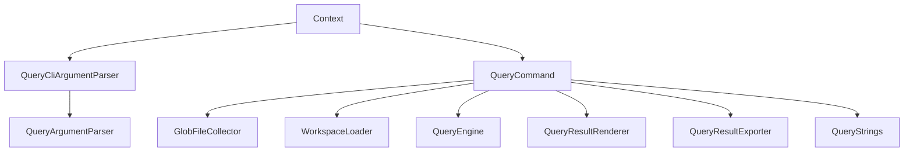

## DemaConsulting.SysML2Tools.Tool — Query Subsystem

### Overview

The Tool Query subsystem is now a thin CLI adapter over Core's public Query API. It owns only
CLI-specific concerns: parsing `query` command tokens, extracting the Tool-only `--output`
flag, resolving file globs, loading the workspace, resolving `--element`, writing stdout or a
single output file, and printing localized help text. Verb semantics, the shared `QueryResult`
output model, deterministic Markdown/JSON rendering, JSON serialization, and the file-writing
helpers themselves live in `docs/design/sysml2-tools-core/query.md`.

This subsystem contains three cooperating types:

- `QueryCliArgumentParser` — pre-scans for the Tool-only `--output <file>` flag, removes those
  two tokens, then delegates the remaining grammar to Core's `QueryArgumentParser`.
- `QueryCommand` — the CLI entry point. It validates CLI-only rules, resolves globs, loads the
  workspace, looks up the target element, delegates execution to `QueryEngine.Execute`, and then
  either writes rendered output to stdout or to `Context.QueryOutput`.
- `QueryStrings` — the culture-aware `.resx` accessor used by `PrintGeneralHelp` and
  `PrintVerbHelp`.

### Interfaces

**`QueryCliArgumentParser`**: Tool-only wrapper around the Core parser.

- *Type*: Static class.
- *Role*: Provider.
- *Contract*: `Parse(IReadOnlyList<string> commandArgs, bool helpRequested)` returns the parsed
  `QueryOptions`, trailing file-glob patterns, and optional output-file path.

**`QueryCommand`**: CLI command orchestrator.

- *Type*: Static class.
- *Role*: Provider.
- *Contract*: `RunAsync(Context)` executes the command; `PrintGeneralHelp` and `PrintVerbHelp`
  render localized help.

**`QueryStrings`**: Localized help-text accessor.

- *Type*: Static class.
- *Role*: Provider.
- *Contract*: `ResourceManager`-backed properties expose every general-help line,
  verb-specific option line, example invocation, and schema hint printed by `QueryCommand`.

### Design

1. `Context.Create` delegates the `query` command's remaining tokens to
   `QueryCliArgumentParser.Parse`. `QueryCliArgumentParser` strips the Tool-only
   `--output <file>` pair, delegates the rest to Core's `QueryArgumentParser`, and stores the
   results on `Context.Query`, `Context.QueryFiles`, and `Context.QueryOutput`.
2. `QueryCommand.RunAsync` performs the CLI-only validation that remains outside Core:
   `--element` is required for element-scoped verbs, `find` requires at least one of
   `--kind`/`--name`, and `--format` must be `markdown` or `json`.
3. The command resolves `Context.QueryFiles` through `GlobFileCollector.Collect`, then loads the
   semantic workspace with `StdlibProvider.GetSymbolTable()` and `WorkspaceLoader.LoadAsync`.
4. For verbs that require a target element, `QueryCommand` resolves `QueryOptions.Element`
   through `workspace.Declarations.TryGetValue`. Missing elements are reported as a CLI error;
   Core never receives a `null` element from this path.
5. The command delegates verb execution to `QueryEngine.Execute`, so the CLI and every library
   caller share the same public Core dispatcher and verb implementations.
6. `QueryCommand` renders results through `QueryResultRenderer.RenderMarkdown` or
   `RenderJson`. Markdown heading depth still comes from the global `Context.HeadingDepth`
   option, and custom heading text still comes from `QueryOptions.Heading`.
7. `PrintGeneralHelp` and `PrintVerbHelp` remain the single source of truth for `query --help`
   and `query <verb> --help`. Every printed line is sourced from `QueryStrings`, including the
   `--output` help text, the workflow note, and the per-verb example/schema-hint enrichment.

#### Pass-Through Options

- `QueryCliArgumentParser` pre-extracts only `--output`; every other token is forwarded verbatim
  to Core's `QueryArgumentParser`, and `Context` stores the resulting `QueryOptions` whole.
  Adding a new Core option therefore requires no parsing change in this subsystem.
- `--include-connections` (connection-aware `impact` analysis, Core's
  `QueryOptions.IncludeConnections`) is exactly such an option: the only Tool-side work is help
  text. `Query_GeneralOptionIncludeConnections` is printed by `PrintGeneralHelp` immediately
  after the `--include-stdlib` line, and `Query_OptionIncludeConnectionsImpact` by
  `PrintVerbHelp`'s `QueryVerb.Impact` arm immediately after `Query_OptionWalkDepthImpact`. Both
  keys live in `QueryStrings.resx` with matching `QueryStrings` accessor properties, as the
  resx-parity tests require.
- Because the Tool does not parse the flag itself, keeping this help text in lockstep with
  Core's accepted grammar is a Tool-subsystem responsibility verified by a dedicated help test;
  a Core-only option with no Tool help line would be silently undiscoverable.

#### Output File Option

- `Context.QueryOutput` is a **file path** (not a directory) from `--output`; when omitted,
  output goes to stdout. This differs in meaning from `render`'s `--output`, which names an
  output *directory* for per-view files — the flag name is reused deliberately (avoiding a
  differently-named flag for "where does output go") but the meaning is documented explicitly
  in both the resource text and help output to prevent confusion between the two commands.
- When `Context.QueryOutput` is non-null, `QueryCommand.RunAsync` creates the parent directory,
  then calls `QueryResultExporter.WriteMarkdownAsync` or `WriteJsonAsync` instead of writing to
  stdout.
- Write failures are caught at the CLI boundary. `IOException`, `UnauthorizedAccessException`,
  and `NotSupportedException` are translated to
  `query <verb>: failed to write output file '<path>': <message>`.
- On success, the command reports `query <verb>: wrote output to '<path>'.`.

### Design Constraints

- The Tool subsystem shall not re-implement verb semantics, result rendering, JSON
  serialization, or Markdown-only name shortening; those are single-source-of-truth Core
  responsibilities documented in `docs/design/sysml2-tools-core/query.md`.
- `QueryCliArgumentParser` is intentionally aware of `--output`; Core's public
  `QueryArgumentParser` is intentionally unaware of it.
- Workspace loading, glob resolution, element lookup, and console/log/file reporting remain in
  the Tool layer because they depend on `Context`, filesystem conventions, and CLI error
  phrasing.

### Requirements Traceability

| Requirement ID | Satisfied by |
| --- | --- |
| SysML2Tools-Tool-Query-VerbGrammar | `QueryCliArgumentParser.Parse`; Core `QueryArgumentParser.Parse` |
| SysML2Tools-Tool-Query-UnknownVerb | Core `QueryVerbParsing.Parse`, surfaced by `QueryCliArgumentParser.Parse` |
| SysML2Tools-Tool-Query-ElementRequired | Element-required check at the start of `QueryCommand.RunAsync` |
| SysML2Tools-Tool-Query-Format | `QueryCommand.RunAsync` format validation |
| SysML2Tools-Tool-Query-NoFilesMatched | Zero-resolved-files guard in `QueryCommand.RunAsync` |
| SysML2Tools-Tool-Query-OutputFormat | `QueryCommand.RunAsync`; `QueryResultRenderer.RenderMarkdown`/`RenderJson` |
| SysML2Tools-Tool-Query-ElementNotFound | Element-lookup check in `QueryCommand.RunAsync` |
| SysML2Tools-Tool-Query-Find | `QueryCommand.RunAsync`'s `find`-filter validation; Core `QueryEngine.Find` dispatch |
| SysML2Tools-Tool-Query-Help | `QueryCommand.PrintGeneralHelp`; `QueryCommand.PrintVerbHelp` |
| SysML2Tools-Tool-Query-LocalizableHelpText | `QueryStrings` accessor, used by `PrintGeneralHelp` and `PrintVerbHelp` |
| SysML2Tools-Tool-Query-ReportHeading | `HeadingDepth`; `QueryOptions.Heading`; `QueryResultRenderer.RenderMarkdown` |
| SysML2Tools-Tool-Query-HelpEnrichment | `QueryStrings.GetExample`/`Query_SchemaHint_*`; workflow-note lines |
| SysML2Tools-Tool-Query-OutputFile | `QueryCliArgumentParser.Parse`; `QueryCommand.RunAsync`; `QueryResultExporter` |
| SysML2Tools-Tool-Query-IncludeConnections | Core `QueryArgumentParser.Parse` pass-through; `QueryStrings` help lines |
