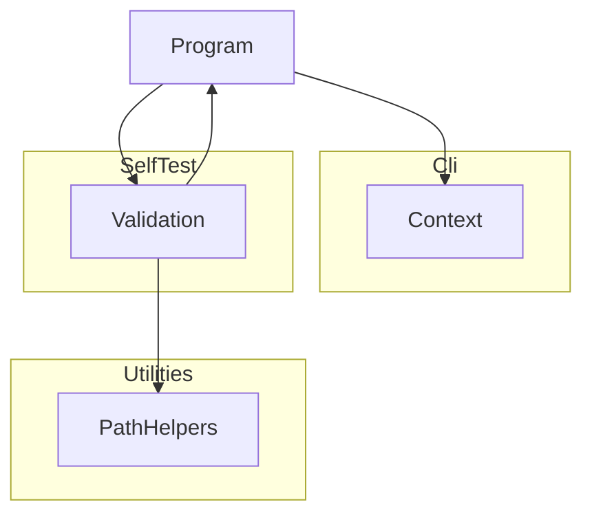

# TemplateDotNetTool

## Architecture

The Template DotNet Tool is a command-line application built on .NET. It is structured as one
system containing one top-level unit (`Program`) and three subsystems (`Cli`, `SelfTest`,
`Utilities`):

`Program` is the entry point. It creates a `Context` from the `Cli` subsystem, dispatches to
`Validation` when `--validate` is passed, and returns the exit code from `Context`. `Validation`
calls `Program.Run` recursively to exercise the tool during self-testing, and uses `PathHelpers`
to construct safe temporary file paths.

## External Interfaces

**Command-Line Interface**: The primary input interface for tool invocation.

- *Type*: CLI.
- *Role*: Consumer (the host environment invokes the system with command-line arguments).
- *Contract*: Accepts arguments `-v`/`--version`, `-?`/`-h`/`--help`, `--silent`, `--validate`,
  `--results <file>`, `--result <file>` (legacy alias for `--results`), `--depth <n>`, and
  `--log <file>`. Returns exit code 0 for success and 1 for failures.
- *Constraints*: Unknown arguments cause exit code 1 and an error message on stderr.

**Standard Output**: Normal program output written to `Console.Out`.

- *Type*: Standard I/O.
- *Role*: Provider.
- *Contract*: Writes version, banner, help text, validation summary, or demo message depending
  on the flags provided. Suppressed when `--silent` is active; the log file still receives all
  output.
- *Constraints*: Human-readable text; no machine-parseable format contract.

**Standard Error**: Error message output written to `Console.Error`.

- *Type*: Standard I/O.
- *Role*: Provider.
- *Contract*: Writes error messages in red when a failure occurs. Suppressed when `--silent`
  is active but the exit code is still set to 1.
- *Constraints*: Color output requires a terminal that supports `ConsoleColor`.

**Log File**: Optional persistent output file.

- *Type*: File.
- *Role*: Provider.
- *Contract*: When `--log <file>` is supplied, all `Context.WriteLine` and `Context.WriteError`
  output is written to the file regardless of `--silent`. The file is truncated at open.
- *Constraints*: The path must be writable; failure to open the file raises an
  `InvalidOperationException` and causes exit code 1.

**Results File**: Optional self-validation results file.

- *Type*: File.
- *Role*: Provider.
- *Contract*: When `--results <file>` is supplied alongside `--validate`, self-validation results
  are serialized to the file. Extension `.trx` selects MSTest TRX format; `.xml` selects JUnit
  XML format.
- *Constraints*: Any other extension causes an error message and exit code 1; no file is written.

## Dependencies

- **DemaConsulting.TestResults**: provides `TestResults`, `TestResult`, and `TestOutcome` for
  accumulating self-validation results.
- **DemaConsulting.TestResults.IO**: provides `TrxSerializer` and `JUnitSerializer` for writing
  results files.

## Risk Control Measures

N/A - not a safety-classified software item.

## Data Flow

1. The host environment starts the tool process and passes command-line arguments to
   `Program.Main`.
2. `Program.Main` calls `Context.Create(args)`, which parses the arguments and opens the log
   file if `--log` was specified. An `ArgumentException` or `InvalidOperationException` at
   this point is caught, written to stderr, and causes exit code 1.
3. `Program.Run(context)` inspects the parsed flags and dispatches to one handler:
   - `--version` flag → `context.WriteLine(Version)`, then return.
   - Otherwise, `PrintBanner` is called first; then:
     - `--help` flag → `PrintHelp(context)`, then return.
     - `--validate` flag → `Validation.Run(context)`.
     - No flags → `RunToolLogic(context)`.
4. `Program.Main` returns `context.ExitCode` (0 if no errors were reported, 1 otherwise).

## Design Constraints

- Platform: multi-targets net8.0, net9.0, and net10.0 framework compatibility specifications on Windows, Linux, and macOS.
- Threading: single-threaded console application; no shared mutable state between invocations.
- Immutability: `Context` properties are set once at construction via `init` accessors and are
  read-only thereafter.
- Resource lifecycle: `Context` implements `IDisposable`; callers must dispose it to flush and
  close any open log file handle.
- Path safety: all caller-supplied path components are validated by `PathHelpers.SafePathCombine`
  before file-system use.
