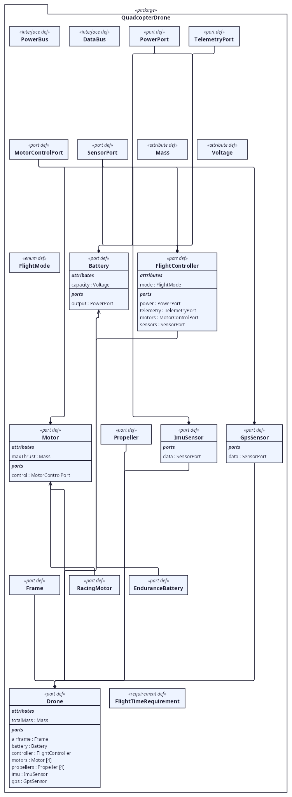
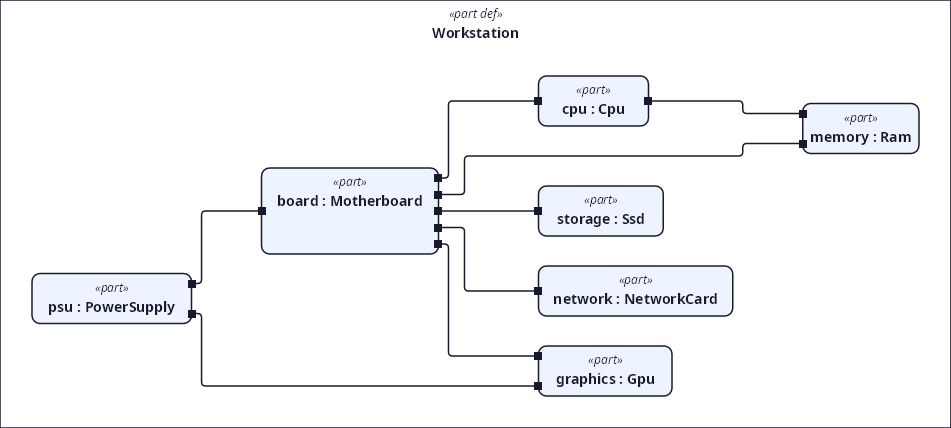
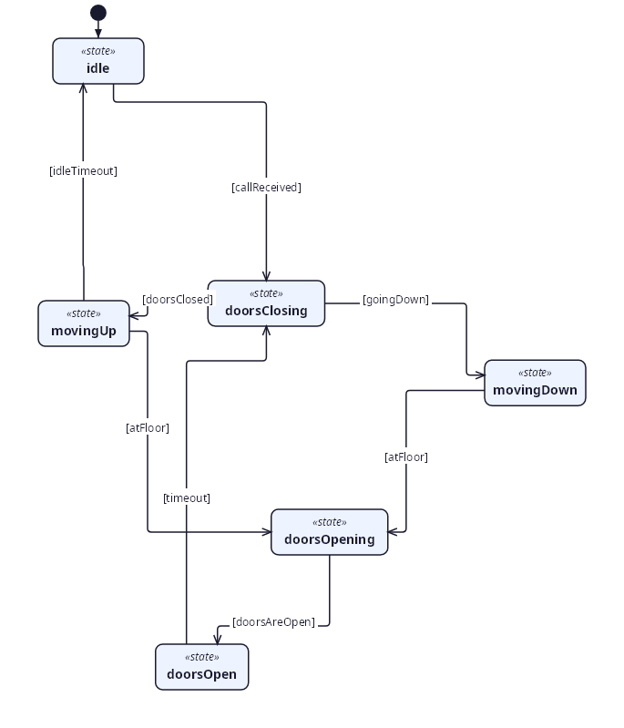
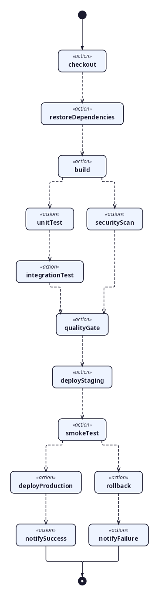
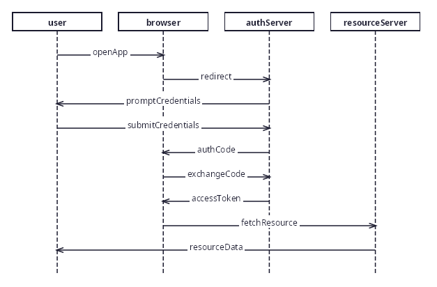
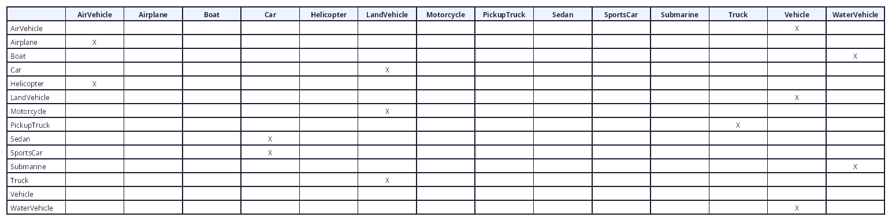
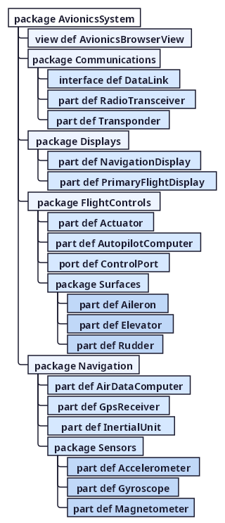

# SysML2Tools Diagram Gallery

This gallery showcases every diagram view type that SysML2Tools can render, each
generated from an interesting example system. Every model is rendered to both
**PNG** (raster, in [`png/`](png/)) and **SVG** (vector, in [`svg/`](svg/)).

All diagrams are produced by the `sysml2tools render` command directly from the
SysML v2 textual models in [`models/`](models/) — no manual layout. The view kind
is selected automatically from each view's name (see the
[rendering roadmap](../../ROADMAP.md) for the dispatch rules).

To regenerate the gallery, run for each model:

```pwsh
sysml2tools render <model>.sysml --format png --output docs/gallery/png
sysml2tools render <model>.sysml --format svg --output docs/gallery/svg
```

---

## 1. General View — Quadcopter Drone

Shows every definition kind (part, port, interface, attribute, enumeration,
requirement) grouped in a package folder, with typed compartments (attributes,
ports, parts) and specialization edges. Definitions are placed by a layered
(ELK-style) engine with orthogonal edge routing.

Model: [`models/01-drone-general.sysml`](models/01-drone-general.sysml) ·
SVG: [`svg/DroneGeneralView.svg`](svg/DroneGeneralView.svg)



---

## 2. Interconnection View — Desktop Workstation

Shows the internal structure of a part: nested part usages placed by the
force-directed engine, ports on box boundaries, and connectors routed between them.
The motherboard sits at the hub of the component connections.

Model: [`models/02-computer-interconnection.sysml`](models/02-computer-interconnection.sysml) ·
SVG: [`svg/WorkstationInterconnectionView.svg`](svg/WorkstationInterconnectionView.svg)



---

## 3. State Transition View — Elevator Controller

Shows states placed top-to-bottom by the layered layout pipeline, an initial pseudo-state, and
guarded transitions routed as orthogonal `[guard]`-labelled arrows.

Model: [`models/03-elevator-state.sysml`](models/03-elevator-state.sysml) ·
SVG: [`svg/ElevatorStateTransitionView.svg`](svg/ElevatorStateTransitionView.svg)



---

## 4. Action Flow View — CI/CD Pipeline

Shows actions arranged top-to-bottom by the layered layout pipeline,
with a start node, a done node, and a quality-gate branch and join.

Model: [`models/04-pipeline-action-flow.sysml`](models/04-pipeline-action-flow.sysml) ·
SVG: [`svg/PipelineActionFlowView.svg`](svg/PipelineActionFlowView.svg)



---

## 5. Sequence View — OAuth 2.0 Login

Shows lifelines for each participant and the ordered messages exchanged during an
OAuth authorization-code login.

Model: [`models/05-oauth-sequence.sysml`](models/05-oauth-sequence.sysml) ·
SVG: [`svg/OAuthSequenceView.svg`](svg/OAuthSequenceView.svg)



---

## 6. Grid View — Vehicle Taxonomy

Shows a specialization relationship matrix: a cell is marked where the row
definition specializes the column definition.

Model: [`models/06-vehicle-grid.sysml`](models/06-vehicle-grid.sysml) ·
SVG: [`svg/TaxonomyMatrixView.svg`](svg/TaxonomyMatrixView.svg)



---

## 7. Browser View — Avionics System

Shows the membership hierarchy of nested packages and definitions as an indented
tree with parent-to-child connectors.

Model: [`models/07-avionics-browser.sysml`](models/07-avionics-browser.sysml) ·
SVG: [`svg/AvionicsBrowserView.svg`](svg/AvionicsBrowserView.svg)



---

## View coverage

| # | View type | Example system | Status |
| --- | --- | --- | --- |
| 1 | General View | Quadcopter Drone | ✅ |
| 2 | Interconnection View | Desktop Workstation | ✅ |
| 3 | State Transition View | Elevator Controller | ✅ |
| 4 | Action Flow View | CI/CD Pipeline | ✅ |
| 5 | Sequence View | OAuth 2.0 Login | ✅ |
| 6 | Grid View | Vehicle Taxonomy | ✅ |
| 7 | Browser View | Avionics System | ✅ |
| 8 | Geometry View | — | Deferred (requires spatial coordinate data) |
