# SysML2Tools Diagram Gallery

This gallery showcases every diagram view type that SysML2Tools can render, each
generated from an interesting example system. Every model is rendered to both
**PNG** (raster, in [`png/`](png/)) and **SVG** (vector, in [`svg/`](svg/)).

All diagrams are produced by the `sysml2tools render` command directly from the
SysML v2 textual models in [`models/`](models/) — no manual layout. Where a
model declares an explicit `render asTreeDiagram;` or `render
asInterconnectionDiagram;` statement (the two rendering kinds SysML2Tools
currently implements), that takes precedence; otherwise the view kind is
inferred from each view's name (see the
[DiagramTypeRouter design](../design/sysml2-tools-core/rendering/internal/diagram-type-router.md)
for the full dispatch rules).

To regenerate the gallery, run for each model:

```pwsh
sysml2tools render <model>.sysml --format png --output docs/gallery/png
sysml2tools render <model>.sysml --format svg --output docs/gallery/svg
```

---

## 1. General View — Quadcopter Drone

Shows every definition kind (part, port, interface, attribute, enumeration,
requirement) grouped in a package folder, with typed compartments (attributes,
ports, parts) and specialization edges. Definitions are placed by a layered
(ELK-style) engine with orthogonal edge routing.

`RacingMotor` also redefines `Motor`'s inherited `maxThrust` attribute
(`attribute :>> maxThrust : Mass;`), demonstrating the hollow-triangle-crossbar
marker used for `redefines`/`:>>` relationships.

Model: [`models/01-drone-general.sysml`](models/01-drone-general.sysml) ·
SVG: [`svg/DroneGeneralView.svg`](svg/DroneGeneralView.svg)

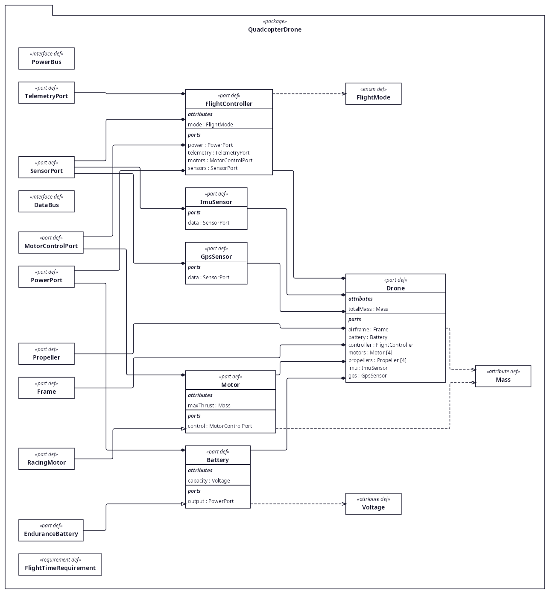

### 1b. View-scoped rendering — `expose` narrows the same model to one subsystem

The same `01-drone-general.sysml` model also declares a second, named `view` usage
that adds an `expose Battery;` statement. Instead of the full workspace, the diagram
is scoped to just the `Battery` definition's containment subtree — demonstrating
that `expose` (not `render`) is what controls diagram content scope. See the user
guide's [Expose vs. Render](../user_guide/introduction.md#expose-vs-render-worked-examples)
section for the full explanation and more worked examples.

Model: [`models/01-drone-general.sysml`](models/01-drone-general.sysml) (`BatterySubsystemView`) ·
SVG: [`svg/BatterySubsystemView.svg`](svg/BatterySubsystemView.svg)

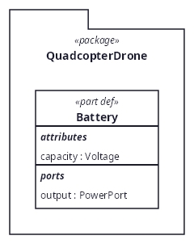

---

## 2. Interconnection View — Desktop Workstation

Shows the internal structure of a part: nested part usages placed by the
interconnection layout engine (a façade over the layered pipeline), ports on box
boundaries, and connectors routed between them.
The motherboard sits at the hub of the component connections. The view declares an
explicit `render asInterconnectionDiagram;` statement, so the interconnection
strategy is selected directly rather than inferred from the view's name.

Model: [`models/02-computer-interconnection.sysml`](models/02-computer-interconnection.sysml) ·
SVG: [`svg/WorkstationInterconnectionView.svg`](svg/WorkstationInterconnectionView.svg)

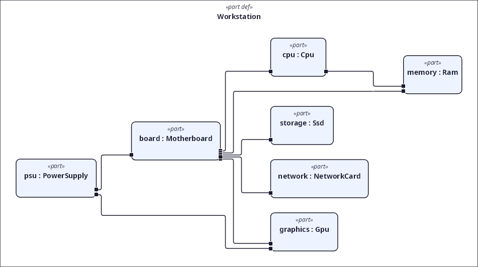

### 2b. View-scoped rendering — `expose` narrows the diagram to two parts

The same model also declares `CoreLinkInterconnectionView`, which exposes only
`Workstation::cpu` and `Workstation::memory`. The root part (`Workstation`) is kept,
but every other part usage — and every connector with an endpoint outside the exposed
scope (to `board`, `graphics`, `storage`, `psu`, `network`) — is dropped, leaving just
the two exposed parts and the connection directly between them (`c8`).

Model: [`models/02-computer-interconnection.sysml`](models/02-computer-interconnection.sysml)
(`CoreLinkInterconnectionView`) ·
SVG: [`svg/CoreLinkInterconnectionView.svg`](svg/CoreLinkInterconnectionView.svg)

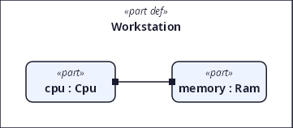

---

## 3. State Transition View — Elevator Controller

Shows states placed top-to-bottom by the layered layout pipeline, an initial pseudo-state, and
guarded transitions routed as orthogonal `[guard]`-labelled arrows.

Model: [`models/03-elevator-state.sysml`](models/03-elevator-state.sysml) ·
SVG: [`svg/ElevatorStateTransitionView.svg`](svg/ElevatorStateTransitionView.svg)

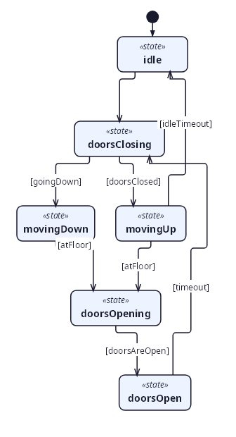

---

## 4. Action Flow View — CI/CD Pipeline

Shows actions arranged top-to-bottom by the layered layout pipeline,
with a start node, a done node, and a quality-gate branch and join.

Model: [`models/04-pipeline-action-flow.sysml`](models/04-pipeline-action-flow.sysml) ·
SVG: [`svg/PipelineActionFlowView.svg`](svg/PipelineActionFlowView.svg)

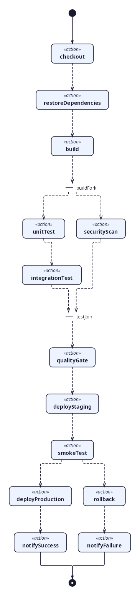

---

## 5. Sequence View — OAuth 2.0 Login

Shows lifelines for each participant and the ordered messages exchanged during an
OAuth authorization-code login.

Model: [`models/05-oauth-sequence.sysml`](models/05-oauth-sequence.sysml) ·
SVG: [`svg/OAuthSequenceView.svg`](svg/OAuthSequenceView.svg)

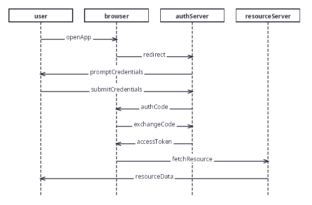

### 5b. View-scoped rendering — `expose` narrows the diagram to two lifelines

The same model also declares `TokenExchangeSequenceView`, which exposes
`AuthorizationFlow::browser` and `AuthorizationFlow::authServer`. Only those two
lifelines remain, and every message with an endpoint on `user` or `resourceServer`
(`openApp`, `promptCredentials`, `submitCredentials`, `fetchResource`, `resourceData`)
is dropped as dangling, leaving just the token-exchange leg of the flow (`redirect`,
`authCode`, `exchangeCode`, `accessToken`).

Model: [`models/05-oauth-sequence.sysml`](models/05-oauth-sequence.sysml) (`TokenExchangeSequenceView`) ·
SVG: [`svg/TokenExchangeSequenceView.svg`](svg/TokenExchangeSequenceView.svg)

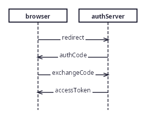

---

## 6. Grid View — Vehicle Taxonomy

Shows a specialization relationship matrix: a cell is marked where the row
definition specializes the column definition.

Model: [`models/06-vehicle-grid.sysml`](models/06-vehicle-grid.sysml) ·
SVG: [`svg/TaxonomyMatrixView.svg`](svg/TaxonomyMatrixView.svg)

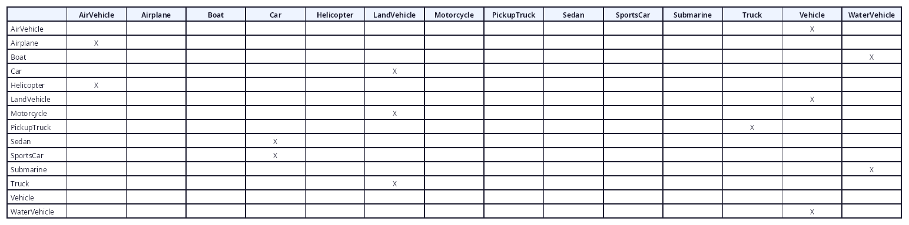

### 6b. View-scoped rendering — `expose` narrows the matrix along specialization

The same model also declares `CarLineageGridView`, which exposes only `Car`. Because
a matrix cell inherently relates two definitions, Grid View keeps a row/column when
either dimension is in scope: `Car` itself, its supertype `LandVehicle`, and its
subtypes `Sedan` and `SportsCar` all remain, while every unrelated definition
(`Vehicle`, `WaterVehicle`, `AirVehicle`, `Truck`, `PickupTruck`, `Motorcycle`,
`Boat`, `Submarine`, `Airplane`, `Helicopter`) is dropped.

Model: [`models/06-vehicle-grid.sysml`](models/06-vehicle-grid.sysml) (`CarLineageGridView`) ·
SVG: [`svg/CarLineageGridView.svg`](svg/CarLineageGridView.svg)

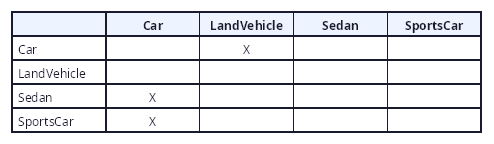

---

## 7. Browser View — Avionics System

Shows the membership hierarchy of nested packages and definitions as an indented
tree with parent-to-child connectors. The view declares an explicit `render
asTreeDiagram;` statement, so the browser strategy is selected directly rather
than inferred from the view's name.

Model: [`models/07-avionics-browser.sysml`](models/07-avionics-browser.sysml) ·
SVG: [`svg/AvionicsBrowserView.svg`](svg/AvionicsBrowserView.svg)

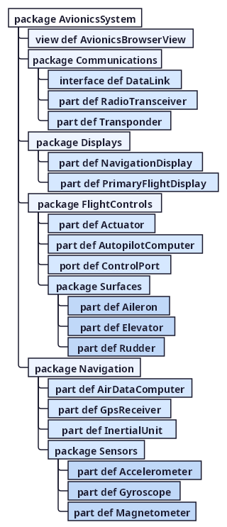

---

## 8. Nested Interconnection View — Computer System

Shows a two-level nested Interconnection View. The `Computer` part contains a `board`
typed by `Motherboard`, which has its own internal `cpu`, `chipset`, and `ram` parts and
connections. The motherboard's interior is laid out recursively (bottom-up) and nested
inside the `board` container box, while the outer power and storage connections route
between the top-level parts. The view declares an explicit `render
asInterconnectionDiagram;` statement, so the interconnection strategy is
selected directly rather than inferred from the view's name.

Model: [`models/08-nested-interconnection.sysml`](models/08-nested-interconnection.sysml) ·
SVG: [`svg/ComputerSystemInterconnectionView.svg`](svg/ComputerSystemInterconnectionView.svg)

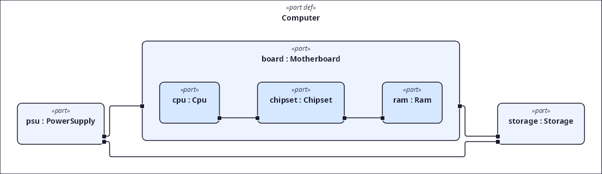

---

## View coverage

| # | View type | Example system | Status |
| --- | --- | --- | --- |
| 1 | General View | Quadcopter Drone | ✅ |
| 2 | Interconnection View | Desktop Workstation | ✅ |
| 3 | State Transition View | Elevator Controller | ✅ |
| 4 | Action Flow View | CI/CD Pipeline | ✅ |
| 5 | Sequence View | OAuth 2.0 Login | ✅ |
| 6 | Grid View | Vehicle Taxonomy | ✅ |
| 7 | Browser View | Avionics System | ✅ |
| 8 | Nested Interconnection View | Computer System | ✅ |
| 9 | Geometry View | — | Deferred (requires spatial coordinate data) |
