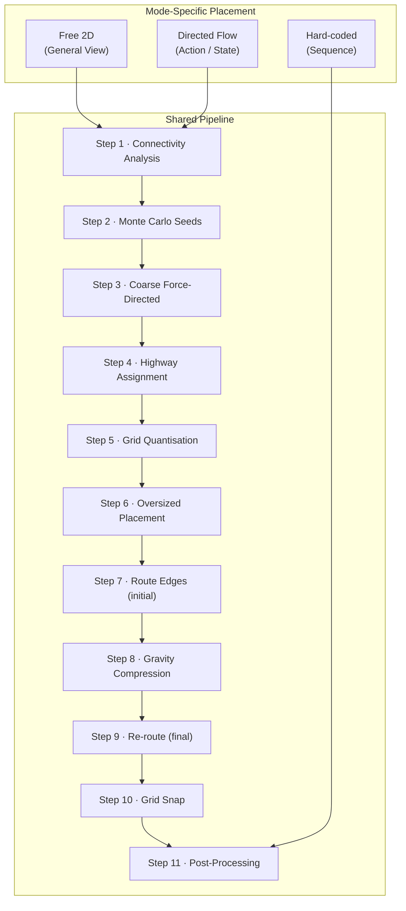
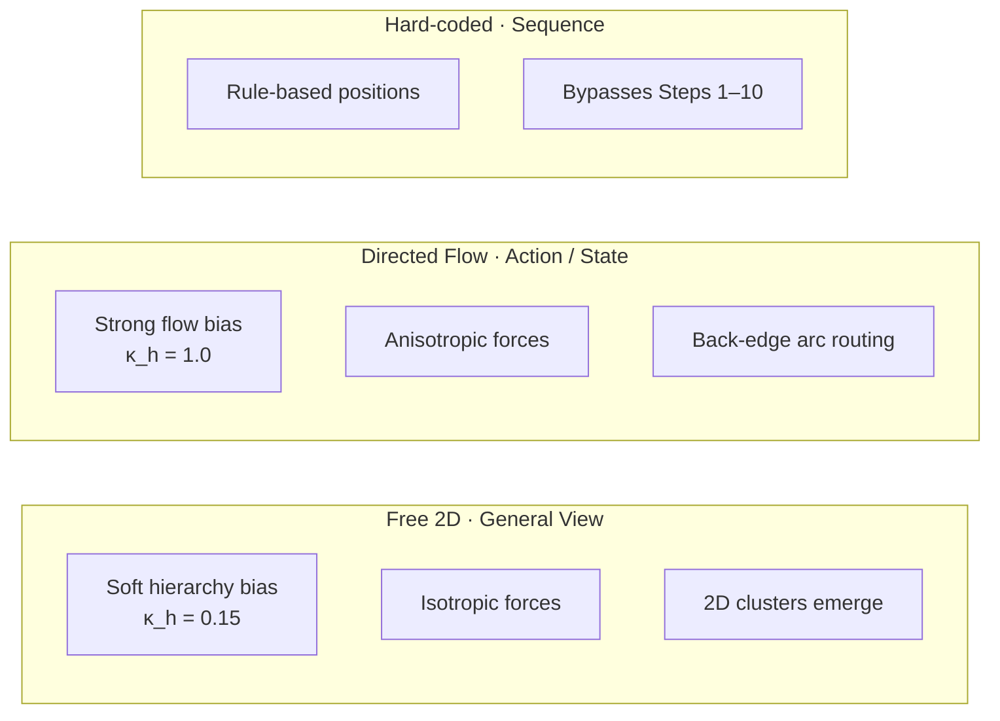

# Algorithm Overview

The algorithm has two layers: a **mode-specific placement phase** and a **shared
pipeline** that all modes feed into.

The three modes share all pipeline steps. They differ in the force parameters used in
Steps 2–3 and in whether back-edge arc routing is active. Hard-coded Sequence View skips
Steps 1–10 entirely and enters at Step 11.

## Three Layout Modes

---
