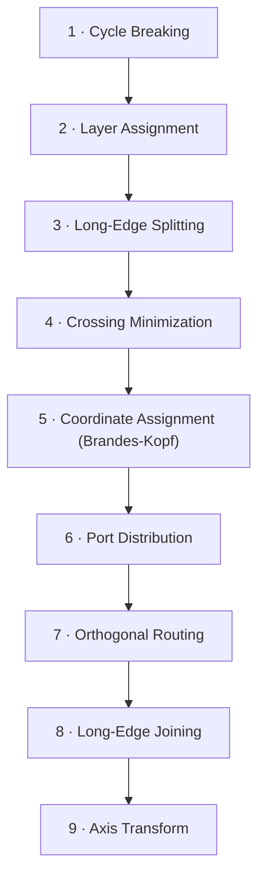
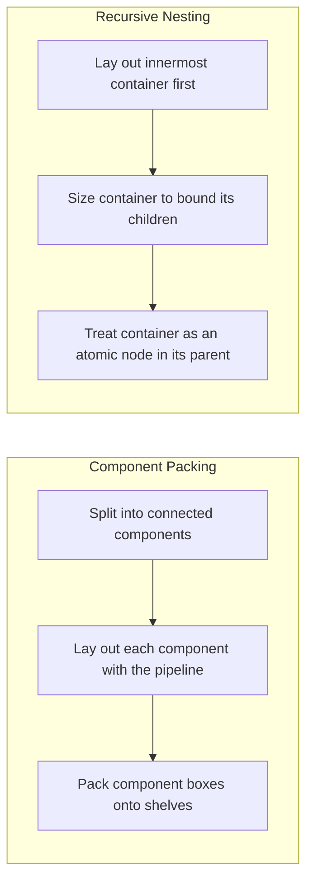

# Algorithm Overview

The core of the layout subsystem is a **layered graph-drawing pipeline** in the style of
Sugiyama, Tagawa & Toda (1981). A graph of nodes and directed edges passes through an ordered
sequence of single-responsibility stages; each stage reads the results of the previous stages
and writes its own contribution to a shared `LayeredGraph`. The stages compute in one canonical
orientation (layers advancing left-to-right) and a final stage maps the result onto the
requested flow direction.

The pipeline's structure follows the well-established layered method and is similar in shape to
the Eclipse Layout Kernel's layered algorithm; the algorithms below are this project's own
independent implementation, cited by their original sources rather than by any particular
library's API.

## The Pipeline

Each stage is summarized below and specified in detail in the *Detailed Algorithm* chapter.

1. **Cycle Breaking** — reverse a small set of back edges so the graph is acyclic (greedy
   depth-first heuristic; Eades, Lin & Smyth, 1993).
2. **Layer Assignment** — assign each node to a discrete layer by longest-path layering.
3. **Long-Edge Splitting** — insert a dummy node per intermediate layer so every edge spans
   exactly one layer.
4. **Crossing Minimization** — reorder nodes within each layer to reduce edge crossings using
   the barycenter heuristic (Sugiyama et al., 1981; Gansner et al., 1993).
5. **Coordinate Assignment** — assign compact, aligned within-layer positions using the
   Brandes-Köpf algorithm (Brandes & Köpf, 2002); layer positions come from corridor widths.
6. **Port Distribution** — distribute connector ports evenly along each node face.
7. **Orthogonal Routing** — route each connector as an orthogonal polyline, assigning distinct
   routing slots in the inter-layer channel so connectors never overlap.
8. **Long-Edge Joining** — reassemble each split edge into a single polyline from source to
   target.
9. **Axis Transform** — map the canonical left-to-right layout onto the requested
   `LayoutDirection` (`RIGHT`, `DOWN`, `LEFT`, or `UP`).

## Wrappers for Disconnected and Nested Graphs

Two concerns sit outside the linear stage sequence:

- **Component packing** (`ComponentPacker`) detects connected components, lays each out
  independently with the pipeline, and packs the results side by side on shelves. A graph that
  is already connected is a transparent pass-through, so single-component output is identical to
  running the stages directly.
- **Recursive nesting** lays a container's interior out first (innermost-first, bottom-up),
  sizes the container to bound that interior, and then treats the container as an atomic node at
  its parent level. In the current code this recursion is driven by the Interconnection View
  strategy, because detecting containers is a semantic-model concern the model-independent
  engine cannot see.

## Parameters

The pipeline is configured by two enumerations:

- **`LayoutDirection`** — `RIGHT`, `DOWN`, `LEFT`, or `UP`; the flow direction applied by the
  final transform.
- **`HierarchyHandling`** — `Flat` (run the pipeline once over one graph). A `Recursive`
  pipeline mode is reserved scaffolding and is not currently wired; nesting is driven at the
  strategy level as described above.

Fixed spacing values (node spacing, minimum corridor width, slot spacing, connector clearance,
and content padding) are single-sourced as shared constants so every stage spaces content
consistently.

---
