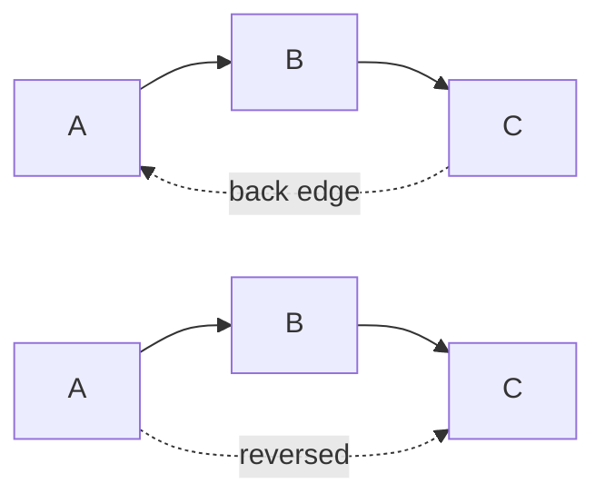
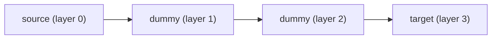
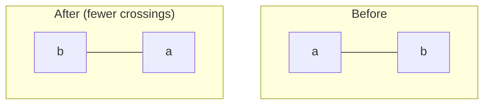
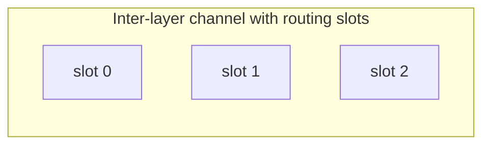

# Detailed Algorithm

This chapter specifies each stage of the layered pipeline. The stages run in the order listed
and communicate through a shared `LayeredGraph`: every stage reads fields written by earlier
stages and writes its own. Unless stated otherwise, a stage computes in the canonical
left-to-right orientation, where *along* is the layer-progression axis and *cross* is the
within-layer axis; the final Axis Transform maps these onto screen coordinates.

Fixed spacing constants referenced below are shared across all stages:

| Constant | Value | Meaning |
| --- | --- | --- |
| `NodeSpacing` | 30 | Gap between nodes stacked within one layer |
| `CorridorMinWidth` | 70 | Minimum spacing between adjacent layers |
| `EdgeSpacing` | 16 | Slot-to-slot spacing within an inter-layer channel |
| `ConnectorClearance` | 10 | Clearance from a node face to the nearest routing slot |
| `Padding` | 20 | Uniform padding around placed content |
| `BarycentricSweeps` | 4 | Number of crossing-reduction sweeps |

## Stage 1 — Cycle Breaking

Layered layout requires a directed acyclic graph, but models contain cycles. This stage makes
the graph acyclic using a greedy depth-first heuristic in the spirit of Eades, Lin & Smyth
(1993): a depth-first traversal classifies any edge pointing to a node still on the recursion
stack as a **back edge**, and each back edge is reversed. Self-loops are dropped and duplicate
edges are removed. The stage records which retained edges were produced by reversal so the
connector emitter can later restore the original orientation (and draw the arrowhead on the
correct end).



**Outputs**: the acyclic edge set and a parallel flag marking reversed edges.

## Stage 2 — Layer Assignment

Each node is assigned to a layer (rank) by **longest-path layering** over the acyclic graph.
Sources — nodes with no incoming edges — sit at layer 0, and every other node is placed one
layer beyond the deepest of its predecessors:

```text
layer[v] = max(layer[u] + 1) over all edges u → v
```

The computation is a single topological pass (Kahn's algorithm), so it is linear in the number
of nodes and edges. The result is the minimum number of layers consistent with edge direction.

## Stage 3 — Long-Edge Splitting

After layering, an edge may span more than one layer. This stage restores the invariant that
every edge connects adjacent layers by inserting one zero-size **dummy node** at each
intermediate layer, turning a long edge into a chain of unit-span sub-edges:



The dummy chain gives the crossing-minimization and routing stages a concrete node to order and
a concrete point to route through in every intermediate layer. The dummies are removed again by
Long-Edge Joining once routing is complete. An edge of unit span is passed through unchanged.

## Stage 4 — Crossing Minimization

Within each layer the node order determines how many edge crossings appear in the adjacent
channels. This stage reduces crossings with the **barycenter heuristic** (Sugiyama et al.,
1981; Gansner et al., 1993): each node is repositioned to the average position of its neighbors
in the adjacent layer, and the layer is sorted by that barycenter value.

The stage performs `BarycentricSweeps` (four) alternating sweeps — forward sweeps order each
layer against the layer to its left, backward sweeps against the layer to its right. A node with
no neighbors in the reference layer keeps its current relative position, and ties break by
original index, so the result is deterministic. The sweep count is fixed rather than run to
convergence, because barycenter ordering can oscillate between two equal-crossing orderings.



## Stage 5 — Coordinate Assignment

This stage assigns absolute coordinates. It is the only stage that turns discrete layers and
orderings into real positions.

**Cross-axis (within-layer) positions** follow the **Brandes-Köpf** balanced algorithm (Brandes
& Köpf, 2002). Four independent alignments are computed — combining the two vertical sweep
directions with the two horizontal preferences — each aligning nodes into vertical **blocks**
through their median neighbors and then compacting the blocks apart by the minimum separation.
The four candidate positions for each node are combined by averaging their medians, producing a
compact, port-aligned assignment that favors straight edges without letting any single alignment
dominate.

**Along-axis (layer) positions** place each layer just far enough beyond the previous one to
hold both the widest node in the previous layer and the channel needed for the connectors
crossing between them. The channel width grows with the number of sub-edges in that channel:

```text
corridorWidth = max(CorridorMinWidth, 2 · ConnectorClearance + (subEdges − 1) · EdgeSpacing)
layerPos[l]   = layerPos[l − 1] + maxNodeExtent[l − 1] + corridorWidth
```

Within a layer, dummy nodes are centered in the channel while real nodes align to the layer's
start edge, which keeps long-edge chains straight through the intermediate layers.

## Stage 6 — Port Distribution

Every connector attaches to a node at a **port** on one of its faces. This stage distributes
ports evenly along the relevant faces: outgoing sub-edges are spread across the node's
downstream face and incoming sub-edges across its upstream face, spaced so multiple connectors
on the same face are separated rather than stacked at the face midpoint. The stage records the
source-side and target-side attachment coordinate for every sub-edge, which the router consumes.

## Stage 7 — Orthogonal Routing

Each connector is drawn as an **orthogonal polyline** — axis-aligned segments joined at right
angles. Within the channel between two layers, a connector that must change its cross-axis
position does so on a single vertical jog placed in an assigned **routing slot**:

```text
slotPosition = channelStart + slot · EdgeSpacing
```

Slots are assigned by **topological numbering** over a dependency graph of segment pairs: when
two connectors' vertical extents overlap such that routing them in the wrong order would force a
crossing, a dependency orders their slots. Each segment's slot is one past the maximum of its
predecessors' slots, so connectors that would otherwise share a vertical line are separated into
distinct slots and can never overlap or share a segment. A connector whose endpoints already
align on the cross axis is drawn straight and consumes no slot.



Routing is **decoration-aware**: for a reversed (back) edge, whose end marker is drawn on the
real node's face, the final approach segment is pushed out far enough that the rounded corner
never intrudes into the arrowhead decoration. This adjustment only ever moves a jog outward and
is a no-op for forward edges, so ordinary connectors are unaffected. All routing is computed in
canonical coordinates, so the same logic serves every flow direction.

## Stage 8 — Long-Edge Joining

The dummy chains introduced in Stage 3 are now collapsed. For each original edge, the stage
concatenates the bend points of its sub-edges in source-to-target layer order into a single
polyline that runs from the source face, through each intermediate channel, to the target face.
The dummy nodes themselves are discarded; only the polyline remains.

## Stage 9 — Axis Transform

Every preceding stage computed in the canonical left-to-right orientation. This final stage maps
those canonical coordinates onto the requested `LayoutDirection`:

- **`RIGHT`** is the identity — coordinates are already in screen space.
- **`LEFT`** reflects the along axis.
- **`DOWN`** and **`UP`** exchange the along and cross axes so layers progress vertically. For
  these directions the input node sizes are normalized (width and height swapped) before the
  stages run, so layer spacing is driven by node height.

Isolating all direction handling in this single stage is what lets the other eight stages remain
direction-agnostic and share one implementation across all four flow directions.

---
