# Introduction

This document is the technical reference for the SysML2Tools layout pipeline. It
describes the algorithms used to place blocks, route connectors, and produce readable
diagrams from a SysML v2 model. It is intended for contributors extending or maintaining
the layout subsystem and for reviewers evaluating algorithmic correctness.

The layout pipeline converts a parsed SysML v2 workspace into a `LayoutTree` — an
intermediate representation of positioned boxes, routed lines, and labels — which the SVG
and PNG renderers then paint. The pipeline is responsible for every spatial decision: where
blocks sit, how connectors route between them, and how much space separates them.

## Relationship to Other Documents

| Document | Covers |
|---|---|
| User Guide | CLI usage, output formats, view selection |
| Design (`docs/design/`) | Per-component architecture and interfaces |
| Verification (`docs/verification/`) | Test scenarios and acceptance criteria |
| This document | Layout algorithms, engine catalog, per-view analysis |

---

# Design Goals

The layout pipeline aims to produce diagrams with the following properties. These goals
are partly contradictory and collectively NP-Hard to optimise globally; the algorithm
approximates them through a principled pipeline.

- Blocks with high mutual connectivity are near each other — no long connector journeys
- Blocks that connect directly tend to be orthogonally aligned so connectors are straight
  (zero bends)
- Every gap between blocks is exactly wide enough for its connectors — not a pixel wasted,
  not a pixel short
- Connectors never cross, or if they must, crossing count is provably minimal
- Connectors have the minimum possible number of bends (ideally zero or one)
- Parallel connectors through a channel are equidistant — clean even spacing, not bunched
- Connectors from the same source merge into a shared trunk then branch — like a bus bar
- Connectors converging on the same target arrive at a shared stub
- The canvas is compact and balanced — no large empty regions, reasonable aspect ratio
- An implicit grid emerges — blocks align to invisible grid lines, connectors run along them
- The hierarchy is immediately visually obvious — levels readable at a glance
- Relationship semantics are spatially consistent — specialization flows one direction
- Labels never overlap each other, blocks, or connectors
- No connector detours unnecessarily — paths are the shortest available route
- Blocks within the same package cluster visually
- Small model changes produce small layout changes — layout stability

---

# Constraints

## SysML Specification Constraints

The SysML v2 specification constrains *notation* (arrowhead shapes, line styles,
compartment structure) but does **not** mandate block positions or connector routing for
any view type, with one exception:

**Sequence View**: lifelines are vertical swimlanes arranged horizontally; time flows
strictly downward. This is a hard notation constraint. The Sequence View layout is
rule-based and bypasses the placement algorithm entirely.

## Axis Symmetry

All layout operations treat X and Y identically unless there is explicit semantic reason
not to. The only permitted axis bias is the soft hierarchical reading-direction preference.
Specifically:

- Congestion measurement covers both axes
- Gap compression is applied on both axes simultaneously
- Force fields are isotropic unless a directional bias parameter is explicitly set

## Reading Direction Convention

The following are strong conventions (not spec requirements) encoded as soft forces:

- Specialization and composition hierarchies read top-to-bottom
- Action flow and state machine execution reads top-to-bottom or left-to-right

---

# Algorithm Overview

The algorithm has two layers: a **mode-specific placement phase** and a **shared
pipeline** that all modes feed into.

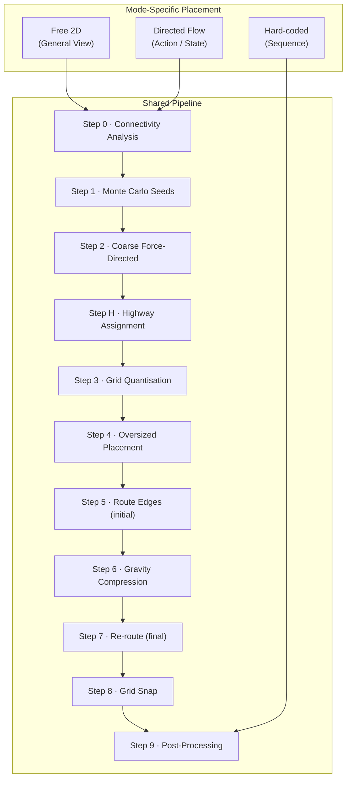

The three modes share all pipeline steps. They differ in the force parameters used in
Steps 1–2 and in whether back-edge arc routing is active. Hard-coded Sequence View skips
Steps 0–8 entirely and enters at Step 9.

## Three Layout Modes

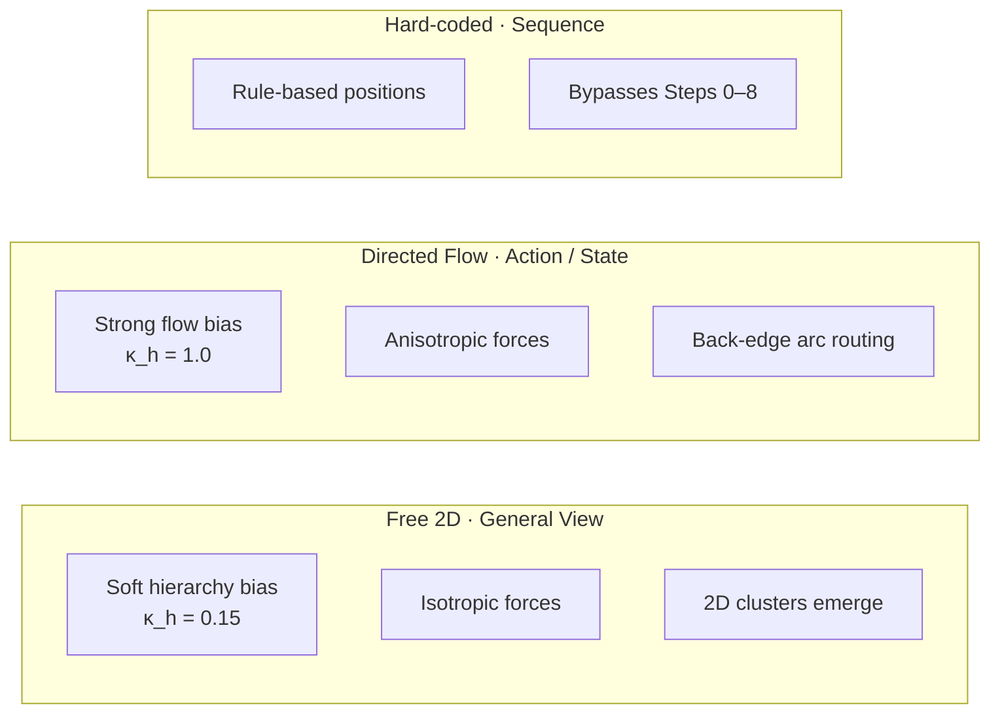

---

# Detailed Algorithm

## Step 0 — Connectivity Analysis

Before any geometry is computed, analyse the graph topology.

**Affinity weight** between every block pair:

```
W(A, B) = edge_count(A, B) × 3
        + package_co_membership(A, B) × 1
        + shared_supertype(A, B) × 2
```

Affinity is structurally **sparse** — `W > 0` only for pairs that share an edge, a
package, or a supertype. It is therefore stored as an **adjacency list built directly
from the edge / membership / supertype lists in O(m)**; the dense n² matrix is never
materialised.

**Layer hint** per block: distance from the root(s) of the specialization/composition
hierarchy. Leaf blocks (no outgoing hierarchy edges) sit at layer 0 (top).

**Natural clusters**: identified by **community detection** (label-propagation, with a
Louvain refinement for large graphs) on the affinity graph. Edges are admitted to the
graph at a *relative* threshold — the top tertile of positive pair weights — so the
clustering is scale-invariant. Community detection (rather than the older
"maximal group where W(A,B) > threshold for *all* pairs" clique rule) is required because
the clique rule cannot group a hub-and-spoke shape: in a specialization fan the
subtype-to-subtype affinity is zero, so a clique rule never recognises the fan, whereas
community detection correctly assigns the hub and its leaves to one community. Cluster
membership biases the Monte Carlo seed generation and the coarse placement.

**Outputs**: sparse affinity adjacency, layer hints, cluster (community) membership list.

**Complexity**: O(m·α(n)) for affinity and clustering (sparse). No dense n² pass. For
very large views (> `N_max` ≈ 300 blocks) the pipeline lays out communities as super-nodes
first, then each community's interior independently, bounding cost while preserving
locality.

---

## Step 1 — Monte Carlo Seed Generation

**Directed Flow mode**: block ordering within layers determines crossing count.

- Generate `K = clamp(5, 2 × max_layer_width, 30)` random initial orderings per layer,
  keeping clustered blocks adjacent. `K` scales with graph size: tiny graphs do not waste
  seeds, large graphs get enough exploration.
- From each seed, apply barycenter crossing minimisation for a **fixed budget of 8
  down+up sweeps**, keeping the best-seen ordering by crossing count. Barycenter is *not*
  run "to convergence" — it can cycle between two equal-crossing orderings, so the budget
  is fixed and the best result retained.
- Score: `crossings × 10 + total_wire_length_estimate`
- Keep best S = 3 orderings as seeds for Step 2

**Free 2D mode**: generate `K = clamp(5, ⌈√n⌉, 30)` random 2D position clouds.

- Positions are biased: blocks in the same cluster start within `cluster_radius` of each
  other; layer hint provides a soft initial y-band. Coincident seed positions are jittered
  deterministically (by node index) so the repulsion force is never singular.
- All K seeds proceed to Step 2; Step 2 culls to the best

**Complexity**: O(K × n × m). Fast — pure graph arithmetic, no geometry.

---

## Step 2 — Coarse Force-Directed Relaxation

Place blocks on a coarse grid whose **cell size is an integer multiple of the fine grid
unit G** — `cell = round(4 × avg_block / G) × G`. Run Fruchterman-Reingold relaxation at
coarse resolution. An integer cell guarantees the coarse→fine mapping in Step 3 is an
exact rescale with no interpolation drift.

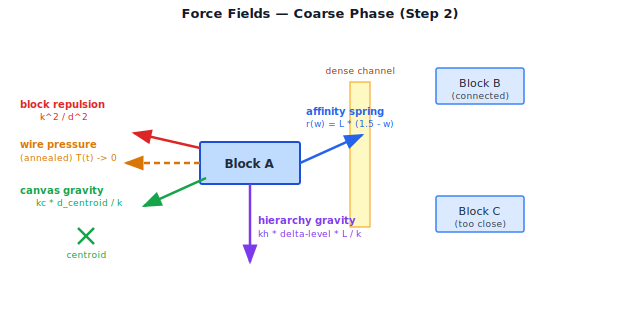

**Dimensionless force model.** All forces are expressed relative to a *characteristic
length* and a *normalised affinity*, so behaviour is invariant to theme scale, block size,
and graph density:

```
L      = mean(block_diagonal) + EdgeClearance      (characteristic spacing unit)
ŵ(A,B) = W(A,B) / W_max ∈ (0,1]                     (normalised affinity)
k      = L                                          (FR optimal distance)
r(ŵ)   = L × (1.5 − ŵ)                              (spring rest length)
```

With this rest length a strongly-connected pair settles ≈ 0.5 L apart and a weakly-
connected pair ≈ 1.5 L apart — equilibrium spacing now scales with block size and
`EdgeClearance`, which the older rest-length-free spring did not (it produced a spacing
independent of block size, causing systematic overlap).

| Force | Formula | Purpose |
|---|---|---|
| Affinity spring | `(d − r(ŵ)) / k` toward rest length | Pull connected blocks to a size-aware distance |
| Hierarchy gravity | `κ_h × (Δlevel·L − Δy) / k` | Soft reading-direction bias (dimensionless ratio) |
| Block repulsion | `k² / d` (d clamped at `d_min`) | Prevent overlap; comparable to spring at `d ≈ k` |
| Canvas gravity | `κ_c × d_from_centroid / k` inward | Compact toward target radius `√n · L` |
| Wire pressure | `κ_w × T(t) × (load − minor_capacity)·G / k` | Open dense channels early; **annealed** |

**Wire pressure is annealed** — scaled by the cooling temperature `T(t)` — so it acts
strongly early (to open channels) and decays to zero as the system cools. This removes the
limit-cycle that an un-annealed density feedback force would cause (a block pushed out of
a channel makes the channel sparse, which removes the force, which lets it drift back).
The final iterations are therefore governed only by the conservative spring/repulsion/
gravity field, which has a proper energy function and settles. A cooling schedule
(temperature decreasing each iteration) is used exactly as in `ForceDirectedEngine`.

**Mode parameters** — the two modes differ only in **two dimensionless ratios**:

| Ratio | Free 2D | Directed Flow | Meaning |
|---|---|---|---|
| `κ_h` (hierarchy / affinity) | 0.15 | 1.0 | soft vs. near-hard reading direction |
| `κ_c` (canvas / affinity) | derived for radius `√n·L` | derived × 1.3 (tighter column) | canvas compaction |

The legacy constants map as: old `k_hier ∈ {0.3, 2.0}` → `κ_h ∈ {0.15, 1.0}`;
old `k_c ∈ {0.4, 0.6}` → derived from the target area `n · L²` rather than fixed.

**Repulsion at scale**: above a node-count threshold the all-pairs O(n²) repulsion is
replaced by a **Barnes–Hut quadtree** approximation (O(n log n) per iteration).

**Termination**: run until kinetic energy < threshold or `max_coarse_iters` = 50, with
the cooling schedule guaranteeing the energy trend is downward.

**Culling**: score each settled state by
`crossing_estimate + total_spring_energy + canvas_area`. Keep the single best state.

The coarse phase establishes approximate 2D clustering. Rows and columns *emerge* from
the physics — they are not pre-assigned. A highly-connected 4-block kernel naturally forms
a 2×2 cluster; satellite blocks nestle against the nearest free face of the kernel.

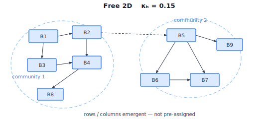

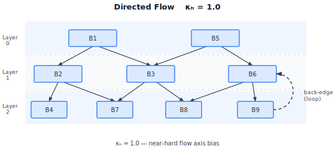

---

## Step H — Highway Assignment (Global Routing)

This step is the algorithmic centrepiece of the design. It is directly analogous to
**global routing** in VLSI chip layout (Cadence Innovus, Synopsys ICC2) and to Holten's
*Hierarchical Edge Bundles* (2006) in information visualisation.

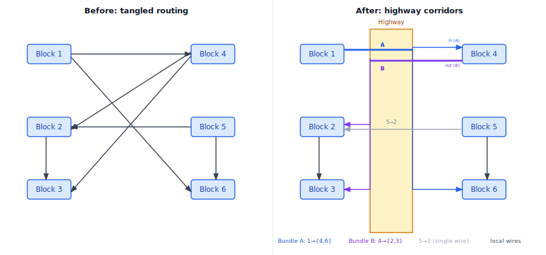

**Motivation**: without committed channel assignments, every re-routing iteration can
choose different paths, causing the compression loop to oscillate. Highways fix the
channel commitment first. Crucially, the commitment is a **hard routing constraint within
a compression round** (not merely a soft cost discount): an edge routes only *within* its
committed corridor for the duration of a round. This is what actually guarantees that a
channel's wire count cannot change mid-compression, which in turn makes the compression
gaps computable in closed form (Step 6).

**Procedure**:

1. **Coarse-route all edges** on the coarse grid from Step 2 using a simplified A* that
   counts grid-cell traversals. Ties are broken by a stable key (edge index) for
   determinism. Complexity: O(m × n).

2. **Score each channel** (boundary between adjacent coarse cells):
   `channel_edge_count = number of edges routed through this channel`

3. **Classify by geometric necessity, not an absolute count.** A "minor road" is any
   channel a single default gap can serve; its capacity is `minor_capacity =
   floor((min_gap − 2 × wire_margin) / G)` — the count of G-spaced lanes that fit inside a
   default gap *after* both wire margins are reserved (using `floor(min_gap / G)` would
   ignore the margins and misclassify a channel that is exactly full). A channel is a
   **Highway** iff its required width exceeds what a minor road can carry:

   ```
   peak_lanes(channel)     = max concurrent wires at any cross-section
                             (see Peak Concurrent Occupancy below; peak_lanes ≤ channel_edge_count)
   required_width(channel) = peak_lanes(channel) × G + 2 × wire_margin
   highway  ⇔  required_width(channel) > min_gap
   ```

   Width is driven by *peak concurrent* occupancy rather than the raw `channel_edge_count`
   because wires that tap off before the congested stretch never coexist there; using the
   total would over-promote channels to highways and waste canvas (see Peak Concurrent
   Occupancy). The two counts coincide only when every edge spans the channel's full length.

   This rule is scale-free and derived from `EdgeClearance`/`G`/`min_gap`, replacing the
   former magic `highway_threshold = 3`. It behaves correctly at both density extremes:
   in sparse models nothing is needlessly bundled; in dense models only channels that
   genuinely overflow a default gap are promoted, so the classification stays
   discriminating (it does not degenerate to "every channel is a highway").

4. **Assign edges to highways** with a *capped* reserved width so a hub cannot create a
   single canvas-dominating corridor:

   ```
   reserved_width = min( peak_lanes(channel) × G + 2·wire_margin , W_cap )
   W_cap          = clamp( 0.25 × canvas_extent_estimate , 6·G , 24·G )
   ```

   When `peak_lanes(channel) × G` exceeds `W_cap` (typical of a single hub connected to
   everything), the bundle is **split across two opposite faces of the hub** (PortAssigner-
   style) and/or arrowheads are stacked on the hub face; a `LayoutWarning` is emitted if a
   face still cannot present all ordered slots.

5. **Reserved widths become hard minimum clearance constraints** for Step 6: no gap
   containing a highway can compress below that highway's reserved width.

**A\* cost discount**: in Steps 5 and 7, traversing a committed-highway cell costs
`highway_cost_factor = 0.6×` the normal per-cell cost, encouraging neat bundling *within*
the corridor. (Within a compression round, leaving the corridor is forbidden outright; the
discount only shapes the path inside it.)

**Stability guarantee**: because corridor membership is a *hard* constraint within a
round, re-routing in Steps 6–7 changes only intra-corridor paths, never which corridor an
edge uses. A wire therefore cannot immigrate into a channel and raise its floor mid-
compression — the failure mode that would otherwise force a gap to expand and break
monotonicity. Corridor assignments are re-evaluated only between rounds, at most twice
(Step 6).

### Two-Phase Design

Highway assignment is intentionally split into two phases that answer different questions:

**Phase 1 — Width Reservation (deterministic, closed-form):**
Reserve a *width* for each corridor based on peak concurrent occupancy (see below).
This width becomes a hard lower bound that Step 6 must honour. Because corridor
assignments are frozen for the round, the width is computable directly — no iteration.

**Phase 2 — Wire Positioning (relaxation-based):**
Within the reserved band, individual wire positions are determined in Step 7 by a 1-D
repulsion-relaxation pass. Wires float to well-separated positions inside the band rather
than being pre-assigned to explicit lanes. This separates the structural question
(*how wide?*) from the aesthetic question (*where exactly within the band?*) and
naturally handles variable density without lane-bookkeeping.

### Peak Concurrent Occupancy

The reserved width for a corridor is determined by its **peak concurrent wire count** —
the maximum number of wires simultaneously present at any cross-section of the trunk —
not the total number of edges that use the corridor.

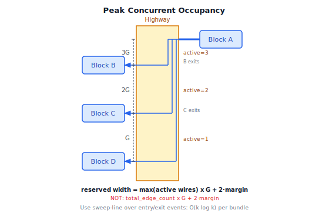

A bundle of 10 edges may require only 3G of width if at most 3 wires are ever active
simultaneously (the remaining 7 have tapped off to their destinations before reaching the
congested stretch). Using the total count overestimates width and wastes canvas space.

**Sweep-line algorithm** (O(k log k) per bundle, O(m log m) total). The events are taken
from the committed routes recorded in Step 5 (the oversized waypoints), measured along the
corridor's long axis:

1. For each wire in the bundle, its corridor span is `[entry, exit]`, where `entry` is the
   smaller and `exit` the larger of the two coordinates at which the wire joins and leaves
   the corridor along its long axis. Emit an *entry event* at `entry` and an *exit event*
   at `exit`.
2. Sort all events by position. **Tie-break: process entry events before exit events at the
   same position**, so two wires that meet exactly at one cross-section are counted as
   concurrent (the conservative, feasibility-preserving choice).
3. Sweep: increment on entry, decrement on exit, and track the running maximum.

```
peak_lanes = max( active_wire_count at each cross-section )
```

This value replaces the naïve `Σ wires` count in the Step 6 compression formula.

**Invariance under compaction.** `peak_lanes` is computed once from the Step 5 routes and is
*invariant* under the order-preserving constraint-graph compaction used in Steps 6 and 8:
compaction only shrinks gaps and never reorders endpoints, so the relative order of all
entry/exit coordinates — and therefore every pairwise overlap relationship — is preserved.
The peak can only stay equal or decrease, never increase. This is what lets Step 6 treat the
peak-based width as a sound closed-form lower bound rather than an estimate that later
re-routing could invalidate.

**Lane position heuristic** (O(degree) per bundle, O(m) total): a bundle's merged trunk is
placed inside the corridor at the *barycenter* of the connected block centres, measured on
the corridor's **cross-axis** (the axis across the trunk — X for a vertical corridor, Y for
a horizontal one):

```
lane_pos = mean(source.cross, dest1.cross, dest2.cross, ...)
```

Bundles are then sorted by `lane_pos` to assign lane slots. As with the Sugiyama barycenter
heuristic this *reduces*, but does not provably eliminate, crossings; any residual crossings
are resolved by the Step 7 1-D repulsion pass. **Edge case** — a single source fanning to
many destinations spread across a wide range yields a `lane_pos` near the middle of that
range, so the trunk is centred on the fan, which is exactly the configuration the centre-fed
comb fan-out (below) assumes. The barycenter weights the single source equally with each
destination, so where one endpoint should dominate (e.g. a tight source feeding a wide
spread) the result is an accepted heuristic approximation, not a guaranteed optimum.

### Port Merging (Merged Trunk)

Naïve port assignment allocates one slot per wire on each block face, so stubs between
the face and the corridor fan from mismatched y-positions. When port order does not match
lane order inside the corridor, stubs must cross in the *stub area* (the gap between block
face and corridor wall).

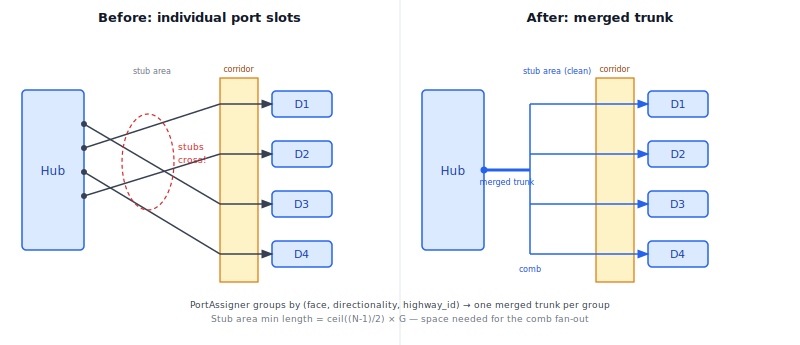

`PortAssigner` eliminates stub crossings by grouping all connections sharing
`(face, directionality, highway_id)` into a single **merged trunk**:

- The block face exposes **one port point** per group regardless of the wire count N.
- In the stub area a **comb fan-out** branches the trunk into individual wire lanes.
  The comb is a non-crossing structure (vertical spine, horizontal teeth) because wires
  are sorted to match their target order inside the corridor.
- **Stub area minimum length**: `ceil((N-1)/2) × G` so that the comb fans without
  crossings. This is a *derived* minimum block-to-corridor separation, not a magic
  constant. The derivation assumes a **centre-fed** trunk: the comb fans symmetrically, so
  the farthest lane is `ceil((N-1)/2)` lanes from the centre and each successive tooth must
  peel off one grid unit `G` earlier than the next to keep the vertical risers from
  overlapping. A purely **one-sided** fan (all lanes on one side of the trunk) instead needs
  `(N-1) × G`; `PortAssigner` therefore centres the trunk on the lane span to obtain the
  shorter bound.

The merged trunk reduces per-face port demand from N slots to 1, resolving the port
capacity constraint for most diagrams. Remaining overload is handled by the threshold
tiers below.

### Capacity Thresholds

Even with merged trunks, a corridor can become too dense for comfortable reading. Three
tiers apply, selected by comparing `peak_lanes` against two thresholds.

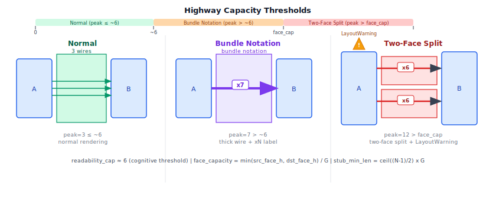

The tiers are selected by the following **precedence** — the physical limit is always
checked first, so the classification stays well-defined even when `face_capacity <
readability_cap`:

```
if    peak_lanes >  face_capacity:    tier = Two-face split
elif  peak_lanes >  readability_cap:  tier = Bundle notation
else:                                 tier = Normal
```

| Tier | Selected when | Rendering |
|------|---------------|-----------|
| **Normal** | `peak_lanes ≤ min(readability_cap, face_capacity)` | Individual wires, distinct colours/styles |
| **Bundle notation** | `readability_cap < peak_lanes ≤ face_capacity` | Thick single wire + ×N label |
| **Two-face split** | `peak_lanes > face_capacity` | Two corridors on opposite faces + `LayoutWarning` if still over |

```
readability_cap = 6                                  // cognitive threshold (fixed)
face_capacity   = trunk_face_h / G                   // physical slot limit of the face
                                                     // hosting the merged trunk
```

**Boundary and degenerate cases:**

- **`peak_lanes = face_capacity` exactly** — the comb just fits on one face, so the bundle
  stays single-faced (Bundle notation if also above `readability_cap`, otherwise Normal).
  The split is triggered only by strict overflow (`peak_lanes > face_capacity`).
- **`peak_lanes = readability_cap` exactly** — rendered Normal (the cap is inclusive).
- **`face_capacity < readability_cap`** (a short face) — the precedence above sends a peak in
  `(face_capacity, readability_cap]` straight to Two-face split rather than Normal, because
  it physically cannot fit even though it is under the cognitive cap. The Bundle-notation
  band is empty in this case, which is correct.
- **Two-face split still over capacity** — each face then carries `ceil(peak_lanes / 2)`
  lanes; if `ceil(peak_lanes / 2) > face_capacity` even after splitting, a `LayoutWarning`
  is emitted and the comb falls back to stacked arrowheads at minimum pitch `G`.

`readability_cap ≈ 6` reflects the subitising limit: humans discriminate up to ~6 parallel
wires without counting. Above this, a thick line with a multiplicity badge (×N) communicates
"many connections" more clearly than literal parallel rendering.

`face_capacity` is the hard physical limit: the number of G-spaced slots that fit on the
face that actually hosts the merged trunk (the congested face — the shared target face for a
fan-in, the shared source face for a fan-out). It is *not* a blanket minimum over every
connected block, since a block that contributes only one wire never constrains the bundle.
Exceeding `face_capacity` means the comb cannot physically reach all wire lanes at minimum
pitch G. The two-face split then routes `ceil(peak_lanes / 2)` wires through each of two
opposite faces; a `LayoutWarning` is emitted if even the split exceeds capacity.

---

## Step 3 — Grid Quantisation (Constraint-Graph Compaction)

Scale coarse positions to the fine pixel grid. Because the coarse cell is an integer
multiple of G (Step 2), this is an exact rescale, not an interpolation.

Block widths and heights round **up** to the nearest multiple of G. Positions are then
fixed by **1-D constraint-graph compaction** per axis — *not* by independent per-block
snapping and *not* by global row/column width unification (both of which can reorder or
overlap blocks, and global unification re-imposes the rigid shelf structure that Free 2D
is meant to avoid):

- For each axis, build a directed acyclic constraint graph: an edge `a → b` for each pair
  where `a` immediately precedes `b` in that axis's order, weighted by the required
  minimum separation `(extent(a)/2 + gap + extent(b)/2)`, where `gap` includes any
  highway-reserved width that must sit between them.
- The **longest-path** assignment over this DAG gives each block its minimal grid-aligned
  coordinate that preserves order and honours every separation. The result is feasible by
  construction — no overlap and no reordering is possible. (This is standard VLSI
  graph-based compaction.)
- **Local** width/height unification is applied *only* within a detected aligned group and
  *only* when it reduces total bends (i.e. when blocks are already nearly aligned and
  directly connected), never globally.
- **Cluster-integrity guard**: if a community's bounding-box area grew by more than ~1.5×
  versus its coarse footprint, re-run compaction treating that community as a single rigid
  super-node, then expand it in place.

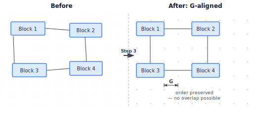

**Benefit**: anchor points lie on predictable grid lines; the Hanan grid for fine routing
has far fewer unique positions; equidistant wire spacing within highways becomes exact
integer arithmetic; and clusters that were compact in coarse space stay compact and
feasible after quantisation.

---

## Step 4 — Oversized Placement

Expand all inter-block gaps to generous headroom:

```
vGap[i] = max(min_vGap, highway_reserved_height[i] × expansion_factor)
hGap[j] = max(min_hGap, highway_reserved_width[j]  × expansion_factor)
```

`expansion_factor = 3.0` (tunable). With three times the required space, A* routing is
trivially clean — minimum-bend paths, no forced detours, shared trunks form naturally at
highway merge points.

The oversized layout is **never shown to the user**. It is the starting state for
compression.

---

## Step 5 — Route Edges (Initial)

Route all edges using `ChannelRouter` (A* Hanan grid) with highway cost discounts active.

With oversized gaps and highway biasing:

- Routes take minimum-bend paths
- Edges committed to the same highway bundle naturally (they prefer the same channel)
- Shared trunks emerge at highway merge points without explicit post-processing
- No congestion — oversized gaps guarantee every path is reachable

Record complete waypoints per edge; these serve as the clearance reference in Step 6.

---

## Step 6 — Gravity Compression (Closed-Form, Corridor-Constrained)

Shrink all gaps on both axes to their minimum feasible width. This replaces both the
previous heat-expansion approach (which expanded from a too-tight baseline on the wrong
axis) **and** the earlier fixed-step shrink loop, which was *not* a correct minimal-gap
solver. The fixed-step loop terminates (gaps only ever shrink, bounded below) but can
leave a channel narrower than the wires now in it, because re-routing under a *soft*
highway discount lets a wire immigrate into a channel and raise its floor after that
channel was already compressed — producing a silently infeasible layout and routing
thrash. The corrected algorithm removes the iteration entirely.

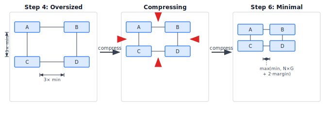

**Corridors are hard constraints (from Step H), so the minimal gap is closed-form.**
Because every edge is confined to its committed corridor for the round, no edge can
immigrate into a channel; therefore each channel's required width is *fixed*, and the
minimal feasible gap is computed directly — no `compress_step`, no convergence loop, no
measurement aliasing:

```
for each inter-column channel j:
    required_h = sweep_line_peak(j) × G + 2·wire_margin   // peak concurrent, not total count
               + label_box_width(j)                        // labels reserve space here, not post-hoc
    hGap[j]    = max(min_hGap, required_h, highway_reserved_width[j])

for each inter-row band i:
    required_v = sweep_line_peak(i) × G + 2·wire_margin   // peak concurrent, not total count
               + label_box_height(i)
    vGap[i]    = max(min_vGap, required_v, highway_reserved_height[i])

re-place blocks with the computed gaps (via the Step 3 constraint-graph compaction)
route edges within their committed corridors only
```

**Why this is closed-form.** Both `sweep_line_peak(j)` (for vertical channels) and
`sweep_line_peak(i)` (for horizontal bands) are evaluated *once*, from the committed Step 5
routes, before any re-placement. They are not mutually dependent: each is read from the same
fixed waypoint set, so there is no cross-axis fixed point to iterate toward. By the
invariance property (see Peak Concurrent Occupancy), the order-preserving re-placement that
follows can only reduce each peak, never raise it, so the gaps sized from the pre-placement
peaks remain feasible lower bounds afterwards. This is the precise sense in which the
corridor constraint makes the minimal gap computable without a convergence loop.

**Bounded outer re-evaluation.** After the single closed-form sizing and the final route
(Step 7), check whether any edge's corridor-constrained route is materially longer than
its unconstrained route (i.e. an edge "wants" a different corridor). If so, recompute the
Step H corridor assignment **at most once more**, recompute gaps, and keep the **best
feasible** result by total wire length. Corridor assignments are drawn from a finite set
and the outer loop is capped at 2 rounds, so the procedure is guaranteed to terminate with
a feasible, minimal layout; a `LayoutWarning` is emitted if a violation remains.

**Key properties (now actually true):**

- **Feasible and minimal**: each gap equals the exact minimum its committed wires (and
  labels) require — proven by the hard corridor constraint, not asserted from monotonicity.
- **Axis-symmetric**: X and Y sized with identical logic.
- **Highway-floored**: reserved widths are hard lower bounds; no degenerate collapse.
- **Stable**: no inter-corridor reassignment within a round; bounded re-evaluation between
  rounds.
- **No magic constants**: all bounds derived from measured wire/label clearances.

`wire_margin = EdgeClearance × 0.5`. Label boxes are included in `required_*` so that
compression reserves label space rather than leaving Step 9 to resolve overlaps after the
fact.

---

## Step 7 — Re-route (Final Compact)

One full A* re-route on the compressed, quantised layout with highway cost discounts
active. This is the routing that appears in the output.

---

## Step 8 — Grid Snap (Post-Compression)

Re-run the Step 3 constraint-graph compaction so every block coordinate is G-aligned while
order and minimum separations are preserved by construction. Blocks are **never** snapped
independently (independent snapping can reorder neighbours or create overlaps). Re-route
once if any block moved during snap.

---

## Step 9 — Post-Processing

**Equidistant wire spacing**: within each highway, wire segments are separated by the
Phase 2 (Step 7) 1-D repulsion-relaxation pass rather than pre-assigned to fixed lanes. At a
*fully occupied* cross-section (active wires = `peak_lanes`), repulsion inside a band of
width `peak_lanes × G` settles to the even positions G/2, 3G/2, 5G/2, …; this is exact
integer arithmetic because of the grid quantisation. In *under-occupied* sections (fewer
than `peak_lanes` wires active, see Peak Concurrent Occupancy) the same relaxation spreads
the present wires evenly across the band, so the bundle visually tapers toward its sparse
ends instead of leaving a hard-edged empty lane. Equidistance is therefore an emergent
property of the relaxation, consistent with the Two-Phase design, not a separate
lane-assignment step.

**Label placement**: edge-label bounding boxes are already reserved as channel clearance
during Step 6, so space exists by construction. Here each label is *positioned* at the
midpoint of the longest segment of its edge within that reserved space, collision-checked
against blocks and other labels using `ConnectorLabelPlacer`.

**Final verification pass**: check all clearance constraints; emit `LayoutWarnings` for
any remaining violations.

---

# Layout Engines

The layout subsystem provides eight reusable, stateless engines in `Layout/Engine/`. Each
engine accepts plain geometric input (sizes, connection pairs, obstacle rectangles) and
returns computed geometry. No engine references the SysML semantic model.

## Existing Engines

### ChannelRouter

Routes an orthogonal connector between two anchors using A\* on a Hanan grid. Clears
obstacles with configurable `EdgeClearance`. Extended in Layout Engine v2 to accept a
per-cell cost-multiplier map (highway discounts).

### ForceDirectedEngine

Fruchterman-Reingold spring placement. Extended in Layout Engine v2 with:

- Dimensionless force model with explicit rest length `r(ŵ) = L·(1.5 − ŵ)` and
  characteristic length `L = mean(block_diagonal) + EdgeClearance`
- Dimensionless hierarchy-gravity ratio `κ_h`
- Temperature-annealed wire-pressure force at block boundaries
- Cooling schedule retained; kinetic energy exposed as a termination signal
- Barnes–Hut quadtree repulsion above a node-count threshold (O(n log n))
- Deterministic jitter for coincident seed positions

### LayeredLayoutEngine

Simplified Sugiyama (layer assignment + barycenter ordering + x-alignment). Extended in
Layout Engine v2 with:

- Monte Carlo multi-seed option with size-scaled `K`
- Fixed barycenter sweep budget (8) with keep-best (no "to convergence" looping)
- **Virtual/dummy nodes** for edges spanning more than one layer, ordered and routed
  through intermediate layers
- Per-seed crossing count exposed for seed selection

### ContainmentPacker

Bottom-up bin-packing of children in a container. Extended in Layout Engine v2 to emit a
gap array compatible with `GravityCompressor` so the pipeline can recurse into a
container and compress its interior at the same density as the top level.

### PortAssigner

Port-side assignment and slot distribution along a box edge. Extended in Layout Engine v2
to be **highway-aware**: it chooses the box face pointing at an edge's committed corridor
and orders slots along each face to match the corridor's wire order, so stubs do not cross
at the box boundary. When several wires share the same `(face, directionality, highway_id)`
it collapses them into a single **merged trunk** with a comb fan-out (see Port Merging),
exposing **one** corridor-facing port point on that face instead of N independent slots; the
comb then fans the trunk, without crossings, into the N individual corridor lanes that carry
the wires on to their separate far-end blocks. Also
assigns container-boundary ports for edges that cross into a container.

## New Engines (Layout Engine v2)

### ConnectivityAnalyzer

Computes the sparse affinity adjacency, layer hints, community (cluster) membership via
label-propagation/Louvain, and crossing-minimisation scores from a graph of blocks and
edges. Pure graph arithmetic; no geometry; no dense n² matrix.

### HighwayAssigner

Performs global routing on the coarse grid, scores channels, classifies highways by the
geometric necessity rule (`required_width > min_gap`), assigns edges to corridors with a
capped reserved width (`W_cap`, two-sided split for hubs), and produces a per-cell
cost-multiplier map plus hard corridor-membership constraints for `ChannelRouter`.

### GravityCompressor

Implements the closed-form, corridor-constrained gap sizing (Step 6). Accepts the
committed corridor assignments, wire-and-label bounding boxes, and highway floor
constraints; returns the minimal feasible gap array and a feasibility flag. Includes the
bounded (≤2) outer re-evaluation that keeps the best feasible result.

### GridQuantizer

Performs 1-D constraint-graph compaction per axis: snaps positions and sizes to grid unit
G while preserving order and minimum separations (including highway widths) by
construction. Applies only *local* width/height unification. Accepts the current
placed-box list; returns the quantised, feasible placed-box list.

---

# Per-View Analysis

## General View

**What this view shows**: all user-defined SysML definitions (part def, port def,
attribute def, action def, interface def, etc.) as labelled boxes with stereotype keyword;
specialization edges as hollow triangles; membership edges as filled/hollow diamonds;
optional packaging in folder nodes.

**Mode**: Free 2D.

**How the algorithm applies**:
Connectivity analysis builds affinity from specialization and membership edges, and uses
**community detection** so a specialization fan (a hub-and-spoke shape) is recognised as
one cluster — note that the older "all pairs above threshold" clique rule could not do
this, because subtype-to-subtype affinity is zero. Free 2D force-directed produces
clusters matching the model's package structure. Highway assignment bundles specialization
fans — e.g. 6 subtypes converging on one supertype share a corridor. Because all six
arrowheads coexist at the supertype face, `peak_lanes = 6` there and compression sizes that
corridor to `max(min_gap, 6·G + 2·wire_margin)`. `PortAssigner` collapses the six incoming
wires (same face, same directionality, same highway) into one merged trunk: a single shared
arrowhead contacts the supertype's target face (the SysML shared-target "tree" notation) and
a comb fans that trunk, without crossings, into six corridor lanes running on to the six
subtypes. If the face is shorter than `6·G` (`face_capacity < 6`) the bundle follows the
capacity-threshold tiers — splitting across the adjacent face, or stacking with a
`LayoutWarning` — so the fan never overflows a single face. Grid quantisation aligns all
blocks to an implicit shared grid via constraint-graph compaction.

**Common issues in prior implementation**:

| Issue | Root Cause |
|---|---|
| Massive inter-row whitespace | Broken compounding heat loop (applied to already-shifted positions) |
| Horizontal crowding ignored | Only vertical gaps were expanded; wrong axis |
| No crossing minimisation | Blocks ordered by discovery, not connectivity |
| Rows forced regardless of structure | Shelf packing cannot produce 2D clusters |
| Independent fan-out edges | No shared trunk / highway concept |
| Magic constants | `HeatThreshold` / `PerEdgeExpansion` had no principled derivation |

**How the proposal mitigates**:
Compression starts oversized and shrinks to minimum — over-expansion is impossible by
construction. Both axes compressed simultaneously. Monte Carlo + barycenter minimises
crossings. Free 2D placement allows genuine 2D clustering. Highway assignment naturally
produces shared trunks. All bounds are derived from measured wire clearances; no magic
constants.

---

## Interconnection View

**What this view shows**: `part usage` instances as boxes inside a containing part; `port`
usages on box boundaries; `connection` usages as lines between ports; optionally nested
parts.

**Mode**: Free 2D (using existing `ForceDirectedEngine` placement, supplemented by new
compression and quantisation steps).

**How the algorithm applies**:
Existing force-directed placement is retained — a port graph should not be forced into
layers — but the **shared pipeline from Step H onward** is adopted (highway assignment,
constraint-graph compaction, closed-form compression, post-processing) with **port-aware
anchoring**. `HighwayAssigner` identifies connector bundles (e.g. a bus between two parts)
and reserves corridor space. The highway-aware `PortAssigner` chooses each port's side to
face its corridor and orders slots to match the corridor's wire order. `GravityCompressor`
removes empty regions left by force-directed settlement. A **self/nested connection** (a
connection between two ports on the same part) carries no highway meaning; it is routed as
a small external arc and excluded from highway assignment.

**Common issues in prior implementation**:

| Issue | Root Cause |
|---|---|
| Empty regions after force-directed | No post-placement compression |
| Connector bundles not reserved | No highway concept |

**How the proposal mitigates**:
`GravityCompressor` collapses empty regions. `HighwayAssigner` reserves bundle corridors.
`GridQuantizer` aligns port slots to predictable positions.

---

## State Transition View

**What this view shows**: state boxes (with entry/do/exit compartments); directed
transition edges with guard labels; an initial pseudo-state (filled circle); optionally a
final state.

**Mode**: Directed Flow (`κ_h = 1.0`).

**How the algorithm applies**:
`LayeredLayoutEngine` assigns states to layers by longest path from the initial state.
The **initial pseudo-state is pinned to the top layer and the final state to the bottom
layer** — longest-path layering alone does not guarantee the final state is last once
back-edges are reversed. Edges spanning more than one layer receive **virtual nodes** so
ordering and routing stay clean. Monte Carlo seeds try different within-layer orderings to
minimise transition crossings. Edge types are handled distinctly:

- **Back-edge** (transition from layer L to layer L′ < L, a loop-back): routed as an arc
  around the outside of the flow column. Nested loops are treated as nested intervals — a
  back-edge at nesting depth `k` arcs at radius `R_k = EdgeClearance × (1 + k)`, so deeper
  loops arc further out and never overlap.
- **Same-layer transition** (sibling states): routed as a short horizontal connector
  within the layer, not treated as a back-edge.
- **Self-transition** (self-loop): drawn as a small one-sided arc on the state box;
  excluded from highway assignment and back-edge treatment.

Highway assignment bundles common transition targets (e.g. many states transitioning to a
shared error state).

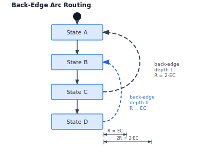

**Common issues in prior implementation**:

| Issue | Root Cause |
|---|---|
| States scatter with unclear flow direction | Force-directed without directional bias |
| No layer assignment | No concept of execution order |
| Loop-back transitions cut across forward flow | No back-edge treatment |
| No crossing minimisation | Single seed only |

**How the algorithm applies**:
`LayeredLayoutEngine` assigns states in execution order. The initial state is pinned to
the top, final to the bottom. Back-edge arc routing (nesting-depth radius), same-layer and
self-loop handling, plus virtual nodes for multi-layer edges, separate loop-backs from
forward flow. Monte Carlo reduces crossings among states in the same layer.

---

## Action Flow View

**What this view shows**: action boxes in execution order; succession edges (dashed,
open-V); fork/join thick bars; decision/merge diamonds; start (filled circle) and done
markers.

**Mode**: Directed Flow (`κ_h = 1.0`). This is the strongest case for directed flow —
execution order is the primary visual message.

**How the algorithm applies**:
`LayeredLayoutEngine` assigns actions to layers by topological sort. **Virtual/dummy nodes
are inserted on every edge that spans more than one layer** — essential here because
fork/join branches of unequal length produce long edges that would otherwise cut across
intermediate layers and confuse barycenter ordering. Fork and join nodes produce
multi-output/multi-input layers; the crossing minimiser handles the fanning over the
virtual-node chain. Decision/merge nodes are placed at layer boundaries. Highway
assignment bundles parallel paths between the same fork/join pair. Back-edge arcs (with
nesting-depth radius) handle loop-back actions.

**Common issues in prior implementation**:

| Issue | Root Cause |
|---|---|
| Parallel branches between fork/join may cross | No highway bundling, no crossing minimisation |
| Fixed inter-layer gaps | Not derived from actual wire density |

**How the proposal mitigates**:
Highway assignment identifies parallel branches and reserves their combined width.
Monte Carlo minimises crossings between branches. Gravity compression sizes each
inter-layer gap to its actual wire density.

---

## Sequence View

**What this view shows**: lifelines as vertical dashed lines with labelled head boxes
arranged horizontally; messages as horizontal arrows between lifelines; optional activation
bars; combined fragments (alt/opt/loop).

**Mode**: Hard-coded. Bypasses Steps 0–8.

**How the algorithm applies**:
Lifelines are placed in declaration order at equal horizontal spacing (minimum = label
width + margin). Messages are placed at sequential vertical positions. Grid snap (Step 8)
aligns lifeline X positions and message Y coordinates to G using an **order-preserving
snap** that keeps a minimum 1-unit (`G`) separation between consecutive messages, so two
closely-spaced messages can never collapse onto the same Y or reorder. Label collision
check (Step 9) ensures message labels do not overlap adjacent lifelines.

**Common issues in prior implementation**:

| Issue | Root Cause |
|---|---|
| Fixed lifeline spacing regardless of label width | No adaptive spacing |
| Message label overlap | No collision check |

**How the proposal mitigates**:
Minimum lifeline spacing derived from label width. Label collision check added in Step 9.

---

## Grid View

**What this view shows**: a relationship matrix — rows and columns are definition names;
cells contain a marker when a relationship exists between the row and column elements.

**Mode**: arithmetic (no placement algorithm). Grid snap (Step 8) aligns column widths to
G for visual regularity.

**Common issues in prior implementation**: none significant. This view is already
principled.

---

## Browser View

**What this view shows**: a tree of model elements reflecting package/namespace membership;
indented lines with connector stubs showing parent-child relationships.

**Mode**: tree-walk arithmetic (no placement algorithm). Grid snap aligns node Y positions
to G.

**Common issues in prior implementation**: none significant. This view is already
principled.

---

# Resolved Design Decisions

The following questions were raised during algorithmic review; each is resolved here and
the resolution is reflected in the algorithm steps above.

1. **Coarse-to-fine coupling** — *Resolved: integer coarse grid.* The coarse cell is sized
   as an integer multiple of G (`cell = round(4 × avg_block / G) × G`) so coarse positions
   map to fine positions by exact rescale. Fine placement uses constraint-graph compaction
   (Step 3), not interpolation, eliminating the risk of a cluster that fits in coarse cells
   becoming infeasible on the fine grid.

2. **Highway threshold** — *Resolved: geometric necessity rule.* The absolute
   `highway_threshold = 3` is replaced by `highway ⇔ peak_lanes·G + 2·wire_margin >
   min_gap` (Step H), where `peak_lanes` is the peak concurrent occupancy. This is
   scale-free, derived from `EdgeClearance`/`G`/`min_gap`, and stays discriminating at both
   density extremes. Reserved width is capped at `W_cap`, and hub bundles split across
   opposite faces.

3. **Compression step size** — *Resolved: no stepping.* Because corridors are hard
   constraints, the minimal feasible gap is closed-form (Step 6); the fixed-step (and the
   binary-search alternative) are unnecessary. A bounded (≤2) outer re-evaluation of
   corridor assignments replaces per-step iteration.

4. **Back-edge arc radius** — *Resolved: nesting-depth radius.* Concurrently-open
   back-edges are treated as nested intervals; a back-edge at nesting depth `k` arcs at
   `R_k = EdgeClearance × (1 + k)`, so deeper loops arc further out and never overlap.

5. **Cluster threshold** — *Resolved: community detection.* An all-pairs-above-threshold
   clique rule cannot cluster a hub-and-spoke (zero leaf-leaf affinity), so it is replaced
   by label-propagation/Louvain community detection on an affinity graph whose edges are
   admitted at a relative threshold (top tertile of positive weights).

6. **Interconnection View scope** — *Resolved: partial adoption.* Keep `ForceDirectedEngine`
   placement (do not impose layering on a port graph), but adopt the shared pipeline from
   Step H onward with port-aware anchoring, plus an explicit self/nested-connection rule.

7. **Highway stability after compression** — *Resolved: committed per round, ≤2
   re-evaluations.* Hard corridor membership means edge counts cannot drift within a round.
   Between rounds, at most one re-evaluation is allowed; the best feasible result is kept;
   a warning is emitted otherwise.

8. **Label highways** — *Resolved: yes.* Label bounding boxes are added to channel
   `required_width`/`required_height` during compression (Step 6), so label space is
   reserved by construction; Step 9 only *positions* labels within that reserved space.

---

# Scalability and Large Models

For very large views the exact pipeline is bounded:

- **Sparse affinity**: affinity is built as an adjacency list from edge/membership/
  supertype lists in O(m); the dense n² matrix is never materialised (Step 0).
- **Barnes–Hut repulsion**: the O(n²) per-iteration repulsion in Step 2 is replaced by an
  O(n log n) quadtree approximation above a node-count threshold.
- **Cluster-first fallback**: above `N_max` (≈ 300 blocks per view), communities are laid
  out as super-nodes, then each community's interior is laid out independently and
  stitched, bounding total cost while preserving locality.
- **Container recursion**: the pipeline recurses into folder/package containers (via
  `ContainmentPacker` emitting compressor-compatible gaps), so a container's interior is
  compressed at the same density as the top level, with cross-boundary edges meeting at
  container-boundary ports ordered by the external corridor.
